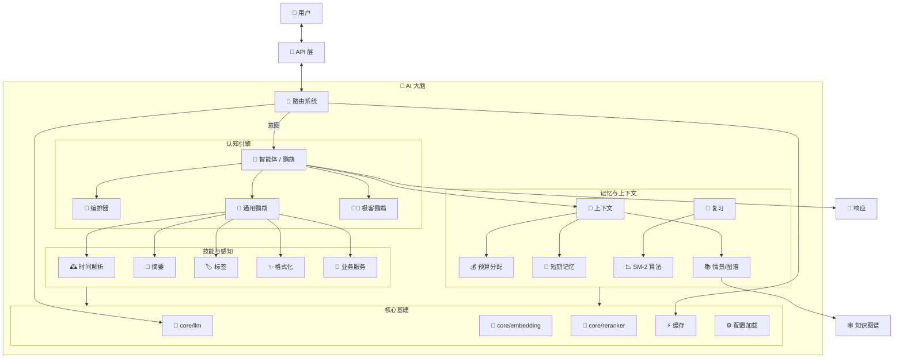
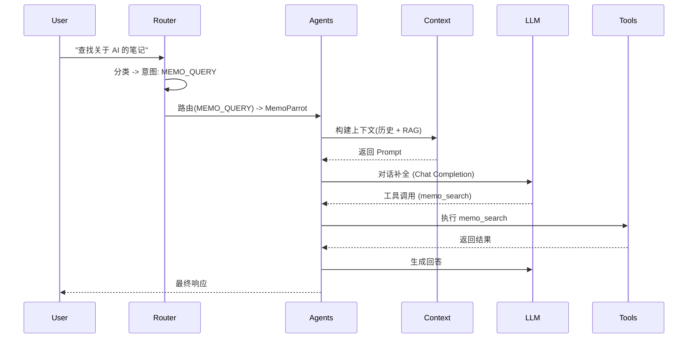
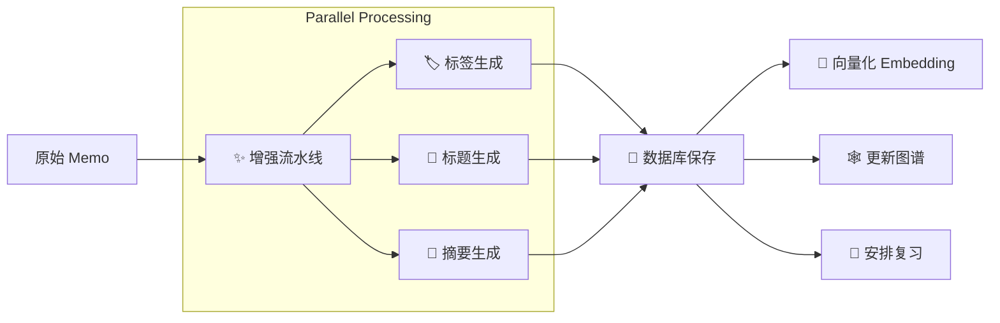

# DivineSense AI 大脑 (`ai/`)

`ai` 包是 DivineSense 的认知核心，囊括了从基础的 LLM 集成到高级自主 Agent（智能体）的所有智能能力。

## 🧠 系统架构 (知识图谱)

此架构图展示了 AI 模块的“宏观架构”与数据流转。



## 📚 微观架构与算法

### 1. 感知与路由 (前额叶)
*   **[routing](./routing/README.md)**: **四层意图分类架构**。
    *   *算法*: `L0:LRU缓存` -> `L1:规则匹配 (加权关键词)` -> `L2:历史匹配 (向量相似度)` -> `L3:LLM兜底`。
*   **[duplicate](./duplicate/README.md)**: **混合相似度检测**。
    *   *算法*: `得分 = 0.5*向量相似度 + 0.3*标签重合度 + 0.2*时间衰减`。
*   **[aitime](./aitime/README.md)**: **自然语言时间解析**。
    *   *流程*: 正则匹配 -> NLP处理 (相对时间/中文语义) -> 标准化时间。

### 2. Agent 智能体系统 (鹦鹉)
*   **[agents](./agents/README.md)**: 自主实体系统。
    *   **UniversalParrot**: 配置驱动的通用 Agent (如 Memo, Schedule)。支持 `Direct` (直接), `ReAct` (推理+行动), `Planning` (规划), `Reflexion` (反思) 策略。
    *   **GeekParrot**: 通过 Claude Code CLI 实现代码执行能力的 Agent。
    *   **Orchestrator**: 基于 DAG 的多 Agent 协同编排，包含 `Decomposer` (拆解器) 和 `Handoff` (交接) 机制。
*   **[services](./services/README.md)**: 业务逻辑封装 (如 `schedule` 的重复规则处理)。

### 3. 认知能力 (技能)
*   **[tags](./tags/README.md)**: **三层标签推荐系统**。
    *   *算法*: `L1:统计推荐` -> `L2:规则推荐` -> `L3:LLM语义推荐`。
*   **[summary](./summary/README.md)**: **高可用摘要生成**。
    *   *流程*: 尝试 LLM -> 降级至首段提取 -> 降级至截断。
*   **[enrichment](./enrichment/README.md)**: **流水线处理**。
    *   *机制*: 存前 (阻塞式) + 存后 (异步并行) 增强。

### 4. 记忆与上下文 (海马体)
*   **[context](./context/README.md)**: **动态 Token 管理**。
    *   *特性*: Token 预算分配 (STM/LTM/RAG 比例)，增量更新 (Context Caching)。
*   **[graph](./graph/README.md)**: **个人知识图谱**。
    *   *算法*: PageRank (重要性计算), 标签传播 (社区发现)。
*   **[review](./review/README.md)**: **间隔重复复习**。
    *   *算法*: **SM-2** (SuperMemo-2) 记忆曲线算法，优化复习间隔。
*   **[cache](./cache/README.md)**: **双层缓存架构**。
    *   *架构*: `L1:LRU` (精确 SHA256) + `L2:Semantic` (向量余弦相似度)。

### 5. 基础设施 (脑干)
*   **[core](./core/README.md)**: 统一的 LLM, Embedding, Reranker, Retrieval 接口。
*   **[observability](./observability/README.md)**: 全栈 `logging`, `metrics` (Prometheus), `tracing` (OTEL)。
*   **[configloader](./configloader/README.md)**: 具备回退机制的 YAML 配置加载器。
*   **[timeout](./timeout/README.md)**: 集中式系统限制，防止“认知过载”。

## 🔄 核心工作流

### W1: 用户查询处理


### W2: Memo 知识摄入


## 📂 目录结构映射

```text
ai/
├── core/               # Layer 0: 基础能力 (LLM, Embed, Rerank)
├── internal/           # Layer 0: 内部工具 (strutil)
├── observability/      # Layer 0: 监控 (Logs, Metrics, Traces)
├── configloader/       # Layer 0: 配置加载
├── timeout/            # Layer 0: 系统限制
├── cache/              # Layer 1: 语义缓存
├── context/            # Layer 1: 上下文窗口管理
├── services/           # Layer 2: 业务逻辑 (Schedule, Session)
├── agents/             # Layer 3: 自主智能体 (Parrots)
├── routing/            # Layer 3: 意图分类与路由
├── aitime/             # Skill: 时间解析
├── tags/               # Skill: 标签推荐
├── summary/            # Skill: 摘要生成
├── format/             # Skill: 格式化
├── enrichment/         # Skill: 处理流水线
├── duplicate/          # Skill: 去重与查重
├── review/             # Skill: 间隔复习
└── graph/              # Skill: 知识图谱
```
