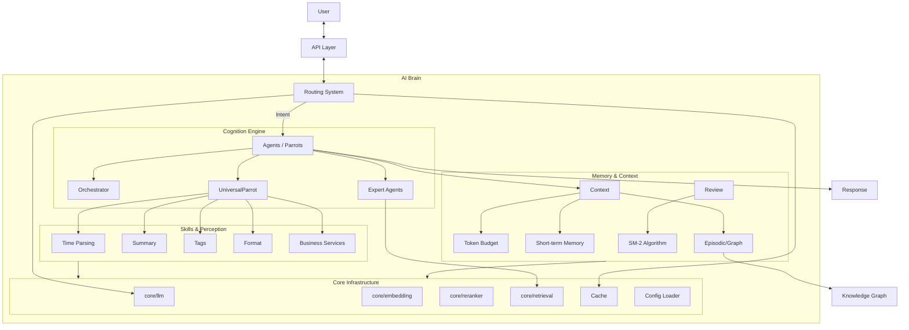
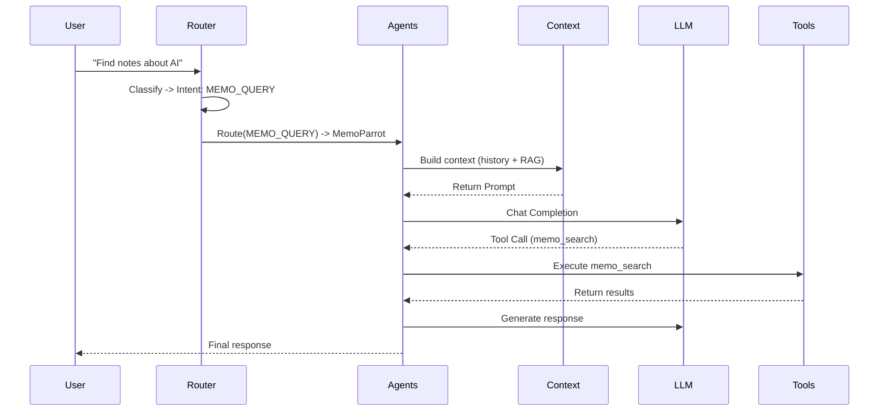
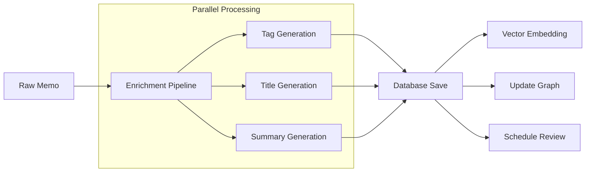

# DivineSense AI Brain (`ai/`)

`ai` package is DivineSense's cognitive core, encompassing all intelligent capabilities from basic LLM integration to advanced autonomous Agents.

## System Architecture (Knowledge Graph)

This architecture diagram shows the "macro architecture" and data flow of the AI module.



## Micro-Architecture & Algorithms

### 1. Perception & Routing (Prefrontal Cortex)
- **[routing](./routing/README.md)**: **Four-layer intent classification architecture**.
    - *Algorithm*: `L0:LRU Cache` -> `L1:Rule Matching (Weighted Keywords)` -> `L2:History Matching (Vector Similarity)` -> `L3:LLM Fallback`.
- **[duplicate](./duplicate/README.md)**: **Hybrid similarity detection**.
    - *Algorithm*: `Score = 0.5*Vector Similarity + 0.3*Tag Overlap + 0.2*Time Decay`.
- **[aitime](./aitime/README.md)**: **Natural language time parsing**.
    - *Flow*: Regex matching -> NLP processing (relative time/Chinese semantics) -> Standardized time.

### 2. Agent System (Parrots)
- **[agents](./agents/README.md)**: Autonomous entity system.
    - **Orchestrator**: LLM-driven task decomposition and multi-agent coordination. Contains `Decomposer` and `Handoff` mechanisms.
    - **UniversalParrot**: Config-driven general Agent (e.g., Memo, Schedule). Supports `Direct`, `ReAct`, `Planning`, `Reflexion` strategies.
    - **Expert Agents**: Domain-specific agents including MemoParrot and ScheduleParrot.
    - **GeekParrot**: Claude Code CLI integration for code execution.
- **[services](./services/README.md)**: Business logic encapsulation (e.g., schedule repeat rule processing).

### 3. Cognitive Capabilities (Skills)
- **[tags](./tags/README.md)**: **Three-layer tag recommendation system**.
    - *Algorithm*: `L1:Statistics` -> `L2:Rules` -> `L3:LLM Semantic`.
- **[summary](./summary/README.md)**: **High-availability summary generation**.
    - *Flow*: Try LLM -> Fallback to first paragraph extraction -> Fallback to truncation.
- **[enrichment](./enrichment/README.md)**: **Pipeline processing**.
    - *Mechanism*: Pre-save (blocking) + Post-save (async parallel) enhancement.

### 4. Memory & Context (Hippocampus)
- **[context](./context/README.md)**: **Dynamic Token Management**.
    - *Features*: Token budget allocation (STM/LTM/RAG ratio), incremental updates (Context Caching).
- **[graph](./graph/README.md)**: **Personal Knowledge Graph**.
    - *Algorithm*: PageRank (importance), Label Propagation (community detection).
- **[review](./review/README.md)**: **Spaced repetition review**.
    - *Algorithm*: **SM-2** (SuperMemo-2) memory curve algorithm.
- **[cache](./cache/README.md)**: **Two-layer cache architecture**.
    - *Architecture*: `L1:LRU` (exact SHA256) + `L2:Semantic` (vector cosine similarity).

### 5. Infrastructure (Brainstem)
- **[core](./core/README.md)**: Unified LLM, Embedding, Reranker, Retrieval interfaces.
- **[retrieval](./core/retrieval/README.md)**: Adaptive retrieval with RRF fusion and quality assessment.
- **[observability](./observability/README.md)**: Full-stack `logging`, `metrics` (Prometheus), `tracing` (OTEL).
- **[configloader](./configloader/README.md)**: YAML config loader with fallback mechanism.
- **[timeout](./timeout/README.md)**: Centralized system limits to prevent "cognitive overload".

## Core Workflows

### W1: User Query Processing


### W2: Memo Knowledge Ingestion


## Directory Structure

```text
ai/
├── core/               # Layer 0: Foundation (LLM, Embed, Rerank, Retrieval)
│   ├── llm/            # LLM client with multi-provider support
│   ├── embedding/      # Vectorization with chunking
│   ├── reranker/       # Re-ranking for RAG
│   └── retrieval/      # Adaptive retrieval strategies
├── internal/           # Layer 0: Internal tools (strutil)
├── observability/      # Layer 0: Monitoring (Logs, Metrics, Traces)
├── configloader/       # Layer 0: Config loading
├── timeout/            # Layer 0: System limits
├── cache/              # Layer 1: Semantic cache
├── context/            # Layer 1: Context window management
├── services/           # Layer 2: Business logic (Schedule, Session)
├── agents/             # Layer 3: Autonomous Agents (Parrots)
├── routing/            # Layer 3: Intent classification & routing
├── aitime/            # Skill: Time parsing
├── tags/               # Skill: Tag recommendation
├── summary/            # Skill: Summary generation
├── format/             # Skill: Formatting
├── enrichment/         # Skill: Processing pipeline
├── duplicate/          # Skill: Deduplication
├── review/             # Skill: Spaced repetition
└── graph/              # Skill: Knowledge graph
```

## Key Interfaces

### LLM Service
```go
type Service interface {
    Chat(ctx context.Context, messages []Message) (string, *LLMCallStats, error)
    ChatStream(ctx context.Context, messages []Message) (<-chan string, <-chan *LLMCallStats, <-chan error)
    ChatWithTools(ctx context.Context, messages []Message, tools []ToolDescriptor) (*ChatResponse, *LLMCallStats, error)
    Warmup(ctx context.Context)
}
```

### Embedding Service
```go
type Service interface {
    Embed(ctx context.Context, text string) ([]float32, error)
    EmbedBatch(ctx context.Context, texts []string) ([][]float32, error)
}
```

### Retrieval Service
```go
type AdaptiveRetriever interface {
    Retrieve(ctx context.Context, opts *RetrievalOptions) ([]*SearchResult, error)
}
```
