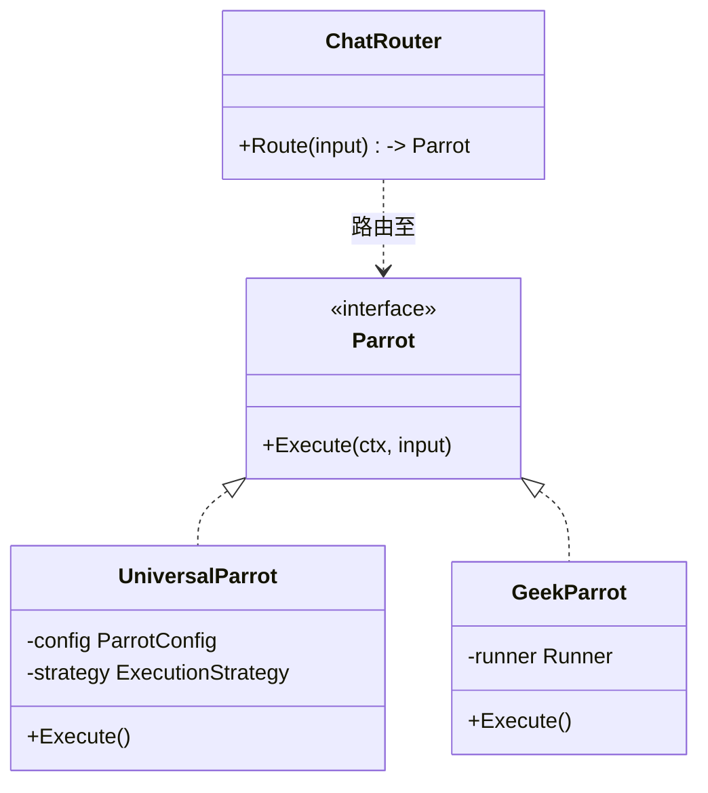

# AI Agent 智能体系统 (`ai/agents`)

`agents` 包实现了 DivineSense 的核心智能体系统，我们将其形象地称为“鹦鹉 (Parrot)”系统。

## 概览

DivineSense 使用“鹦鹉”作为 AI Agent 的隐喻——每一只鹦鹉都有独特的性格、能力和使命。系统支持两种类型的鹦鹉：
1.  **配置驱动型 (UniversalParrot)**: 通过 YAML 定义，无需写代码。
2.  **代码实现型 (GeekParrot/EvolutionParrot)**: 通过 Go 代码实现复杂逻辑。

## 架构设计



## 目录结构

```
agents/
├── universal/              # 通用鹦鹉系统 (策略, 工厂)
├── geek/                   # 极客鹦鹉 (代码执行 & 进化)
├── orchestrator/           # 多智能体编排 (DAG, 交接)
├── runner/                 # 执行引擎 (会话, 隔离, 安全检查)
├── tools/                  # 具体工具实现
├── events/                 # 事件定义
├── registry/               # 工具、Prompt、指标注册中心
├── router/                 # 聊天路由 (chat_router.go)
└── *test.go                # 测试文件
```

## 鹦鹉列表 (Parrot Roster)

| 鹦鹉                | 中文名 | 角色     | 性格           | 实现方式           |
| :------------------ | :----- | :------- | :------------- | :----------------- |
| **MemoParrot**      | 灰灰   | 笔记助手 | 好奇, 严谨     | Universal (Config) |
| **ScheduleParrot**  | 时巧   | 日程管家 | 有条理, 高效   | Universal (Config) |
| **AmazingParrot**   | 折衷   | 全能助手 | 平衡, 乐于助人 | Universal (Config) |
| **GeekParrot**      | 极客   | 代码专家 | 技术流, 精准   | Code (Geek)        |
| **EvolutionParrot** | 进化   | 自我进化 | 分析型, 审慎   | Code (Evolution)   |

## 扩展指南

### 1. 创建新工具
实现 `ToolWithSchema` 接口并在 `registry` 中注册。

```go
type MyTool struct {}
func (t *MyTool) Name() string { return "my_tool" }
func (t *MyTool) Description() string { return "功能描述" }
func (t *MyTool) Parameters() string { returnJSONSchema }
func (t *MyTool) Execute(ctx, args) (string, error) { ... }
```

### 2. 定义新鹦鹉
在 `config/parrots/` 下创建新的 YAML 配置文件：

```yaml
id: "MY_PARROT"
name: "MyParrot"
chinese_name: "我的鹦鹉"
strategy: "react"
tools:
  - my_tool
system_prompt: "你是..."
```
