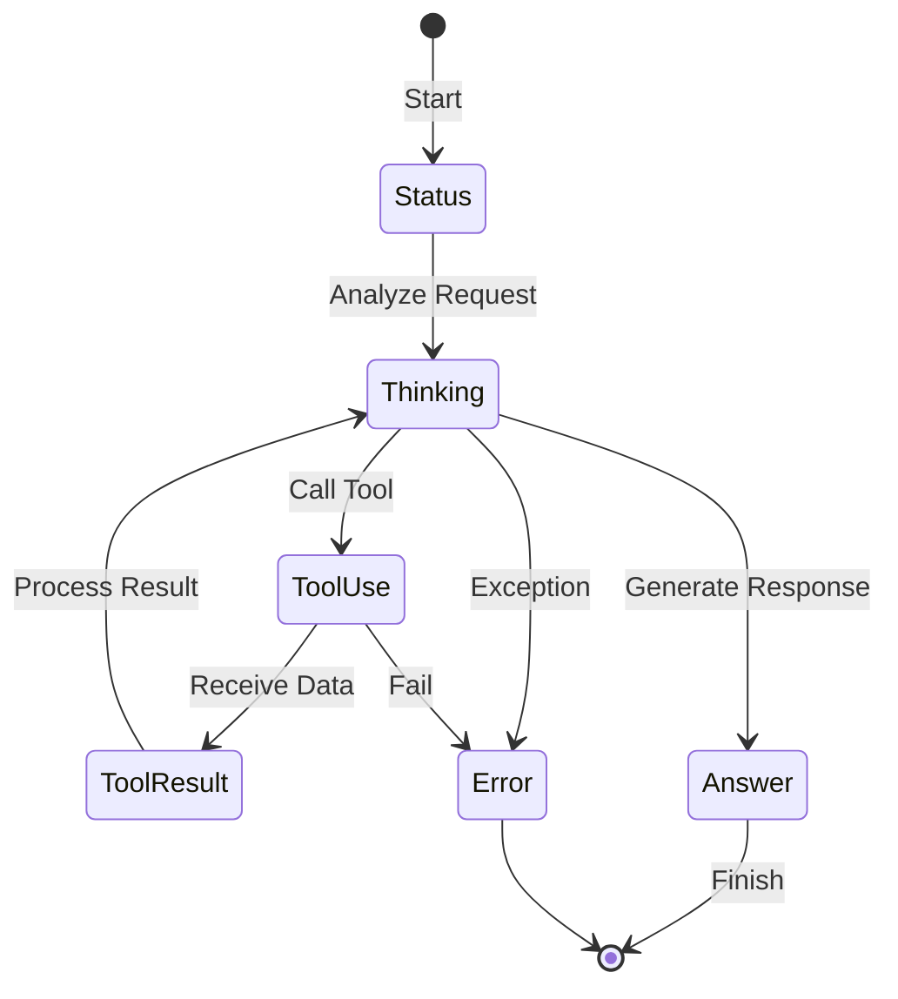

# Agent Events (`ai/agents/events`)

`events` 包定义了 Agent 在执行过程中触发的各类事件，用于前端 UI 实时展示 Agent 的思考过程和状态。

## 事件流



## 事件类型

前端通过 WebSocket 或 SSE 订阅这些事件，实现类似 "ChatGPT 打字机" + "Chain of Thought" 的效果。

### 核心事件

| 事件类型 | 说明 | Payload 示例 |
| :--- | :--- | :--- |
| `thinking` | Agent 正在思考 | `{"type":"text","data":"正在分析..."}` |
| `tool_use` | Agent 决定调用工具 | `{"name":"schedule_query","input":{...}}` |
| `tool_result` | 工具执行完成 | `{"name":"schedule_query","result":"..."}` |
| `answer` | Agent 生成最终回复 | `"感谢您的提问..."` |
| `error` | 发生错误 | `"无法完成请求: ..."` |
| `status` | 状态变更 | `{"message":"开始规划任务"}` |

### 扩展事件

| 事件类型 | 说明 | Payload 示例 |
| :--- | :--- | :--- |
| `phase_change` | 处理阶段变更 | `{"phase":"planning","number":2,"total":4}` |
| `progress` | 进度更新 | `{"percent":50,"estimated_seconds":30}` |
| `session_stats` | 会话统计 | `{"tokens":1000,"duration_ms":5000}` |
| `danger_block` | 危险操作拦截 | `{"operation":"rm -rf","reason":"..."}` |

## 阶段定义

系统定义了以下处理阶段：

```go
const (
    PhaseAnalyzing   ProcessingPhase = "analyzing"   // 分析请求
    PhasePlanning    ProcessingPhase = "planning"    // 规划任务
    PhaseRetrieving  ProcessingPhase = "retrieving" // 检索数据
    PhaseSynthesizing ProcessingPhase = "synthesizing" // 合成响应
)
```

## 使用方式

### 回调函数类型

```go
// Callback 是事件回调函数类型
type Callback func(eventType string, data interface{}) error

// SafeCallback 包装 Callback，记录错误而不是返回
type SafeCallback func(eventType string, data interface{})
```

### 使用示例

```go
callback := func(event string, data interface{}) error {
    // 推送给前端
    ws.Push(event, data)
    return nil
}

// 传入 Agent 执行函数
agent.Execute(ctx, input, history, callback)

// 使用 SafeCallback 处理非关键事件
safeCallback := events.SafeCallback(callback)
safeCallback("phase_change", &PhaseChangeEvent{
    Phase:       PhasePlanning,
    PhaseNumber: 2,
    TotalPhases: 4,
})
```

### 事件数据结构

```go
// EventWithMeta 带元数据的事件
type EventWithMeta struct {
    EventType string
    EventData interface{}
    Meta      *EventMeta
}

// EventMeta 事件元数据
type EventMeta struct {
    Status          string // running / success / error
    ToolName       string
    ToolID         string
    DurationMs     int64
    TotalDurationMs int64
    InputSummary   string
    OutputSummary  string
}

// SessionStatsData 会话统计数据
type SessionStatsData struct {
    SessionID          string
    UserID             int32
    AgentType          string
    StartTime          int64
    EndTime            int64
    TotalDurationMs    int64
    InputTokens        int
    OutputTokens       int
    ToolCallCount      int
    TotalCostUSD       float64
}
```
