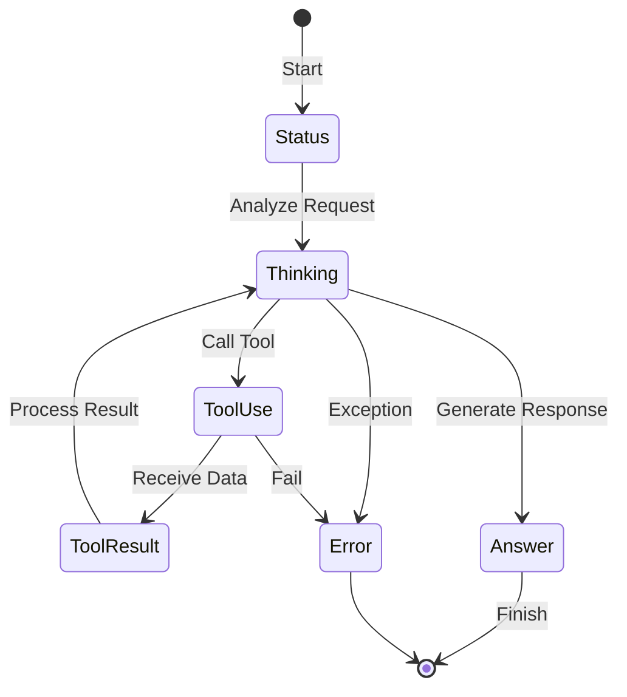

# Agent Events (`ai/agents/events`)

`events` 包定义了 Agent 在执行过程中触发的各类事件，用于前端 UI 实时展示 Agent 的思考过程和状态。

## 事件流




## 事件类型

前端通过 WebSocket 或 SSE 订阅这些事件，实现类似 "ChatGPT 打字机" + "Chain of Thought" 的效果。

*   **`EventTypeThinking`**: Agent 正在思考（生成 Thought）。
    *   Payload: 思考内容的增量文本。
*   **`EventTypeToolUse`**: Agent 决定调用工具。
    *   Payload: 工具名称、输入参数。
*   **`EventTypeToolResult`**: 工具执行完成。
    *   Payload: 执行结果（JSON 或 文本）。
*   **`EventTypeAnswer`**: Agent 生成最终回复。
    *   Payload: 回复内容的增量文本。
*   **`EventTypeStatus`**: 状态变更（如“开始规划”、“正在搜索”）。
*   **`EventTypeError`**: 发生错误。

## 使用方式

```go
callback := func(event string, data interface{}) {
    // 推送给前端
    ws.Push(event, data)
}

// 传入 Agent 执行函数
agent.Execute(ctx, input, callback)
```
