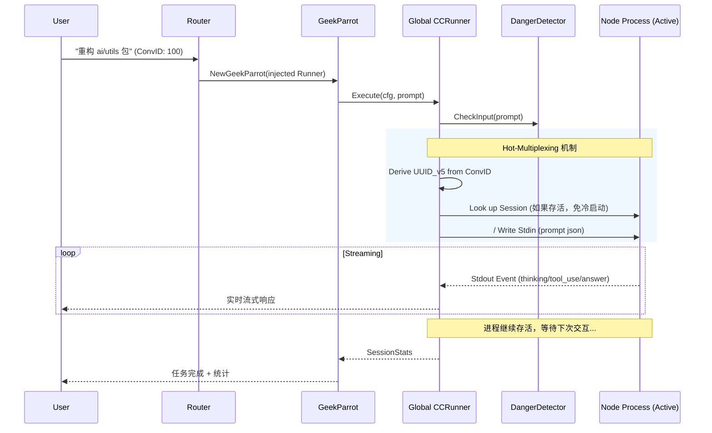

# Geek Parrot (`ai/agents/geek`)

`geek` 包实现了面向**代码执行**和**自我进化**的高级 Agent —— `GeekParrot` 和 `EvolutionParrot`。它通过集成 **[HotPlex](https://github.com/hrygo/hotplex)** 深度连接 Claude Code CLI，使其具备直接操作文件系统、运行终端命令和编写代码的能力。

## 架构与能力

### 1. GeekParrot (Geek Mode)
*   **代码执行**: 封装了 Claude Code CLI 的交互。
*   **适配器模式**: 自身是无状态瞬态对象，将请求转发给基于 **HotPlex** 构建的 `runner.CCRunner` 引擎。
*   **会话一致性**: 通过 UUID v5 (ConversationID + UserID) 保证绝对物理隔离。

### 2. EvolutionParrot (Evolution Mode)
*   **仓库感知**: 能够理解当前代码库的结构和上下文。
*   **自我进化**: 接受架构调整任务，自动跨文件修改（需配合专门的长生 `evoRunner` 单例运转，防止缓存脏堵）。

### 3. GeekMode / EvolutionMode
*   **工作目录**: 每个用户有独立的沙盒目录。
*   **权限控制**: 基于用户权限的访问控制。
*   **系统提示**: 自动生成包含用户和设备上下文的系统提示。

## 安全机制

由于赋予了 Agent 极高的权限（文件读写、命令执行），必须有严格的安全限制：

*   **Danger Detection**: 拦截高危命令 (如 `rm -rf /`, `mkfs` 等)。
*   **路径检查**: 防止访问敏感目录。
*   **绕过模式**: 仅 Evolution 模式可绕过安全检查（管理员专用）。
*   **超时控制**: 强制执行超时，防止死循环或挂起。

## 业务流程



## Parrot 接口实现

GeekParrot 实现了 `agent.ParrotAgent` 接口：

```go
type GeekParrot struct {
    runner    *agentpkg.CCRunner
    mode      *GeekMode
    sessionID string
    userID    int32
    workDir   string
}

func (p *GeekParrot) Name() string { ... }
func (p *GeekParrot) Execute(ctx, userInput, history, callback) error { ... }
func (p *GeekParrot) SelfDescribe() *agentpkg.ParrotSelfCognition { ... }
func (p *GeekParrot) GetSessionStats() *agentpkg.NormalSessionStats { ... }
```

## 配置选项

GeekParrot 通过环境变量或配置获取工作目录：

| 环境变量                          | 说明                         |
| :-------------------------------- | :--------------------------- |
| `DIVINESENSE_CLAUDE_CODE_WORKDIR` | Claude Code 工作目录         |
| 默认值                            | `~/.divinesense/claude-code` |
