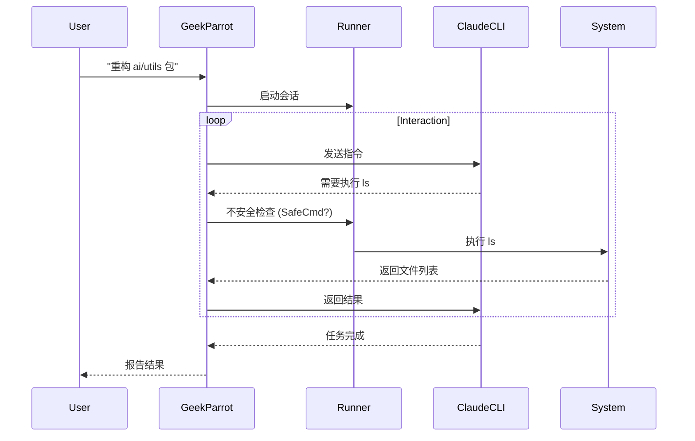

# Geek Parrot (`ai/agents/geek`)

`geek` 包实现了面向**代码执行**和**自我进化**的高级 Agent —— `GeekParrot`。它集成了 Claude Code CLI，使其具备直接操作文件系统、运行终端命令和编写代码的能力。

## 架构与能力

### 1. Code Execution Mode (`mode.go`)
*   **CLI Integration**: 封装了 `claude` 命令行工具的交互。
*   **Isolation**: 通过 `runner` 模块在受控环境中执行命令。
*   **Streaming**: 实时流式传输代码执行的输出结果。

### 2. Self-Evolution (`evolution.go`)
*   **Repo Awareness**: 能够理解当前代码库的结构和上下文。
*   **Feature Implementation**: 接受开发任务，自动创建并修改文件。
*   **Pull Request**: 自动提交变更（未来规划）。

## 安全机制

由于赋予了 Agent 极高的权限（文件读写、命令执行），必须有严格的安全限制：
*   **Danger Detection**:拦截高危命令 (如 `rm -rf /`, `mkfs` 等)。
*   **Sandboxing**: 限制工作目录，防逃逸（依赖 `runner` 实现）。
*   **Timeout**: 强制执行超时，防止死循环或挂起。

## 业务流程

