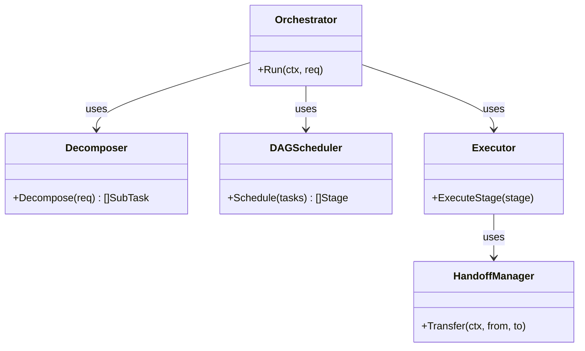
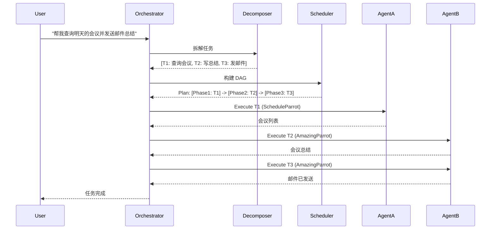

# Agent Orchestrator (`ai/agents/orchestrator`)

`orchestrator` 包实现了多 Agent 协作的核心逻辑，负责将复杂的用户请求拆解为子任务，并调度不同的 Agent（Parrot）协同完成。

## 架构设计

### 核心组件
1.  **Decomposer (任务拆解器)**: 使用 LLM 将自然语言请求拆解为结构化的子任务列表。
2.  **DAG Scheduler (DAG 调度器)**: 分析子任务间的依赖关系 (Dependency)，构建有向无环图 (DAG)，并规划并行执行阶段。
3.  **Executor (执行器)**: 负责具体阶段的执行，管理 Agent 的生命周期。
4.  **Handoff Manager (交接管理器)**: 处理 Agent 之间的上下文传递和控制权转移。

## 协作流程

## 功能特性
*   **动态规划**: 根据 Agent 的能力地图 (`CapabilityMap`) 动态指派最合适的 Agent。
*   **上下文注入**: 下游任务自动获取上游任务的产出结果。
*   **错误恢复**: 单个子任务失败时，支持重试或人工干预。
