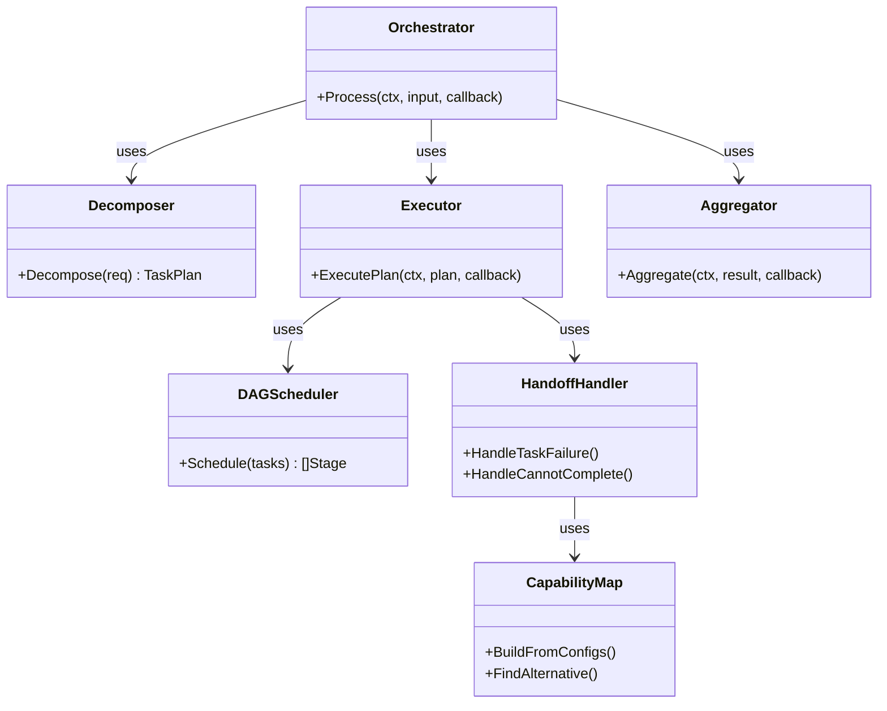
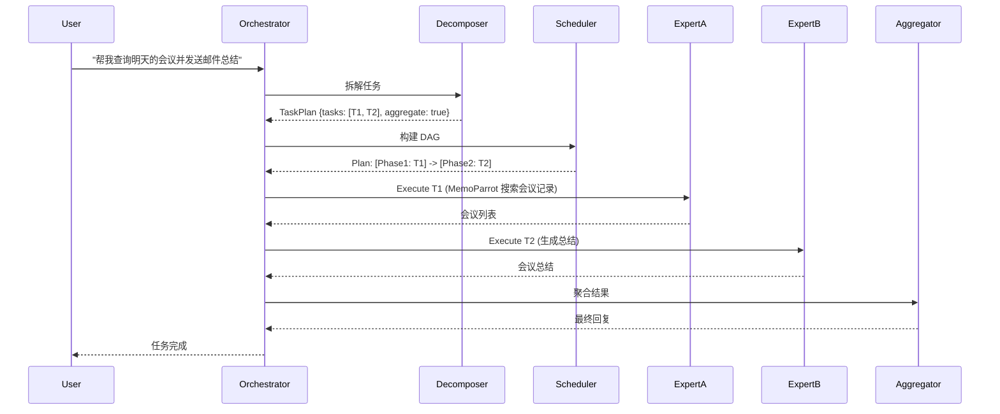

# Agent Orchestrator (`ai/agents/orchestrator`)

`orchestrator` 包实现了多 Agent 协作的核心逻辑，负责将复杂的用户请求拆解为子任务，并调度不同的 Agent（Parrot）协同完成。

## 架构设计



### 核心组件

1.  **Decomposer (任务拆解器)**: 使用 LLM 将自然语言请求拆解为结构化的子任务列表。
2.  **DAG Scheduler (DAG 调度器)**: 分析子任务间的依赖关系，构建有向无环图，并规划并行执行阶段。
3.  **Executor (执行器)**: 负责具体阶段的执行，管理 Agent 的生命周期。支持任务交接（Handoff）。
4.  **Aggregator (聚合器)**: 将多个 Expert Agent 的结果聚合为最终响应。
5.  **CapabilityMap (能力地图)**: 维护所有 Expert Agent 的能力描述，用于智能任务分配。
6.  **HandoffHandler (交接处理器)**: 处理 Agent 能力不足时的任务交接。

## 协作流程



## 功能特性

*   **动态规划**: 根据 Agent 的能力地图 (`CapabilityMap`) 动态指派最合适的 Agent。
*   **DirectResponse**: 简单任务（如总结、翻译）可由 LLM 直接处理，无需调用 Expert Agent。
*   **上下文注入**: 下游任务自动获取上游任务的产出结果。
*   **错误恢复**: 单个子任务失败时，支持重试或切换到其他 Agent（Handoff）。
*   **任务交接 (Handoff)**: 当某个 Expert Agent 无法完成任务时，自动寻找其他合适的 Agent 继续处理。
*   **并行执行**: 独立任务可以并行执行，提高响应速度。

## 配置选项

```go
config := &OrchestratorConfig{
    MaxParallelTasks:   3,           // 最大并行任务数
    EnableAggregation:  true,          // 启用结果聚合
    EnableHandoff:      true,         // 启用任务交接
    DecompositionModel: "default",    // 任务分解模型
    AggregationModel:   "default",    // 结果聚合模型
    DefaultLanguage:    "zh",         // 默认语言
    MaxRetries:         3,            // 最大重试次数
    RetryBackoff:       time.Second, // 重试间隔
}
```

## ExpertRegistry 接口

Orchestrator 通过 `ExpertRegistry` 接口访问 Expert Agent：

```go
type ExpertRegistry interface {
    GetAvailableExperts() []string
    GetExpertDescription(name string) string
    GetExpertConfig(name string) *agents.ParrotSelfCognition
    ExecuteExpert(ctx context.Context, expertName string, input string, callback EventCallback) error
    GetIntentKeywords() map[string][]string
}
```
