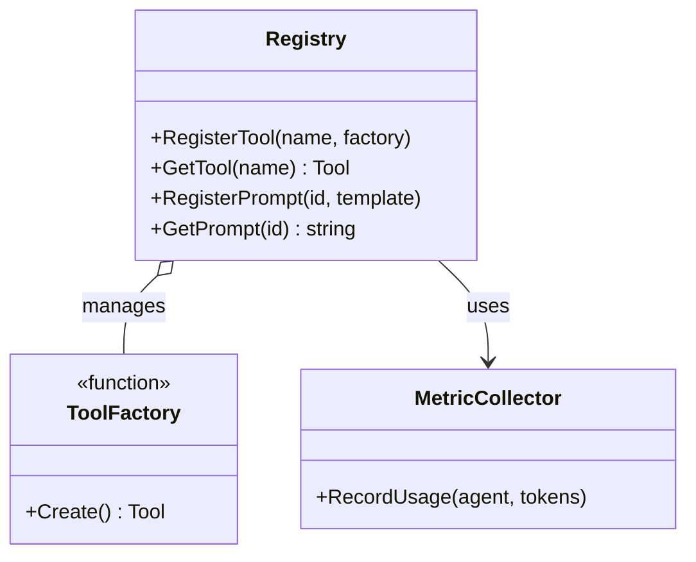

# Agent Registry (`ai/agents/registry`)

`registry` 包充当 Agent 系统的“注册中心”，集中管理工具、Prompt 模板和监控指标。

## 架构设计




## 功能模块

### 1. Tool Registry
**动态工具发现与加载**。
*   允许在运行时注册新的 `ToolFactory`。
*   支持按名称查找和实例化工具。
*   `UniversalParrot` 启动时通过此 Registry 加载配置中声明的工具。

### 2. Prompt Registry
**Prompt 版本控制与管理**。
*   集中存储各类 Agent 的 System Prompt。
*   支持 Prompt 模板渲染（例如注入当前时间、用户信息）。

### 3. Metrics Registry
**统一监控指标出口**。
*   注册和管理 Agent 相关的 Prometheus 指标（如 Token 消耗、工具调用次数）。

## 使用示例

```go
// 注册工具
registry.RegisterTool("weather_query", func(ctx context.Context) Tool {
    return &WeatherTool{}
})

// 获取工具实例
tool, err := registry.GetTool("weather_query")
```
