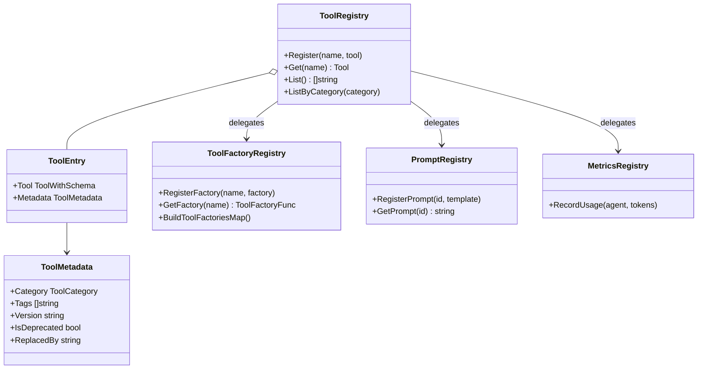

# Agent Registry (`ai/agents/registry`)

`registry` 包充当 Agent 系统的"注册中心"，集中管理工具、Prompt 模板和监控指标。

## 架构设计



## 功能模块

### 1. Tool Registry
**动态工具发现与加载**。

*   允许在运行时注册新的 `ToolFactory`。
*   支持按名称查找和实例化工具。
*   `UniversalParrot` 启动时通过此 Registry 加载配置中声明的工具。

### 2. Tool Factory Registry
**工具工厂注册**。

*   支持带用户上下文的工具实例化（传入 userID）。
*   与全局工具注册表集成。

### 3. Tool Metadata
**工具元数据**。

```go
type ToolMetadata struct {
    Category    ToolCategory  // 工具分类：memo, schedule, search, system, ai, custom
    Tags        []string     // 标签：semantic, keyword, recurring 等
    Version     string       // 版本号
    IsDeprecated bool        // 是否已废弃
    ReplacedBy  string      // 替代工具名称
}
```

### 4. Prompt Registry
**Prompt 版本控制与管理**。

*   集中存储各类 Agent 的 System Prompt。
*   支持 Prompt 模板渲染（例如注入当前时间、用户信息）。

### 5. Metrics Registry
**统一监控指标出口**。

*   注册和管理 Agent 相关的 Prometheus 指标（如 Token 消耗、工具调用次数）。

## 工具分类

| 分类 | 说明 |
| :--- | :--- |
| `CategoryMemo` | 笔记相关工具 |
| `CategorySchedule` | 日程相关工具 |
| `CategorySearch` | 搜索/检索工具 |
| `CategorySystem` | 系统/工具类工具 |
| `CategoryAI` | AI/LLM 工具 |
| `CategoryCustom` | 自定义工具 |

## 使用示例

```go
// 注册工具
func init() {
    registry.RegisterWithMetadata("memo_search", &MemoSearchTool{}, registry.ToolMetadata{
        Category: registry.CategoryMemo,
        Tags:     []string{"semantic"},
    })
}

// 获取工具实例
tool, err := registry.Get("memo_search")

// 按分类列出工具
tools := registry.ListByCategory(registry.CategoryMemo)

// 注册工具工厂（支持 userID 上下文）
registry.RegisterFactory("schedule_add", func(userID int32) (agent.ToolWithSchema, error) {
    return &ScheduleAddTool{UserID: userID}, nil
})
```
