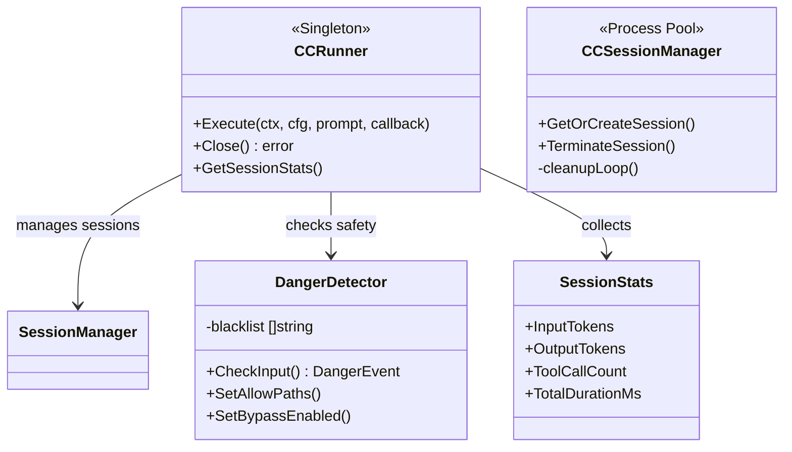

# Agent Runner (`ai/agents/runner`)

`runner` 包是 Agent 系统的底层执行引擎，负责管理执行会话、安全检查和资源隔离。

## 核心组件

### 1. `CCRunner` (Global Singleton)
统一的 Claude Code CLI 集成层，为 Geek Mode 和 Evolution Mode 提供共享的持久化执行引擎。

*   **Hot-Multiplexing (热态多路复用)**: 劫持单一 Node.js 进程的长连接 Stdin/Stdout 流，实现极速多轮对话响应。
*   **PGID 优雅销毁 (Graceful Shutdown)**: 运用 `syscall.SysProcAttr{Setpgid: true}` 将 CLI 进程簇锚定，随主服务关闭时发射级联 `SIGKILL -PID` 抹除孤儿僵尸进程。
*   **流式输出**: 无缝逆序列化解析 CLI 的 `stream-json`，提供并打通 `events.Callback` 回传前台。
*   **统计收集**: 自动收集 Token 消耗、执行时长、工具调用等高阶流式结算数据。

### 2. `SessionManager` (Process Pool Manager)
*   并发维护全局的常驻活跃进程字典映射 (`map[string]*Session`)。
*   内置 `cleanupLoop` 定时器执行 30 分钟惰性生命周期修剪扫除。
*   支持从零到一的冷启动 (`GetOrCreateSession`) 与热链路唤醒。

### 3. `DangerDetector`
安全守门员，保护系统免受恶意操作。

*   **黑名单机制**: 内置高危命令列表（如 `rm -rf /`, `mkfs` 等）。
*   **路径检查**: 防止访问敏感目录（如 `/etc`, `/var`）。
*   **确认机制**: 对中风险操作要求用户二次确认。
*   **绕过模式**: 支持管理员模式绕过安全检查（仅用于 Evolution 模式）。

## 架构图



## 会话隔离机制 (UUID v5 Namespacing)

为彻底消灭“脏写”与“并发缓存锁 (already in use)”事故，系统弃用了自增或直接映射，转而使用 **UUID v5 (MD5+SHA1) 命名空间隔离算法**。

1.  **铁桶隔离**: 首先使用 `geek_userID` 或 `evolution_userID` 作为 NameSpaceOID 派生初始哈希。
2.  **绝对唯一**: 然后将具体的 `conversation_id` 喂入前置命名空间，派生最终态 UUID 返回给底层。
3.  **穿透映射**: CLI 在 OS 目录树 `.claude/sessions/<UUID>` 划定独家物理沙盒结界。

```go
// ConversationIDToSessionID 转换 (v2.0 隔离版)
func ConversationIDToSessionID(namespace string, conversationID int64) string {
    // 假设 namespace 已经是 MD5 派生好的前置实体
    name := fmt.Sprintf("divinesense:conversation:%d", conversationID)
    return uuid.NewSHA1(parsedNamespace, []byte(name)).String()
}
```

## 统计指标

CCRunner 自动收集以下统计指标：

| 指标                 | 说明               |
| :------------------- | :----------------- |
| `InputTokens`        | 输入 Token 数量    |
| `OutputTokens`       | 输出 Token 数量    |
| `TotalTokens`        | 总 Token 数量      |
| `ToolCallCount`      | 工具调用次数       |
| `TotalDurationMs`    | 总执行时长（毫秒） |
| `ToolDurationMs`     | 工具执行时长       |
| `ThinkingDurationMs` | 思考时长           |
| `FilesModified`      | 修改文件数         |
| `TotalCostUSD`       | 预估成本（USD）    |

## 使用示例

```go
// 1. 在服务端常驻生命周期中初始化（单例）
runner, err := NewCCRunner(30*time.Minute, slog.Default())
defer runner.Close() // 引发 PGID 大清洗

// 2. 模拟某次前端 Request 到来
cfg := &Config{
    Mode:           "geek",
    WorkDir:        "/path/to/workdir",
    SessionID:      "db-uuid-v5-generated-hash",
    UserID:         12345,
}

// 3. 热态注入 (Hot-Multiplexing)
err := runner.Execute(ctx, cfg, "帮我重构这个函数", callback)

stats := runner.GetSessionStats()
```
