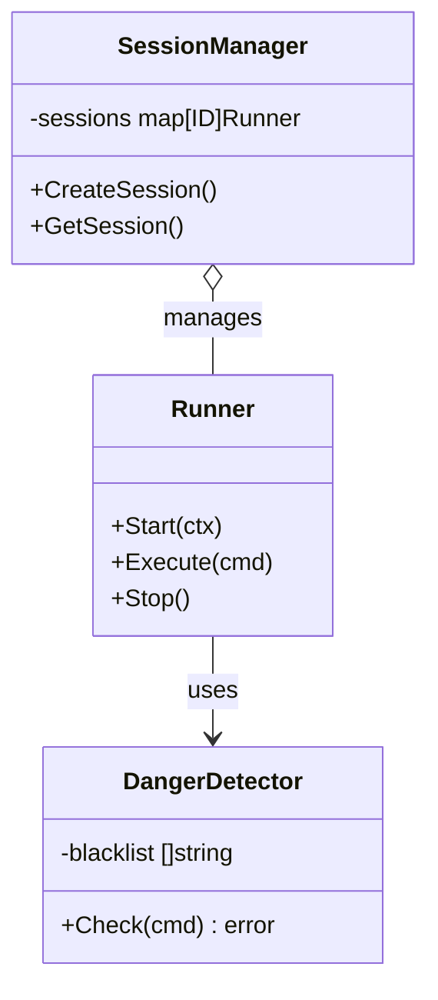

# Agent Runner (`ai/agents/runner`)

`runner` 包是**有状态 Agent**（如 GeekParrot）的底层执行引擎。它负责管理执行会话 (Session)、命令执行安全和资源隔离。

## 核心组件

### 1. `Runner`
执行引擎的入口，管理整个生命周期。
*   **Session Management**: 维护从 `Start` 到 `Stop` 的会话状态。
*   **I/O Streaming**: 处理标准输入/输出/错误的流式转发。

### 2. `DangerDetector`
安全守门员。
*   **黑名单机制**: 内置高危命令列表（如 `rm`, `dd`, `mv /`）。
*   **路径检查**: 防止访问敏感目录（如 `/etc`, `/var`）。
*   **确认机制**: 对中风险操作要求用户二次确认（Human-in-the-loop）。

### 3. `SessionManager`
*   并发管理多个 Agent 会话。
*   处理会话的超时回收和异常清理。

## 架构图

