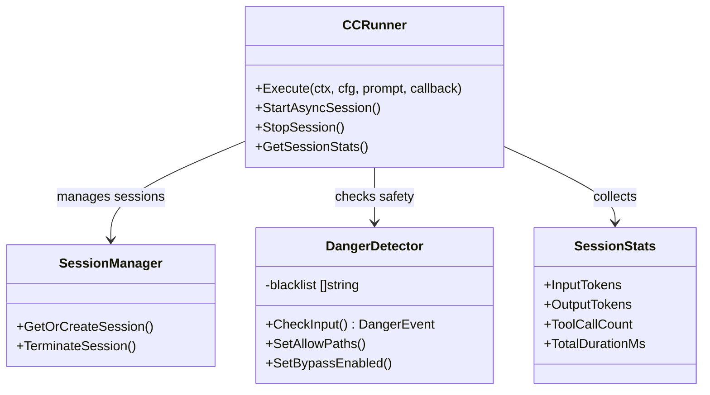

# Agent Runner (`ai/agents/runner`)

`runner` 包是 Agent 系统的底层执行引擎，负责管理执行会话、安全检查和资源隔离。

## 核心组件

### 1. `CCRunner`
统一的 Claude Code CLI 集成层，为所有需要与 Claude Code CLI 交互的模式提供共享实现。

*   **会话管理**: 使用 UUID v5 从 ConversationID 派生 SessionID，实现跨重启的可靠恢复。
*   **流式输出**: 实时解析 CLI 的 `stream-json` 输出并转发给前端。
*   **超时控制**: 支持可配置的执行超时。
*   **统计收集**: 自动收集 Token 消耗、执行时长、工具调用等统计数据。

### 2. `SessionManager`
*   并发管理多个 Agent 会话。
*   处理会话的超时回收和异常清理。
*   支持会话的持久化和恢复。

### 3. `DangerDetector`
安全守门员，保护系统免受恶意操作。

*   **黑名单机制**: 内置高危命令列表（如 `rm -rf /`, `mkfs` 等）。
*   **路径检查**: 防止访问敏感目录（如 `/etc`, `/var`）。
*   **确认机制**: 对中风险操作要求用户二次确认。
*   **绕过模式**: 支持管理员模式绕过安全检查（仅用于 Evolution 模式）。

## 架构图



## 会话恢复机制

系统使用 UUID v5 将数据库 ConversationID 映射到 Claude Code SessionID，确保：

1.  相同的 ConversationID 始终映射到相同的 SessionID
2.  跨后端重启后可以恢复会话
3.  会话状态通过 `--session-id` / `--resume` 参数持久化

```go
// ConversationIDToSessionID 转换
func ConversationIDToSessionID(conversationID int64) string {
    // UUID v5 uses SHA-1 hash of namespace + name
    name := fmt.Sprintf("divinesense:conversation:%d", conversationID)
    return uuid.NewSHA1(divineSenseNamespace, []byte(name)).String()
}
```

## 统计指标

CCRunner 自动收集以下统计指标：

| 指标 | 说明 |
| :--- | :--- |
| `InputTokens` | 输入 Token 数量 |
| `OutputTokens` | 输出 Token 数量 |
| `TotalTokens` | 总 Token 数量 |
| `ToolCallCount` | 工具调用次数 |
| `TotalDurationMs` | 总执行时长（毫秒） |
| `ToolDurationMs` | 工具执行时长 |
| `ThinkingDurationMs` | 思考时长 |
| `FilesModified` | 修改文件数 |
| `TotalCostUSD` | 预估成本（USD） |

## 使用示例

```go
runner, err := NewCCRunner(10*time.Minute, slog.Default())
if err != nil {
    return err
}

cfg := &Config{
    Mode:           "geek",
    WorkDir:        "/path/to/workdir",
    SessionID:      "session-123",
    UserID:         12345,
    PermissionMode: "bypassPermissions",
}

err := runner.Execute(ctx, cfg, "帮我重构这个函数", callback)
if err != nil {
    return err
}

stats := runner.GetSessionStats()
// stats.InputTokens, stats.OutputTokens, etc.
```
