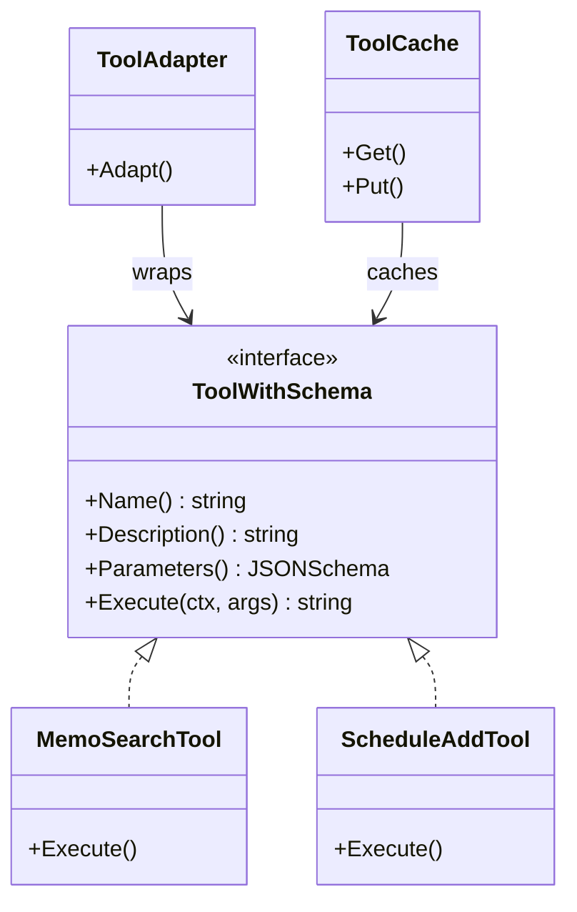

# Agent Tools (`ai/agents/tools`)

`tools` 包包含了所有 Agent 可使用的具体工具实现。

## 架构设计



## 工具列表

### Memo 相关
*   **`memo_search`**: 语义化笔记搜索。支持时间过滤、标签过滤。
*   **`memo_query_intent`**: 识别用户查询意图，提取时间、标签等条件。

### 日程相关 (Schedule)
*   **`schedule_add`**: 创建日程。
    *   *输入*: `{"title": "...", "start_time": "..."}`
    *   *特点*: 支持 ISO8601 时间格式，需先调用 `schedule_query` 查冲突。
*   **`schedule_query`**: 查询日程。
    *   *输入*: `{"start_time": "...", "end_time": "..."}`
*   **`schedule_update`**: 更新日程状态或详情。
    *   *输入*: `{"id": 123, "title": "..."}`
*   **`schedule_delete`**: 删除日程。
    *   *输入*: `{"id": 123}`
*   **`find_free_time`**: 查找空闲时间段。
    *   *输入*: `{"date": "YYYY-MM-DD"}`

### 系统工具
*   **`fallback`**: 提供通用能力，如报告无法完成。
*   **`report_inability`**: 报告代理无法完成某项任务。
*   **`preference`**: 用户偏好设置。
*   **`claude_code`**: Claude Code CLI 工具（用于 Geek/Evolution 模式）。

## 工具开发规范

所有工具必须实现 `ToolWithSchema` 接口：

```go
type ToolWithSchema interface {
    Name() string             // 工具唯一标识 (snake_case)
    Description() string      // 给 LLM 看的功能描述
    Parameters() string       // JSON Schema 格式的参数定义
    Execute(ctx, args) (string, error) // 执行逻辑
}
```

## 工具适配器

`ToolAdapter` 提供工具适配功能，支持：

*   工具结果缓存
*   工具重试机制
*   错误处理标准化

## 工具缓存

`ToolCache` 提供工具执行结果缓存：

*   **LRU 缓存**: 最近最少使用策略。
*   **TTL 支持**: 过期时间控制。
*   **缓存键**: 基于工具名称和参数生成。

## 注册机制

使用 `registry` 包进行注册，以便 `UniversalParrot` 根据配置动态加载。

```go
// 注册工具
func init() {
    registry.RegisterWithMetadata("memo_search", &MemoSearchTool{}, registry.ToolMetadata{
        Category: registry.CategoryMemo,
        Tags:     []string{"semantic", "retrieval"},
    })
}
```
