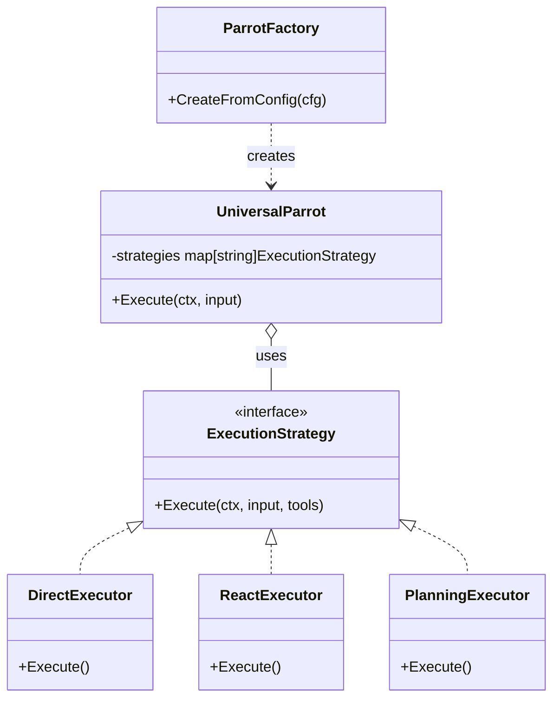

# Universal Parrot (`ai/agents/universal`)

`universal` 包实现了**配置驱动**的通用 AI Agent 系统。任何“鹦鹉 (Parrot)”都可以通过 YAML 配置文件定义，而无需编写 Go 代码。

## 架构设计



*   **`UniversalParrot`**: 通用 Agent 实现。它不包含特定的业务逻辑，而是根据配置加载不同的 Prompt、工具集合和执行策略。
*   **`ExecutionStrategy`**: 定义了 Agent 处理任务的“思考模式”。

## 执行策略 (Strategies)

1.  **Direct (直接执行)**:
    *   不做任何思考，直接将用户输入转发给 LLM。
    *   适用于闲聊或不需要工具的简单任务。
2.  **ReAct (Reason + Act)**:
    *   经典的 ReAct 循环：思考 (Thought) -> 行动 (Action/Tool) -> 观察 (Observation)。
    *   适用于大部分需要调用工具的任务。
3.  **Planning (规划执行)**:
    *   **Phase 1**: 先生成详细的步骤计划。
    *   **Phase 2**: 逐个步骤执行。
    *   适用于复杂、多步骤的任务（如“查询某天日程并发送邮件汇总”）。
4.  **Reflexion (反思执行)**:
    *   在执行失败或结果不理想时，自动触发“反思”，分析原因并重试。

## 配置示例

```yaml
id: "SCHEDULE_PARROT"
name: "ScheduleParrot"
strategy: "planning"  # 指定使用 Planning 策略
tools:                # 挂载工具
  - schedule_add
  - schedule_query
system_prompt: "你是一个日程管理助手..."
```
