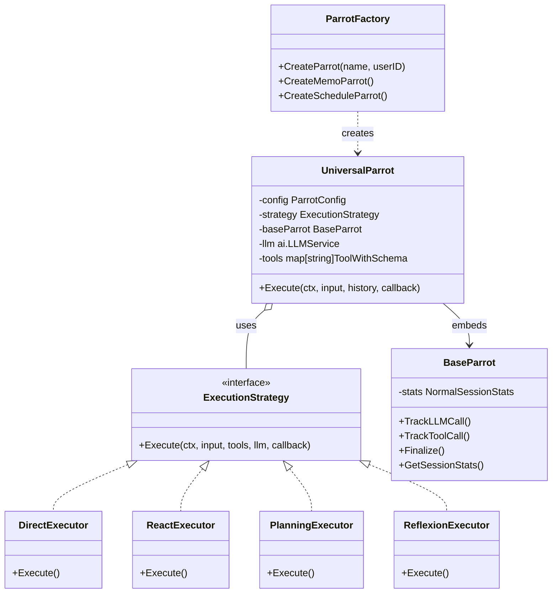

# Universal Parrot (`ai/agents/universal`)

`universal` 包实现了**配置驱动**的通用 AI Agent 系统。任何"鹦鹉 (Parrot)"都可以通过 YAML 配置文件定义，而无需编写 Go 代码。

## 架构设计



*   **`UniversalParrot`**: 通用 Agent 实现。它不包含特定的业务逻辑，而是根据配置加载不同的 Prompt、工具集合和执行策略。
*   **`ParrotFactory`**: 从 YAML 配置文件创建 Parrot 实例的工厂。
*   **`ExecutionStrategy`**: 定义了 Agent 处理任务的"思考模式"。
*   **`BaseParrot`**: 提供通用的统计累积功能（Token 消耗、执行时长、工具调用等）。

## 执行策略 (Strategies)

| 策略 | 哲学 | 适用场景 |
| :--- | :--- | :--- |
| **Direct** | "Just do it" | 简单 CRUD 操作、无需工具调用的闲聊 |
| **ReAct** | "Think then act" | 单工具查询、需要推理的搜索任务 |
| **Planning** | "Plan then execute" | 多工具协调、复杂多步骤任务 |
| **Reflexion** | "Reflect and retry" | 执行失败时的反思和重试 |

### 1. Direct (直接执行)
*   不做任何思考，直接将用户输入转发给 LLM。
*   适用于闲聊或不需要工具的简单任务。

### 2. ReAct (Reason + Act)
*   经典的 ReAct 循环：思考 (Thought) -> 行动 (Action/Tool) -> 观察 (Observation)。
*   适用于大部分需要调用工具的任务。

### 3. Planning (规划执行)
*   **Phase 1**: 先生成详细的步骤计划。
*   **Phase 2**: 逐个步骤执行。
*   适用于复杂、多步骤的任务（如"查询某天日程并发送邮件汇总"）。

### 4. Reflexion (反思执行)
*   在执行失败或结果不理想时，自动触发"反思"，分析原因并重试。
*   适用于需要多次尝试的任务。

## 配置示例

```yaml
id: "SCHEDULE_PARROT"
name: "schedule"
chinese_name: "时巧"
strategy: "planning"  # 指定使用 Planning 策略
tools:                # 挂载工具
  - schedule_add
  - schedule_query
  - find_free_time
system_prompt: "你是一个日程管理助手..."
base_url: "https://app.divinesense.com"
```

## ParrotFactory 使用

```go
factory, err := universal.NewParrotFactory(
    universal.WithConfigDir("./config/parrots"),
    universal.WithLLM(llmService),
    universal.WithGlobalToolFactories(),
)

// 创建特定鹦鹉
memoParrot, err := factory.CreateMemoParrot(userID, retriever)
scheduleParrot, err := factory.CreateScheduleParrot(userID, scheduleService)

// 或通过名称创建
parrot, err := factory.CreateParrot("memo", userID)
```

## 统计功能

UniversalParrot 嵌入 `BaseParrot` 来跟踪执行统计：

```go
stats := parrot.GetSessionStats()
// stats.PromptTokens, stats.CompletionTokens
// stats.TotalTokens, stats.TotalCostMilliCents
// stats.ToolCallCount, stats.ToolsUsed
// stats.TotalDurationMs
```
