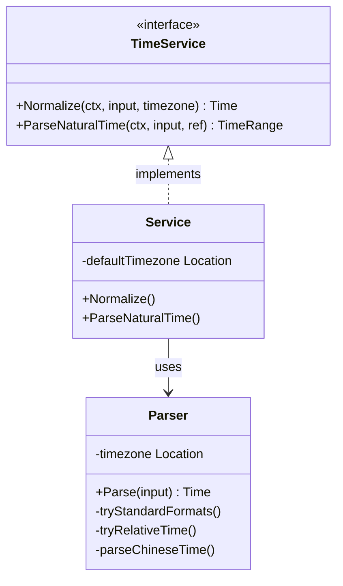

# AI Time Service (`ai/aitime`)

The `aitime` package provides natural language time parsing services for AI Agents. It converts fuzzy natural language time expressions (e.g., "明天下午三点", "下周五") into standard `time.Time` or time ranges.

## Architecture

The package consists of:

- **`TimeService` Interface**: Defines the standard time service, including `Normalize` (normalize time point) and `ParseNaturalTime` (parse time range).
- **`Service`**: Implementation class, responsible for coordinating parsing flow and context management.
- **`Parser`**: Core parsing engine with built-in rules and logic for Chinese time expressions.



## Algorithm

### Rule-based Parsing

The parser uses a hybrid strategy based on regex and keyword matching:

1. **Standard Format Matching**: First try to parse RFC3339, `yyyy-MM-dd HH:mm:ss`, etc.
2. **Relative Time Parsing**: Handle patterns like "x小时后", "x分钟前", calculate based on current reference time.
3. **Chinese Natural Language Parsing**:
   - **Relative Dates**: Identify keywords like "今天", "明天", "后天", calculate date offset.
   - **Week Inference**: Parse "下周三", "本周五", calculate target date based on current date.
   - **Time Period Mapping**: Map "早上", "下午", "晚上" to specific default hours (e.g., "下午" -> 14:00).
   - **Chinese Number Conversion**: Support Chinese number parsing like "二十三点".
   - **AM/PM Correction**: Auto-adjust 12/24 hour system based on "上午/下午" keywords or hour values (1-6 default to afternoon).

## Business Flow

```mermaid
flowchart TD
    A[User Input "明天下午3点"] --> B(Service.Normalize)
    B --> C{Time Range Keyword?}
    C -- Yes (e.g. "这周") --> D[Return TimeRange]
    C -- No --> E[Create Parser]
    E --> F{Try Standard Format}
    F -- Match --> G[Return Time]
    F -- No Match --> H{Try Relative Time "x小时后"}
    H -- Match --> G
    H -- No Match --> I{Try Chinese Natural Language}
    I --> J[Parse Relative Date (明天 -> +1d)]
    J --> K[Parse Specific Time (下午3点 -> 15:00)]
    K --> G
    I -- Fail --> L[Return Error]
```

1. **Input**: Receive natural language string from user (e.g., "明天下午3点" from "帮我定个明天下午3点的闹钟").
2. **Preprocessing**: `Service` initializes `Parser` with configured default timezone.
3. **Parsing Strategy Execution**:
   - If time range keyword (e.g., "这周"), return corresponding start and end time.
   - If specific time point, try parsing in the above order.
4. **Result Normalization**: Return parsed `time.Time` object. For ambiguous times (e.g., date only), typically default to specific time point (e.g., 9:00) or handle based on context.

## Dependencies

- Go standard library `time`, `regexp`, `strings`
