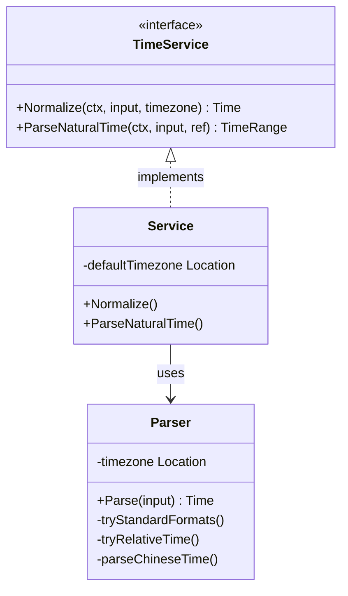

# AI Time Service (`ai/aitime`)

`aitime` 包为 AI Agent 提供自然语言时间解析服务。它能够将模糊的自然语言时间表达（如“明天下午三点”、“下周五”）转换为标准的 `time.Time` 或时间范围。

## 架构设计

该包主要由以下组件构成：

*   **`TimeService` 接口**: 定义了对外提供的时间服务标准，包括 `Normalize`（标准化时间点）和 `ParseNaturalTime`（解析时间范围）。
*   **`Service`**: 接口的实现类，负责协调解析流程及上下文管理。
*   **`Parser`**: 核心解析引擎，内置了针对中文时间表达的规则和逻辑。



## 算法设计

### 基于规则的解析 (Rule-based Parsing)
解析器采用基于正则表达式和关键词匹配的混合策略：

1.  **标准化格式匹配**: 优先尝试解析 RFC3339, `yyyy-MM-dd HH:mm:ss` 等标准格式。
2.  **相对时间解析**: 处理 "x小时后", "x分钟前" 等模式，基于当前参考时间进行计算。
3.  **中文自然语言解析**:
    *   **相对日期**: 识别 "今天", "明天", "后天" 等关键词，计算日期偏移。
    *   **星期推断**: 解析 "下周三", "本周五" 等，根据当前日期推算目标日期。
    *   **时间段映射**: 将 "早上", "下午", "晚上" 映射为具体的默认小时数（如 "下午" -> 14:00）。
    *   **中文数字转换**: 支持 "二十三点" 形式的中文数字解析。
    *   **AM/PM 修正**: 根据 "上午/下午" 关键词或小时数值（1-6点默认为下午）自动调整 12/24 小时制。

## 业务流程

```mermaid
flowchart TD
    A[用户输入 "明天下午3点"] --> B(Service.Normalize)
    B --> C{是否为时间范围关键字?}
    C -- Yes (如"这周") --> D[返回 TimeRange]
    C -- No --> E[创建 Parser]
    E --> F{尝试标准格式}
    F -- Match --> G[返回 Time]
    F -- No Match --> H{尝试相对时间 "x小时后"}
    H -- Match --> G
    H -- No Match --> I{尝试中文自然语言解析}
    I --> J[解析相对日期 (明天 -> +1d)]
    J --> K[解析具体时间 (下午3点 -> 15:00)]
    K --> G
    I -- Fail --> L[返回 Error]
```

1.  **输入接收**: 接收用户输入的自然语言字符串（如 "帮我定个明天下午3点的闹钟" 中的 "明天下午3点"）。
2.  **预处理**: `Service` 根据配置的默认时区初始化 `Parser`。
3.  **解析策略执行**:
    *   如果是时间范围关键词（如 "这周"），直接返回对应的起始和结束时间。
    *   如果是具体时间点，按上述算法顺序尝试解析。
4.  **结果标准化**: 返回解析后的 `time.Time` 对象。如果是模糊时间（如只有日期），通常默认具体时间点（如 9:00）或根据上下文处理。

## 依赖
*   Go 标准库 `time`, `regexp`, `strings`
