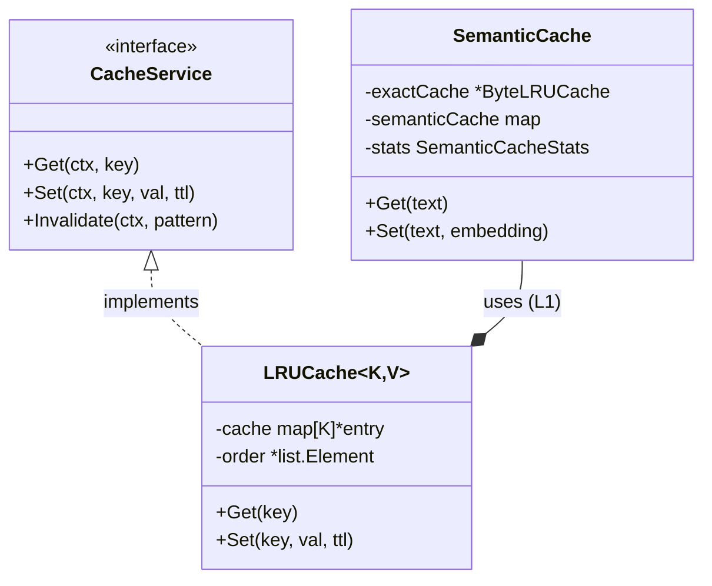
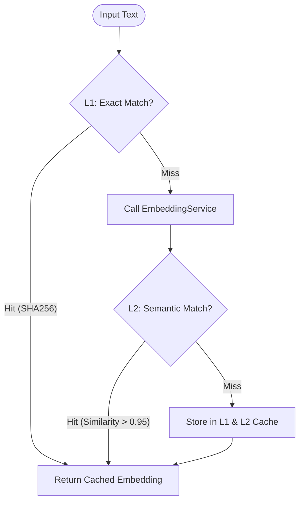

# AI Cache Service (`ai/cache`)

The `cache` package provides a two-layer caching mechanism to optimize AI Agent response speed and reduce API costs. It includes a generic in-memory LRU cache and a dedicated Semantic Cache.

## Architecture

### 1. LRU Cache (`LRUCache[K, V]`)
- **Generic**: Implemented using Go generics, supports any key-value types.
- **Thread-safe**: Uses `sync.RWMutex` for concurrent access safety.
- **TTL Support**: Each cache entry has an expiration time for automatic cleanup.

### 2. Semantic Cache (`SemanticCache`)
Implements a two-layer caching strategy for retrieving similar text embeddings and reducing redundant embedding calculations.

- **Level 1: Exact Match**
  - Uses SHA256 to hash input text.
  - Stored in `ByteLRUCache` for fast access.
- **Level 2: Semantic Match**
  - Stores text Vector Embeddings.
  - Finds similar cached entries using Cosine Similarity.

## Algorithm

1. **Input**: Text to embed.
2. **L1 Lookup**: Calculate SHA256 hash, check table. Return cached embedding on hit (similarity 1.0).
3. **L2 Lookup**:
   - Call `EmbeddingService` to generate embedding vector.
   - Iterate through all valid entries in semantic cache.
   - Calculate **Cosine Similarity** between current and cached vectors.
   - Record max similarity `max_sim` and corresponding entry.
4. **Threshold**: If `max_sim` > `SimilarityThreshold` (default 0.95), treat as semantic hit.
5. **Update**: If both miss, store new embedding in L1 and L2 cache.

## Statistics

The semantic cache tracks detailed statistics for monitoring and optimization:

| Metric | Description |
| :----- | :---------- |
| `ExactHits` | Number of exact cache hits |
| `ExactMisses` | Number of exact cache misses |
| `SemanticHits` | Number of semantic cache hits |
| `SemanticMisses` | Number of semantic cache misses |
| `SemanticSize` | Current number of entries |
| `SimilarityDistribution` | Distribution of similarity scores (buckets: 0.00-0.90, 0.90-0.95, 0.95-1.00) |

## Configuration

| Config | Default | Description |
| :----- | :------ | :---------- |
| `MaxEntries` | 1000 | Maximum cache entries |
| `SimilarityThreshold` | 0.95 | Semantic similarity threshold (0-1) |
| `TTL` | 24h | Cache entry time-to-live |
