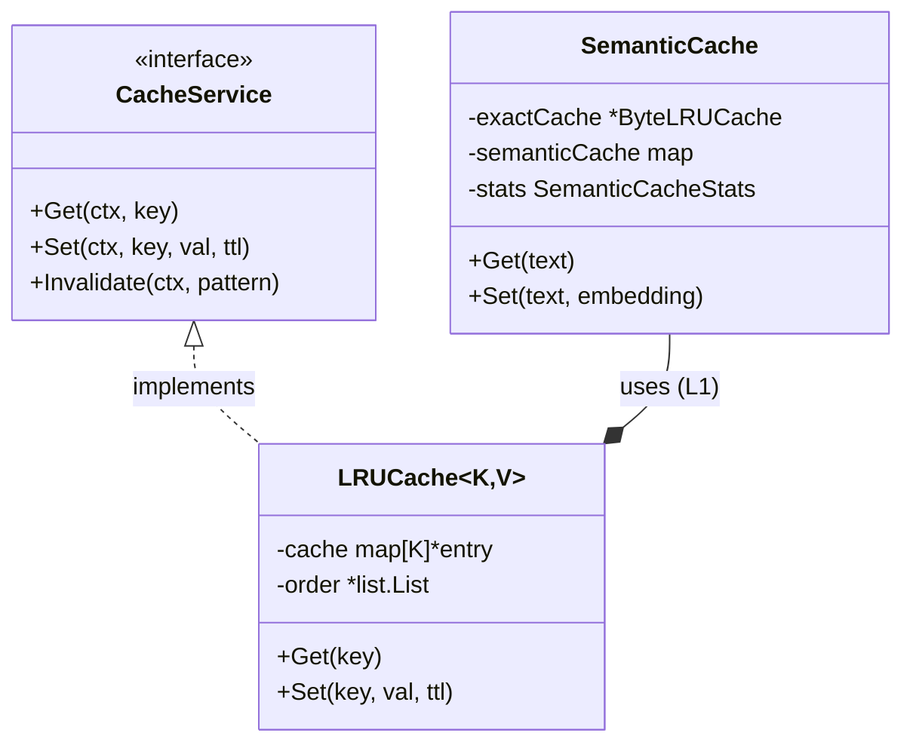
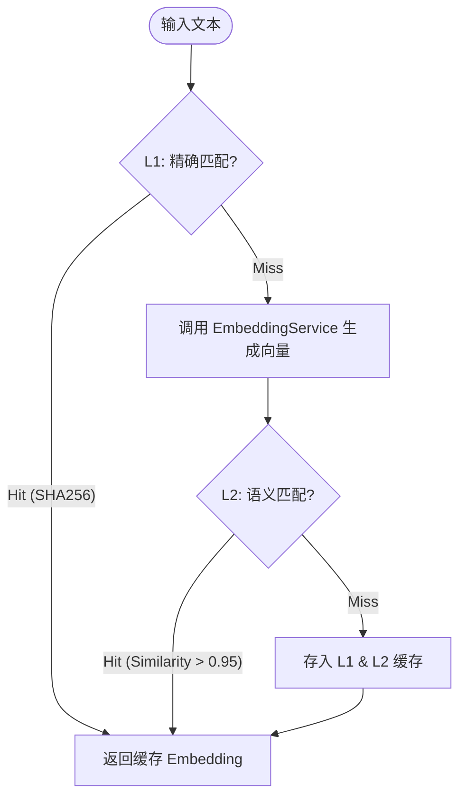

# AI Cache Service (`ai/cache`)

`cache` 包提供了两层缓存机制，旨在优化 AI Agent 的响应速度并降低 API 调用成本。它包含通用的内存 LRU 缓存和专用的语义缓存 (Semantic Cache)。

## 架构设计

### 1. LRU Cache (`LRUCache[K, V]`)
*   **通用性**: 使用 Go 泛型实现，支持任意类型的键值对。
*   **并发安全**: 使用 `sync.RWMutex` 保证并发访问安全，采用“读写分离锁”和“双重检查锁定”策略优化性能。
*   **TTL 支持**: 每个缓存项都包含过期时间，这就支持了自动过期清理。

### 2. Semantic Cache (`SemanticCache`)
语义缓存实现了两级缓存策略，用于检索相似的文本 Embedding，减少重复的 Embedding 计算。
*   **Level 1: 精确匹配 (Exact Match)**
    *   使用 SHA256 对输入文本进行哈希。
    *   基于 `ByteLRUCache` 存储，速度极快。
*   **Level 2: 语义匹配 (Semantic Match)**
    *   存储文本的 Vector Embedding。
    *   通过计算 Cosine Similarity (余弦相似度) 查找相似的已缓存条目。

## 算法设计

### 语义匹配流程

1.  **输入**: 待 Embedding 的文本。
2.  **L1 查找**: 计算 SHA256 哈希，查表。命中则直接返回缓存的 Embedding (相似度 1.0)。
3.  **L2 查找**:
    *   调用 `EmbeddingService` 生成当前文本的 Embedding 向量。
    *   遍历语义缓存中的所有有效条目。
    *   计算当前向量与缓存条目向量的 **余弦相似度 (Cosine Similarity)**.
    *   记录最大相似度 `max_sim` 和对应的条目。
4.  **阈值判定**: 如果 `max_sim` > `SimilarityThreshold` (默认 0.95)，则视为语义命中，返回缓存结果。
5.  **更新**: 如果都未命中，将新生成的 Embedding 存入 L1 和 L2 缓存。

## 业务流程

*   **对于上层服务 (如 Team B/C)**: 调用 `Get(text)`。
*   **内部处理**: `SemanticCache` 透明地处理精确匹配和模糊语义匹配，上层无需感知底层的向量计算细节，只需关注是否拿到了可用的 Embedding。

## 特定配置
*   **MaxEntries**:最大缓存条目数。
*   **SimilarityThreshold**: 语义相似度阈值 (0-1)。
*   **TTL**: 缓存有效期。
