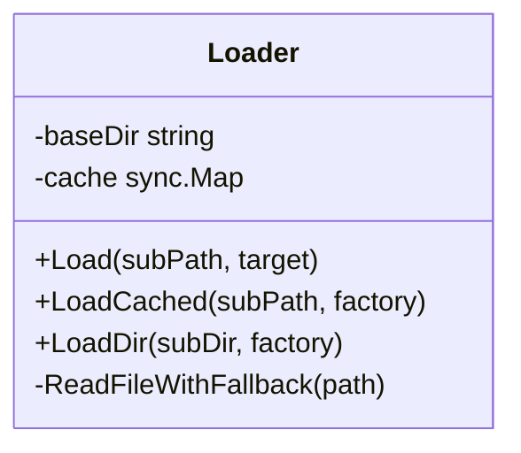
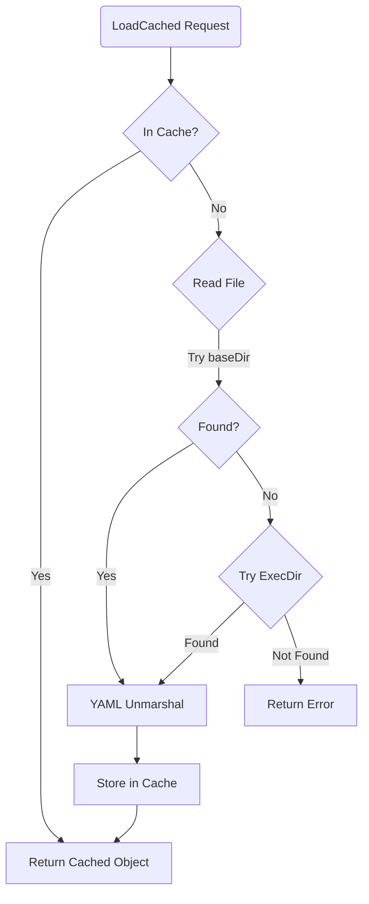

# AI Config Loader (`ai/configloader`)

The `configloader` package provides a unified, simple YAML configuration file loader, designed for AI modules, supporting caching and path fallback mechanisms.

## Architecture

- **`Loader`**: Core struct holding a base directory (`baseDir`) and a thread-safe cache (`sync.Map`).
- **Caching Mechanism**: Loaded configuration objects are cached in memory to avoid repeated disk reads and YAML parsing.
- **Fallback Mechanism**: Considering differences between development and deployment environments, the loader supports automatic path fallback lookup.

## Algorithm

1. **Request Config**: Call `LoadCached(path, factory)`.
2. **Check Cache**: Check if memory `cache` already has the config object. Return directly if yes.
3. **Read File**:
   - First try reading `baseDir/path`.
   - If failed (e.g., in test or binary running environment), try looking up relative to executable file.
4. **Parse**: Use `yaml.v3` to Unmarshal file content into target struct created by `factory` function.
5. **Cache Fill**: Store successfully parsed object in `cache` for next use.

## Methods

| Method | Description |
| :----- | :---------- |
| `Load` | Load single YAML file |
| `LoadCached` | Load with caching |
| `LoadDir` | Load all YAML files from directory |
| `ClearCache` | Clear configuration cache |

## Use Case

Used to load Agent Prompt templates, model configurations, tool definitions and other static resource files, ensuring resources can be found correctly in different running environments.
