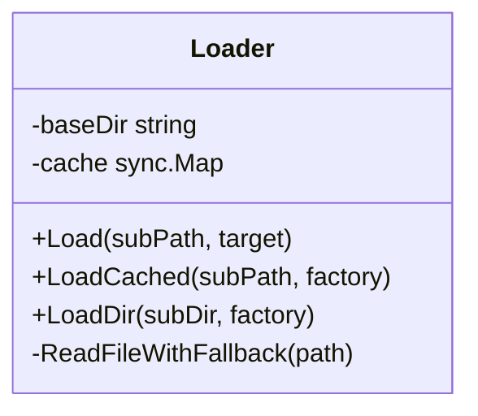
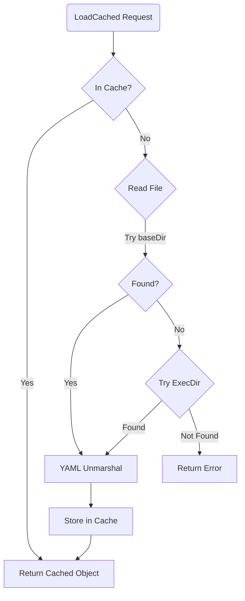

# AI Config Loader (`ai/configloader`)

`configloader` 包提供了一个统一的、简单的 YAML 配置文件加载器，专为 AI 模块设计，支持缓存和路径回退机制。

## 架构设计

*   **`Loader`**: 核心结构体，持有一个基础目录 (`baseDir`) 和一个线程安全的缓存 (`sync.Map`)。
*   **缓存机制**: 加载过的配置对象会被缓存在内存中，避免重复读取磁盘和解析 YAML。
*   **回退机制 (Fallback)**: 考虑到开发环境和部署环境的差异，加载器支持自动路径回退查找。

## 算法与流程

1.  **请求配置**: 调用 `LoadCached(path, factory)`。
2.  **查缓存**: 检查内存 `cache` 是否已有该路径的配置对象。如有直接返回。
3.  **文件读取**:
    *   优先尝试读取 `baseDir/path`。
    *   如果失败（例如在测试或构建后的二进制运行环境中），尝试相对于可执行文件 (`Executable Directory`) 的路径查找。
4.  **解析**: 使用 `yaml.v3` 将文件内容 Unmarshal 到由 `factory` 函数创建的目标结构体中。
5.  **缓存回填**: 将解析成功的对象存入 `cache`，供下次使用。

## 业务场景

用于加载 Agent 的 Prompt 模板、模型配置、工具定义等静态资源文件，确保在不同运行环境下都能正确找到资源。
