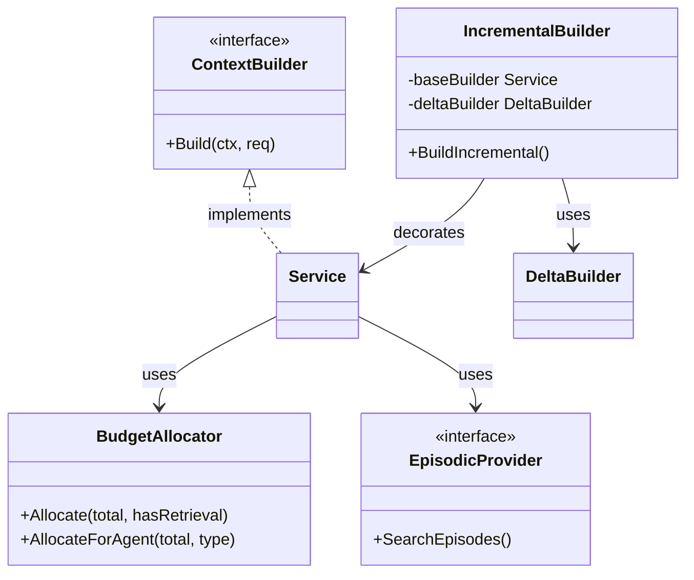
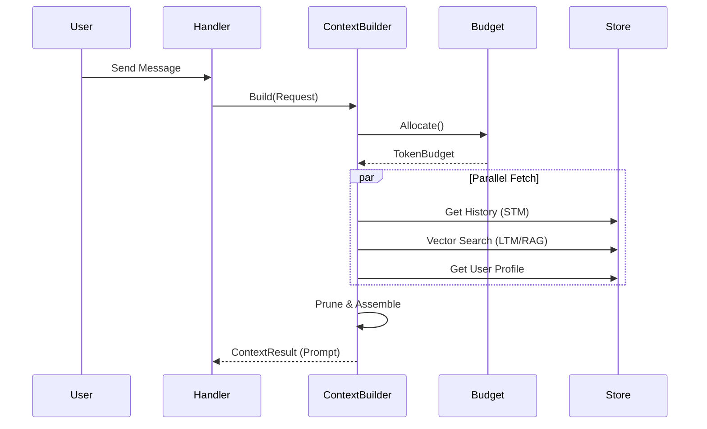

# AI Context Management (`ai/context`)

`context` 包是 AI Agent 的核心组件之一，负责构建、管理和优化发送给 LLM 的上下文窗口 (Context Window)。它实现了动态 Token 预算分配、增量上下文更新 (Delta Update) 和长短期记忆管理。

## 架构设计

该包包含以下核心模块：

1.  **`BudgetAllocator` (预算分配器)**: 负责根据 Agent 类型和配置，计算各类信息（系统提示词、短期记忆、长期记忆、检索内容）的 Token 配额。
2.  **`ContextBuilder` (上下文构建器)**: 编排整个构建流程，从不同源（Memory, RAG, User Profile）拉取数据并组装。
3.  **`DeltaBuilder` (增量构建器)**: 实现高效的上下文更新策略，计算前后两次请求的差异，支持 System Prompt Caching。
4.  **`EpisodicProvider` (情景记忆提供者)**: 基于向量搜索的长短期记忆检索接口。

## 算法设计

### 1. 动态 Token 预算分配
根据 `TokenBudget` 结构进行分配。
*   **基础分配**: 预留 System Prompt 和 User Preferences。
*   **剩余分配**: 根据是否有检索结果 (RAG)，动态调整 Short-term Memory (STM) 和 Long-term Memory (LTM) 的比例。
    *   *有 RAG*: 侧重 RAG 内容 (45%)，减少 STM (40%)。
    *   *无 RAG*: 侧重 STM (55%)。
*   **长对话自适应**: 当对话轮数超过阈值 (`HistoryLengthThreshold=20`)，自动压缩 STM 的比例，增加 LTM 配额，以应对超长上下文产生的“遗忘”问题。

### 2. 增量上下文更新 (Incremental Update)
为了配合支持 Context Caching 的 LLM (如 DeepSeek, Claude)，实现了多种更新策略：
*   **`ComputeDelta`**: 计算并仅发送变化的部分（如新增的 Retrieval Items, 新的 Query）。
*   **`AppendOnly`**: 仅追加新消息，复用之前的 System Prompt 前缀 Hash。
*   **`UpdateConversationOnly`**: 当 System Prompt 未变时，仅更新对话列表部分。
*   通过 SHA256 Hash 比对 System Prompt、User Prefs 等静态区块，决定使用哪种策略。

### 3. 多级记忆检索
*   **短期记忆**: 也就是最近的 N 轮对话历史。
*   **长期记忆 (Episodic)**: 使用向量相似度 (Embedding + Vector Search) 从历史 Memo 或 Episode 中检索与当前 Query 相关的片段。

## 业务流程

1.  **请求接入**: 接收 `ContextRequest`，包含 SessionID, Query, UserID 等。
2.  **预算计算**: `BudgetAllocator` 计算当前请求的 Token 分布。
3.  **策略选择**: `DeltaBuilder` 检查是否有可复用的上一轮 Snapshot，选择更新策略。
4.  **内容组装**:
    *   获取 System Prompt (可能包含 Template 渲染)。
    *   获取 User Preferences (时区、语言风格)。
    *   获取短期对话历史 (Pruning 到预算范围内)。
    *   执行 RAG / Episodic Search 获取相关背景信息。
5.  **输出生成**: 返回 `ContextResult`，包含最终拼接好的 Prompt 字符串和各部分 Token 统计。

## 依赖
*   `ai/core/embedding`: 用于向量化。
*   `store`: 用于向量存储访问。
