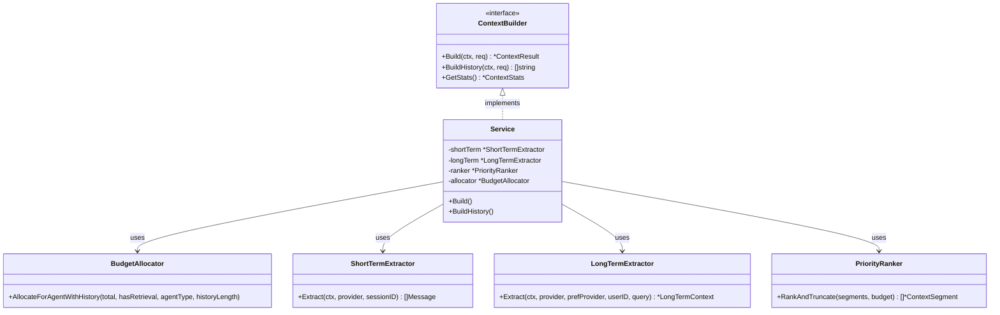
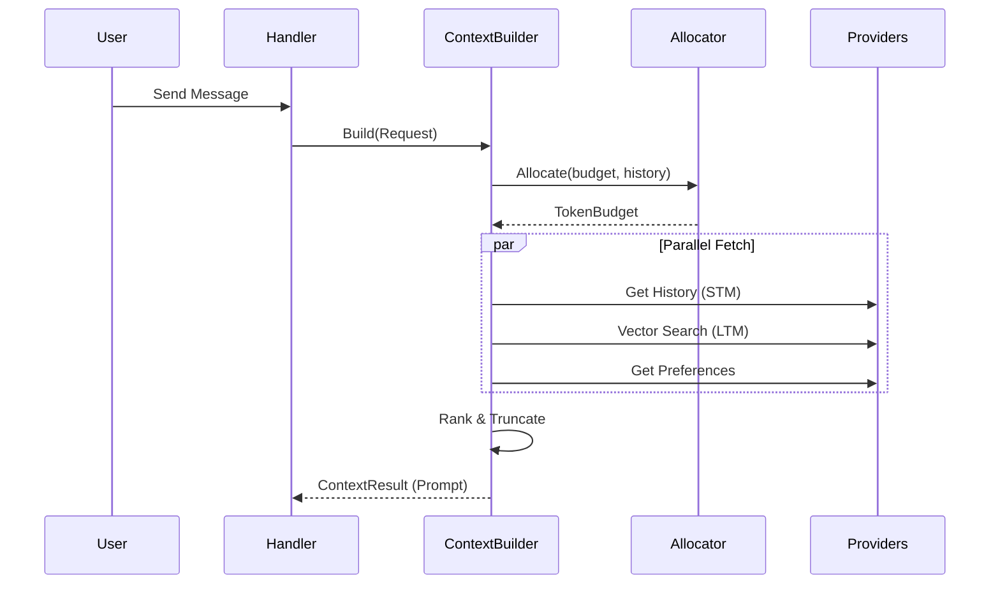

# AI Context Management (`ai/context`)

`context` 包是 AI Agent 的核心组件之一，负责构建、管理和优化发送给 LLM 的上下文窗口 (Context Window)。它实现了动态 Token 预算分配、增量上下文更新 (Delta Update) 和长短期记忆管理。

## 架构设计



## 核心模块

### 1. ContextBuilder 接口

```go
type ContextBuilder interface {
    Build(ctx context.Context, req *ContextRequest) (*ContextResult, error)
    BuildHistory(ctx context.Context, req *ContextRequest) ([]string, error)
    GetStats() *ContextStats
}
```

### 2. Service 实现

组合多个提取器和分配器，提供完整的上下文构建能力：

- **ShortTermExtractor**: 提取近期对话历史
- **LongTermExtractor**: 提取情景记忆和用户偏好
- **PriorityRanker**: 基于优先级裁剪内容以适应预算
- **BudgetAllocator**: 动态 Token 预算分配

### 3. Provider 接口

- **MessageProvider**: 对话消息提供者
- **EpisodicProvider**: 情景记忆检索接口
- **PreferenceProvider**: 用户偏好提供者
- **CacheProvider**: 上下文缓存（可选）

## 算法设计

### 1. 动态 Token 预算分配

根据 `TokenBudget` 结构进行分配：

- **基础分配**: 预留 System Prompt
- **对话历史分配**: 根据对话轮数动态调整
  - 短对话 (< 20 轮): 侧重短期记忆 (STM 55%)
  - 长对话 (>= 20 轮): 自动压缩 STM，增加情景记忆配额
- **RAG 调整**: 有检索结果时，侧重检索内容 (45%)，减少 STM (40%)

### 2. 优先级裁剪

按优先级从低到高裁剪内容：

```
PrioritySystem > PriorityRecentTurns > PriorityRetrieval >
PriorityEpisodic > PriorityOlderTurns > PriorityPreferences
```

### 3. 多级记忆检索

- **短期记忆**: 最近 N 轮对话历史（可配置，默认 10 轮）
- **长期记忆 (Episodic)**: 向量相似度搜索历史 Memo

## 业务流程



1. **请求接入**: 接收 `ContextRequest`，包含 SessionID, Query, UserID 等
2. **预算计算**: 根据 Agent 类型和对话历史长度动态计算 Token 分布
3. **并行拉取**: 同时获取短期记忆、长期记忆、用户偏好
4. **优先级裁剪**: 按优先级排序并裁剪到预算范围内
5. **结果组装**: 返回 `ContextResult`，包含各部分内容和 Token 统计

## ContextResult 结构

```go
type ContextResult struct {
    TokenBreakdown      *TokenBreakdown
    SystemPrompt        string
    ConversationContext string
    RetrievalContext    string
    UserPreferences     string
    TotalTokens         int
    BuildTime           time.Duration
}
```

## 配置

```go
type Config struct {
    MaxTurns    int           // 最大对话轮数 (default: 10)
    MaxEpisodes int           // 最大情景记忆数 (default: 3)
    MaxTokens   int           // 默认最大 token 数 (default: 4096)
    CacheTTL    time.Duration // 缓存 TTL (default: 5 minutes)
}
```

## 目录结构

```
ai/context/
├── builder.go            # ContextBuilder 接口
├── builder_impl.go       # Service 实现
├── budget.go            # 预算分配器
├── budget_profiles.go   # 预算配置文件
├── short_term.go        # 短期记忆提取
├── long_term.go         # 长期记忆提取
├── priority.go          # 优先级排序
├── episodic_provider.go # 情景记忆接口
├── provider.go          # Provider 接口定义
├── store_adapter.go     # 存储适配器
├── delta.go            # 增量更新 (保留)
└── container.go        # 上下文容器
```

## 使用示例

```go
service := context.NewService(cfg).
    WithMessageProvider(msgProvider).
    WithEpisodicProvider(episodicProvider).
    WithPreferenceProvider(prefProvider)

req := &ContextRequest{
    SessionID:     "session-123",
    CurrentQuery: "帮我找一下上周的会议记录",
    AgentType:    "memo",
    UserID:       1,
    MaxTokens:    4096,
}

result, err := service.Build(ctx, req)
```
