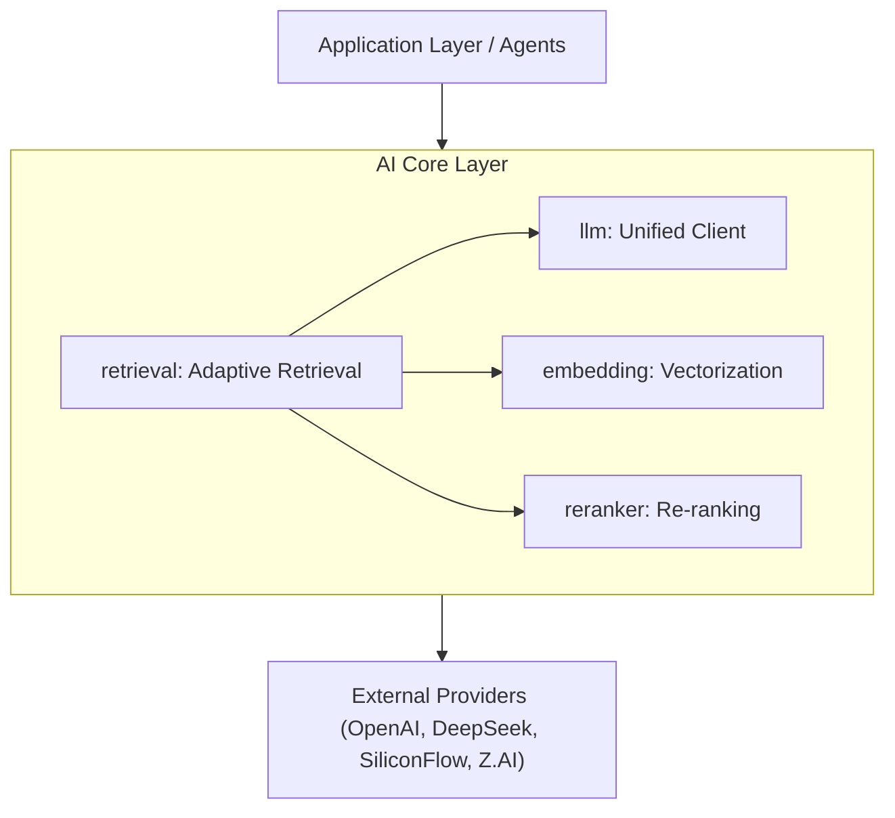

# AI Core Services (`ai/core`)

`core` 包提供了 DivineSense 全局使用的基础 AI 服务接口与实现。

## Overview

These are foundational, well-tested services that form the cornerstone of upper-layer AI capabilities.



## Subpackages

### `embedding` (Vector Service)

Provides unified embedding generation interface for text vectorization.

- **Unified Interface**: Abstracts differences between providers (OpenAI, SiliconFlow, DashScope).
- **Batch Processing**: Supports concurrent batch operations with concurrency limiting (max 3 parallel).
- **Chunking**: Automatic document chunking with overlap for long content.
- **Embedder**: High-level API for memo embedding with automatic averaging pool.

### `llm` (Large Language Model)

Unified Chat interface supporting streaming and function calling.

- **Multi-Provider Support**: DeepSeek, SiliconFlow, Z.AI (智谱), DashScope, OpenAI, OpenRouter, Ollama.
- **Function Calling**: Built-in tool/function calling support with low temperature for deterministic behavior.
- **Streaming**: Full streaming support with usage stats (TTFT, generation duration).
- **Observability**: Integrated metrics tracking (token usage, latency, cache hits).
- **Warmup**: Connection warmup for faster first request.

Key interfaces:
```go
type Service interface {
    Chat(ctx context.Context, messages []Message) (string, *LLMCallStats, error)
    ChatStream(ctx context.Context, messages []Message) (<-chan string, <-chan *LLMCallStats, <-chan error)
    ChatWithTools(ctx context.Context, messages []Message, tools []ToolDescriptor) (*ChatResponse, *LLMCallStats, error)
    Warmup(ctx context.Context)
}
```

### `reranker` (Re-ranking)

Used for the final step in RAG (Retrieval-Augmented Generation), re-ranking retrieved documents to improve accuracy.

- **Provider**: SiliconFlow (primary), generic OpenAI-compatible.
- **Configurable**: Can be disabled for fallback behavior.

### `retrieval` (Adaptive Retrieval)

Implements intelligent retrieval with multiple strategies:

#### Retrieval Strategies

| Strategy                      | Description                                        |
| ----------------------------- | -------------------------------------------------- |
| `schedule_bm25_only`          | Schedule-only query with BM25 + time filter        |
| `memo_list_only`              | Direct SQL listing (fastest, for "list all memos") |
| `memo_filter_only`            | SQL filtering by time/tags                         |
| `memo_bm25_only`              | Pure BM25 keyword search                           |
| `memo_semantic_only`          | Pure vector semantic search                        |
| `hybrid_bm25_weighted`        | Hybrid (BM25 0.7 + Semantic 0.3)                   |
| `hybrid_with_time_filter`     | Hybrid + time filtering                            |
| `hybrid_standard`             | Standard hybrid (BM25 0.5 + Semantic 0.5)          |
| `full_pipeline_with_reranker` | Full pipeline with Rerank                          |

#### Advanced Features

- **RRF Fusion**: Reciprocal Rank Fusion for combining BM25 and vector results.
- **Quality Assessment**: Automatic result quality evaluation (High/Medium/Low).
- **Dynamic Weighting**: Adjusts BM25/Vector weights based on result quality.
- **Fallback Logic**: Automatic BM25 fallback when semantic quality is low.
- **Smart Reranking**: Conditional reranking based on query complexity.
- **Time Optimization**: Default 90-day window for vector search performance.
