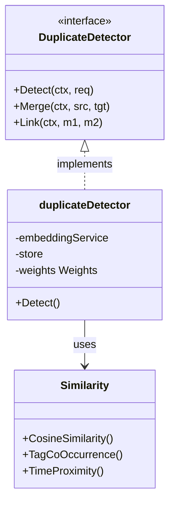

# AI Duplicate Detection (`ai/duplicate`)

The `duplicate` package implements a multi-modal feature-based memo duplicate detection and relationship recommendation algorithm.

## Architecture



- **`DuplicateDetector` Interface**: Defines three core operations: `Detect`, `Merge`, `Link`.
- **Multi-dimensional Similarity Model**: Combines vector semantics, tag system, and time dimensions.

## Algorithm

Uses **Weighted Hybrid Similarity** to calculate similarity score (0-1):

`Score = (Vector * 0.5) + (TagCoOccur * 0.3) + (TimeProx * 0.2)`

### 1. Semantic Similarity (weight 0.5)
- Calculate Cosine Similarity of text embeddings.
- Captures semantic-level similarity.

### 2. Tag Co-occurrence (weight 0.3)
- Calculate Jaccard Similarity (intersection/union) of tag sets.
- Captures explicit user categorization similarity.

### 3. Time Proximity (weight 0.2)
- Use exponential decay function: `exp(-days_diff / 7)`.
- Half-life is 7 days - notes closer in time are more relevant.

## Thresholds

- **Duplicate**: Score > 0.9. System prompts user about possible duplicate content.
- **Related**: 0.7 < Score <= 0.9. System recommends as related notes.

## Workflow

```mermaid
flowchart TD
    Start[New Memo Input] --> Embed[Generate Embedding]
    Embed --> Search[Vector Search (Top-N Candidates)]
    Search --> Candidates

    subgraph Similarity Check
        direction TB
        Candidates --> Calc1[Vector Similarity]
        Candidates --> Calc2[Tag Jaccard]
        Candidates --> Calc3[Time Decay]
        Calc1 & Calc2 & Calc3 --> WeightedSum[Weighted Sum]
    end

    WeightedSum --> Score{Score Check}
    Score -- > 0.9 --> Dup[Mark as Duplicate]
    Score -- 0.7-0.9 --> Rel[Mark as Related]
    Score -- < 0.7 --> Ignore[Ignore]

    Dup & Rel --> Response[Return Detection Result]
```

1. User inputs memo content.
2. System calls `Detect` asynchronously or synchronously.
3. Calculate hybrid similarity with existing memos.
4. Return Top-K results with similarity scores and breakdown factors.

## Core Operations

### Detect
- Generate embedding for new content
- Vector search for top-K candidates
- Calculate 3D similarity for each candidate
- Categorize into Duplicates or Related

### Merge
- Merge content from source to target memo
- Merge tags (union, case-insensitive deduplication)
- Archive source memo (set to ARCHIVED status)

### Link
- Create bidirectional relation between two memos
- Uses `MemoRelationReference` type
