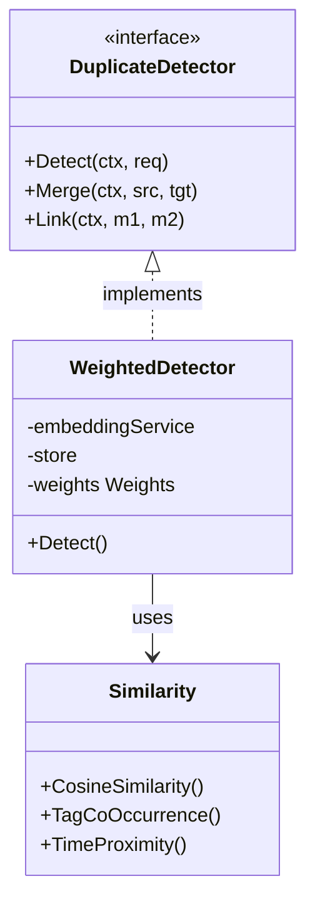

# AI Duplicate Detection (`ai/duplicate`)

`duplicate` 包实现了基于多模态特征的 Memo 重复检测与关联推荐算法。

## 架构设计



*   **`DuplicateDetector` 接口**: 定义了 `Detect`（检测）、`Merge`（合并）、`Link`（关联）三个核心操作。
*   **多维相似度模型**: 不仅仅依赖文本相似度，而是融合了向量语义、标签系统和时间维度的综合打分机制。

## 算法设计

采用 **加权混合相似度 (Weighted Hybrid Similarity)** 算法计算两个 Memo 的相似分 (0-1)：

`Score = (Vector * 0.5) + (TagCoOccur * 0.3) + (TimeProx * 0.2)`

1.  **Semantic Similarity (权重 0.5)**:
    *   计算文本 Embedding 的 Cosine Similarity。
    *   捕捉语义层面的相似性。
2.  **Tag Co-occurrence (权重 0.3)**:
    *   计算标签集合的 Jaccard Similarity (交集/并集)。
    *   捕捉用户显式分类的相似性。
3.  **Time Proximity (权重 0.2)**:
    *   使用指数衰减函数: `exp(-days_diff / 7)`。
    *   半衰期为 7 天，意味着时间越接近的笔记越相关。

## 判定阈值

*   **Duplicate (重复)**: Score > 0.9。系统会提示用户这可能是重复内容。
*   **Related (相关)**: 0.7 < Score <= 0.9。系统会将其推荐为相关笔记。

## 业务流程

```mermaid
flowchart TD
    Start[新笔记输入] --> Embed[生成 Embedding]
    Embed --> Search[Vector Search (Top-N Candidates)]
    Search --> Candidates
    
    subgraph Similarity Check
        direction TB
        Candidates --> Calc1[计算 Vector Similarity]
        Candidates --> Calc2[计算 Tag Jaccard]
        Candidates --> Calc3[计算 Time Decay]
        Calc1 & Calc2 & Calc3 --> WeightedSum[加权求和]
    end
    
    WeightedSum --> Score{Score Check}
    Score -- > 0.9 --> Dup[标记为 Duplicate]
    Score -- 0.7-0.9 --> Rel[标记为 Related]
    Score -- < 0.7 --> Ignore[忽略]
    
    Dup & Rel --> Response[返回检测结果]
```

1.  用户输入 Memo 内容。
2.  系统异步或同步调用 `Detect`。
3.  计算与库中已有 Memo 的混合相似度。
4.  返回 Top-K 结果，包含相似度得分及其构成因子（Breakdown），便于前端展示（如 "语义相似 0.8, 时间相近 0.9"）。
