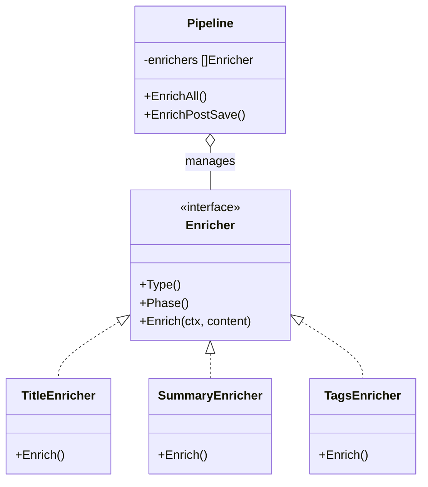
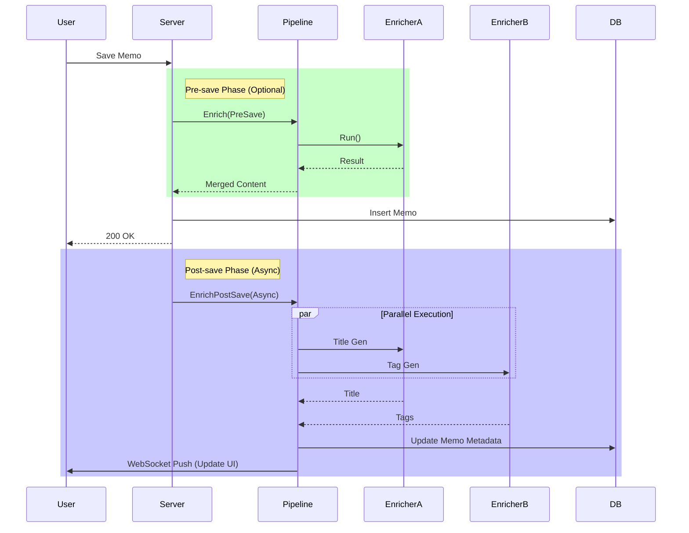

# AI Enrichment Pipeline (`ai/enrichment`)

The `enrichment` package implements an extensible content enrichment pipeline for automatically extracting metadata before/after Memo saving.

## Architecture

Uses **Pipeline Pattern** and **Concurrent Execution Model**.

- **`Enricher` Interface**: Defines single enrichment capability, including `Type` (type), `Phase` (phase), `Enrich` (logic).
- **`Pipeline`**: Responsible for orchestrating multiple Enrichers.
  - **Parallel Execution**: Uses Goroutine + WaitGroup to concurrently execute all independent enrichment tasks, controlled by `context.WithTimeout`.
  - **Phase Separation**: Supports `PreSave` (blocking before save) and `PostSave` (async after save) modes.

## Enrichment Types

Currently built-in Enrichers include:

1. **Title Enricher**: Automatically generate short, concise titles.
2. **Summary Enricher**: Generate one-sentence summary.
3. **Tags Enricher**: Automatically recommend tags based on content.

## Workflow

1. **User saves Memo**.
2. **Pre-save (Optional)**: Execute tasks that need immediate feedback like formatting.
3. **Post-save (Async)**:
   - Trigger `Pipeline.EnrichPostSave`.
   - Parallel call Title, Summary, Tags generators.
   - LLM analyzes content and returns results.
   - Store results in database, push to frontend via WebSocket to update UI.

## Pipeline Methods

| Method | Description |
| :----- | :---------- |
| `EnrichAll` | Execute all enrichers in parallel (both Pre and Post) |
| `EnrichPostSave` | Execute only Post-save phase enrichers |
| `EnrichOne` | Execute single enrichment type |

## Timeout

Default pipeline timeout: 30 seconds.
