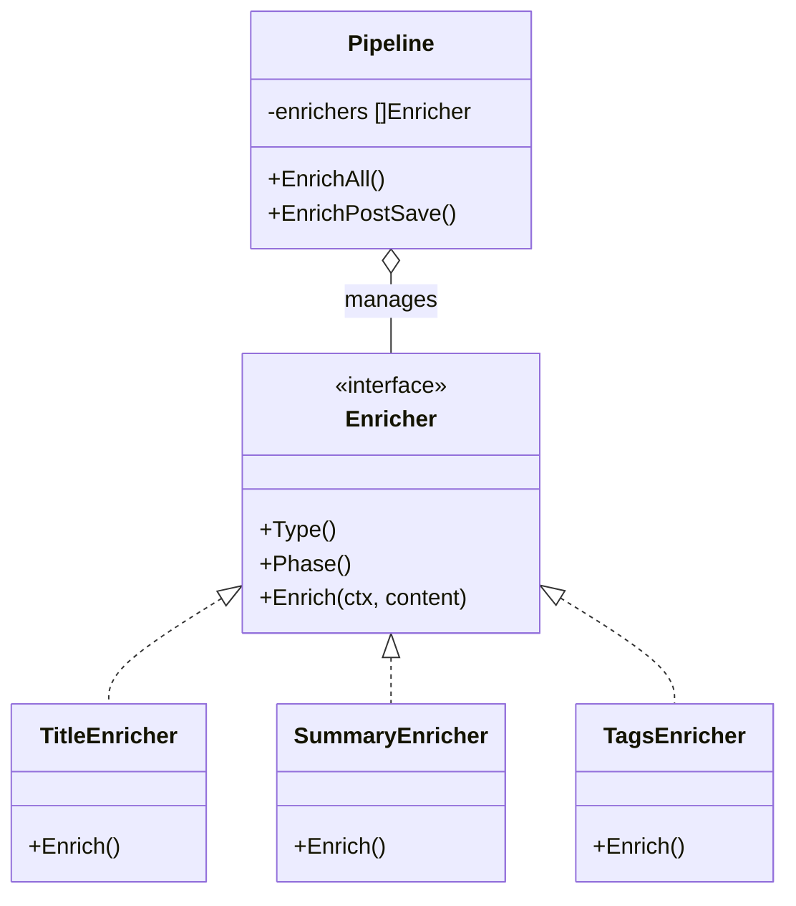
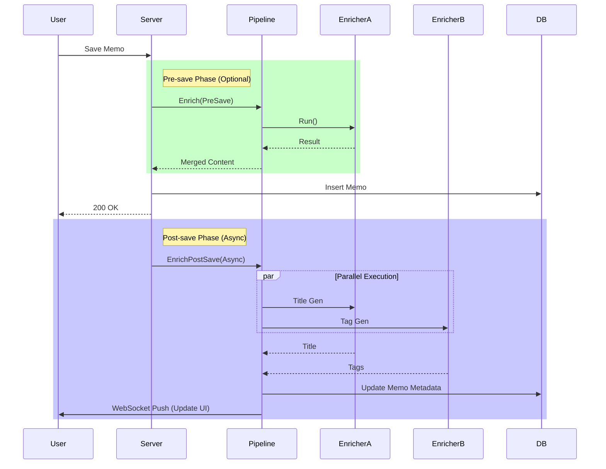

# AI Enrichment Pipeline (`ai/enrichment`)

`enrichment` 包实现了一个可扩展的内容增强管线 (Pipeline)，用于在 Memo 保存前后自动提取元数据。

## 架构设计

采用 **Pipeline Pattern** 和 **并发执行模型**。

*   **`Enricher` 接口**: 定义了单一增强能力的规范，包含 `Type` (类型), `Phase` (阶段), `Enrich` (逻辑)。
*   **`Pipeline`**: 负责编排多个 Enricher。
    *   **并行执行**: 使用 Goroutine + WaitGroup 并发执行所有独立的增强任务，由 `context.WithTimeout` 控制整体超时。
    *   **阶段分离**: 支持 `PreSave` (存前阻塞) 和 `PostSave` (存后异步) 两种模式。

## 算法与能力

当前内置的 Enricher 包括：

1.  **Title Enricher**: 自动生成简短、概括性的标题。
2.  **Summary Enricher**: 生成一句话摘要。
3.  **Tags Enricher**: 基于内容自动推荐标签 (Taxonomy)。

## 业务流程

1.  **用户保存 Memo**。
2.  **Pre-save (可选)**: 执行格式化等需要即时反馈的任务。
3.  **Post-save (异步)**:
    *   触发 `Pipeline.EnrichPostSave`。
    *   并行调用 Title, Summary, Tags 生成器。
    *   LLM 分析内容并返回结果。
    *   结果存入数据库，通过 WebSocket 推送给前端更新 UI。
