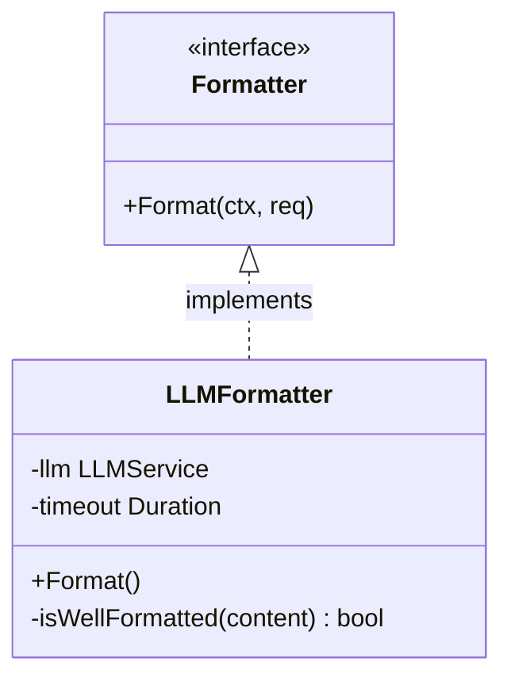

# AI Formatter (`ai/format`)

`format` 包提供智能文本格式化服务，能够将用户随意的输入转换为结构清晰的标准 Markdown。

## 架构设计



*   **`Formatter` 接口**: 定义格式化能力。
*   **`llmFormatter`**: 基于 LLM 的实现。
*   **Heuristic Check (启发式检查)**: 在调用昂贵的 LLM 之前，先通过规则判断内容是否已经是良好的 Markdown，避免浪费 Token。

## 算法流程

```mermaid
flowchart TD
    Start[输入文本] --> Check{isWellFormatted?}
    Check -- Yes --> ReturnPass[返回原文本 (Passthrough)]
    Check -- No --> BuildPrompt[构造 Prompt]
    BuildPrompt --> CallLLM[调用 LLM]
    CallLLM -- Success --> Clean[代码块清洗]
    CallLLM -- Fail --> ReturnPass
    Clean --> ReturnFormat[返回格式化文本]
```

1.  **接收输入**: 用户输入的纯文本。
2.  **预检查 (`isWellFormatted`)**:
    *   检查文本长度。
    *   统计 Markdown 特征字符（`#`, `- `, `* `, `1. `）的密度。
    *   如果判断已经格式良好，直接返回原文本 (`Source: passthrough`)。
3.  **LLM 格式化**:
    *   如果预检查不通过，构造 Prompt："请将以下内容整理为标准 Markdown 格式..."。
    *   调用 LLM 生成。
4.  **后处理**:
    *   去除 LLM 可能包裹的 \`\`\`markdown 代码块标记。
    *   返回清洗后的 Markdown 文本。

## 业务场景

主要用于 Memo 输入框的 "一键美化" 功能，帮助用户快速整理凌乱的会议记录或想法。
