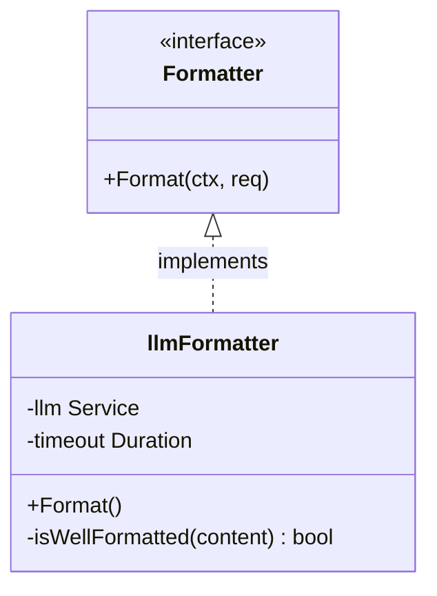

# AI Formatter (`ai/format`)

The `format` package provides intelligent text formatting service, converting user casual input into structured standard Markdown.

## Architecture



- **`Formatter` Interface**: Defines formatting capability.
- **`llmFormatter`**: LLM-based implementation.
- **Heuristic Check**: Before calling expensive LLM, first check if content is already well-formatted Markdown using rules to avoid wasting tokens.

## Algorithm Flow

```mermaid
flowchart TD
    Start[Input Text] --> Short{Short Text?}
    Short -- Yes (<50 chars) --> Check{isWellFormatted?}
    Short -- No --> Check

    Check -- Yes --> ReturnPass[Return Original Text (Passthrough)]
    Check -- No --> BuildPrompt[Build Prompt]
    BuildPrompt --> CallLLM[Call LLM]
    CallLLM -- Success --> Clean[Clean Code Block]
    CallLLM -- Fail --> ReturnPass
    Clean --> ReturnFormat[Return Formatted Text]
```

1. **Receive Input**: Plain text from user.
2. **Pre-check (`isWellFormatted`)**:
   - Check text length (< 50 chars returns false).
   - Count Markdown feature characters (`#`, `- `, `* `, `1. `) density.
   - If at least 2 Markdown markers found, consider already well-formatted, return original text (`Source: passthrough`).
3. **LLM Formatting**:
   - If pre-check fails, build prompt: "请将以下内容整理为标准 Markdown 格式...".
   - Call LLM to generate.
4. **Post-processing**:
   - Remove `\`\`\`markdown` code block markers that LLM might wrap around.
   - Return cleaned Markdown text.

## Configuration

| Config | Default | Description |
| :----- | :------ | :---------- |
| `Timeout` | 10s | LLM call timeout |

## System Prompt

```
你是一个笔记格式化助手。将用户随意输入的内容整理为结构清晰的 Markdown 格式。

规则：
1. 保持原文含义完全不变，不添加、不删除任何信息
2. 合理使用 Markdown 标记：标题(#)、列表(-)、加粗(**)、代码块(''')
3. 如果内容包含多个主题，使用标题分隔
4. 如果内容是清单/列表形式，转为 Markdown 列表
5. 如果内容已经格式良好，原样返回
6. 不要添加额外的标题或总结
7. 直接返回格式化后的 Markdown，不要包裹在 JSON 或代码块中
8. 如果原文是英文，使用英文标点；如果是中文，使用中文标点
```

## Use Case

Mainly used for "One-click Beautify" feature in Memo input box, helping users quickly organize messy meeting notes or ideas.
