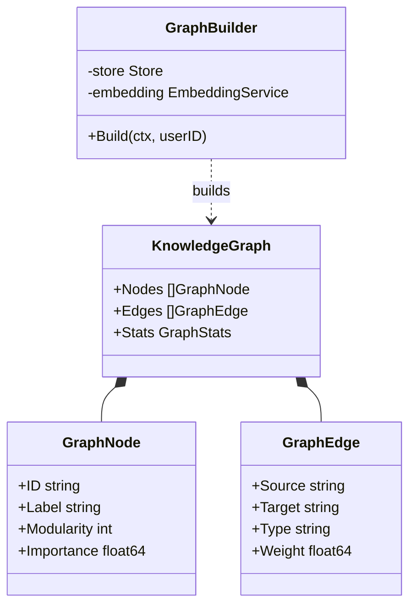

# AI Knowledge Graph (`ai/graph`)

`graph` 包负责构建个人知识图谱 (Personal Knowledge Graph)，将碎片化的 Memo 连接成结构化的网络。

## 架构设计

图谱由 **节点 (Nodes)** 和 **边 (Edges)** 构成，支持多种类型的关联关系。



### 数据结构
*   **Nodes**: 代表 Memo 或 Tag。包含重要性 (`Importance`) 和聚类 ID (`Cluster`) 属性。
*   **Edges**:
    *   `Link`: 显式引用（双向链接 `[[WikiLink]]`）。
    *   `Tag Co-occurrence`: 标签共现关系。
    *   `Semantic`: 向量语义相似关系。

## 算法设计

### 1. 构图过程 (`Build`)

```mermaid
flowchart TD
    Start[开始构建] --> FetchMemos[获取用户所有 Memos]
    FetchMemos --> Nodes[生成节点列表]
    
    Nodes --> LinkEdges[构建 Link Edges (DB Relations)]
    Nodes --> TagEdges[构建 Tag Edges (Jaccard)]
    Nodes --> SemEdges[构建 Semantic Edges (Vector Search)]
    
    LinkEdges & TagEdges & SemEdges --> Merge[合并边集合]
    
    Merge --> Pagerank[计算 PageRank 重要性]
    Merge --> Community[计算 Community 聚类]
    
    Pagerank & Community --> Final[输出 KnowledgeGraph]
```

1.  **节点生成**: 加载用户所有 Memo。
2.  **边生成**:
    *   **Link Edges**: 解析数据库中的 `MemoRelation` 表。
    *   **Tag Edges**: 计算任意两个笔记间标签集合的 Jaccard 相似度，超过阈值则连边。
    *   **Semantic Edges**: 对每个节点，进行 Vector Search 查找 Top-K 相似节点，超过阈值则连边。

### 2. 图分析算法
在构图完成后，运行图算法以提取洞察：
*   **PageRank**: 计算节点的重要性分数 (Importance)。被引用越多、与重要节点连接越紧密的笔记，分数越高。用于在可视化中控制节点大小。
*   **Community Detection (社区发现)**: 使用简化的 **Label Propagation** (标签传播) 算法将节点划分为不同的簇 (Cluster)。用于在可视化中对节点进行着色，展示知识主题分布。

## 业务流程

1.  前端请求 "知识图谱" 视图。
2.  后端实时或从缓存构建图谱。
3.  应用过滤器 (`ApplyFilter`)：根据时间范围、标签、重要性阈值筛选子图。
4.  前端利用 D3.js 或其他库渲染力导向图 (Force-Directed Graph)。
