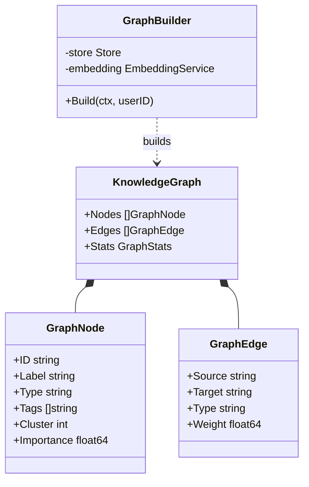

# AI Knowledge Graph (`ai/graph`)

The `graph` package is responsible for building a Personal Knowledge Graph (PKG), connecting fragmented Memos into a structured network.

## Architecture

The graph consists of **Nodes** and **Edges**, supporting multiple types of relationships.



### Data Structures

- **Nodes**: Represent Memo or Tag. Include `Importance` and `Cluster` properties.
- **Edges**:
  - `Link`: Explicit reference (bidirectional `[[WikiLink]]`).
  - `Tag Co-occurrence`: Tag co-occurrence relationship.
  - `Semantic`: Vector semantic similarity relationship.

## Algorithm

### 1. Building Process (`Build`)

```mermaid
flowchart TD
    Start[Build Start] --> FetchMemos[Fetch All User Memos]
    FetchMemos --> Nodes[Generate Node List]

    Nodes --> LinkEdges[Build Link Edges (DB Relations)]
    Nodes --> TagEdges[Build Tag Edges (Jaccard)]
    Nodes --> SemEdges[Build Semantic Edges (Vector Search)]

    LinkEdges & TagEdges & SemEdges --> Merge[Merge Edge Sets]

    Merge --> Pagerank[Calculate PageRank Importance]
    Merge --> Community[Calculate Community Clustering]

    Pagerank & Community --> Final[Output KnowledgeGraph]
```

1. **Node Generation**: Load all user Memos.
2. **Edge Generation**:
   - **Link Edges**: Parse `MemoRelation` table from database.
   - **Tag Edges**: Calculate Jaccard similarity between tag sets of any two notes, connect if exceeds threshold.
   - **Semantic Edges**: For each node, perform Vector Search to find Top-K similar nodes, connect if exceeds threshold.

### 2. Graph Analysis Algorithms

After graph construction, run graph algorithms to extract insights:

- **PageRank**: Calculate node importance score. Notes that are referenced more and connected to important nodes get higher scores. Used to control node size in visualization.
- **Community Detection**: Use simplified **Label Propagation** algorithm to divide nodes into different clusters. Used to color nodes in visualization, showing knowledge topic distribution.

## Filtering

The `GraphFilter` supports filtering the graph for visualization:

| Filter | Description |
| :----- | :---------- |
| `StartDate` | Filter by start date |
| `EndDate` | Filter by end date |
| `Tags` | Filter by tags |
| `Clusters` | Filter by cluster IDs |
| `MinImportance` | Filter by minimum importance |

## Configuration

| Config | Default | Description |
| :----- | :------ | :---------- |
| `EnablePageRank` | true | Enable PageRank calculation |
| `EnableCommunityDetection` | true | Enable community detection |
| `MinTagSimilarity` | 0.3 | Minimum tag similarity threshold |
| `MinSemanticSimilarity` | 0.7 | Minimum semantic similarity threshold |
| `MaxSemanticEdgesPerNode` | 5 | Maximum semantic edges per node |

## Business Flow

1. Frontend requests "Knowledge Graph" view.
2. Backend builds graph in real-time or from cache.
3. Apply filter (`ApplyFilter`): Filter subgraph by time range, tags, importance threshold.
4. Frontend uses D3.js or other libraries to render Force-Directed Graph.
