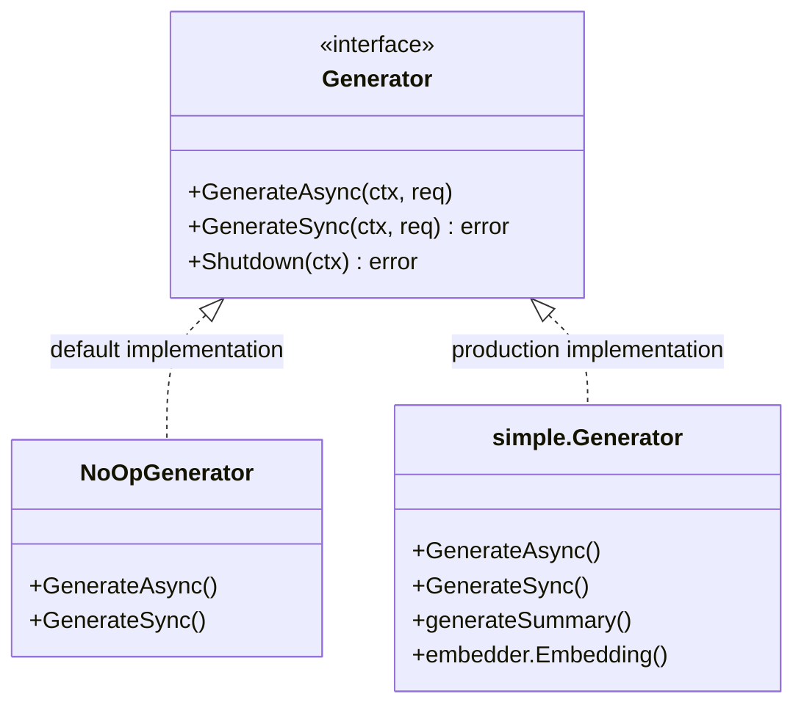

# AI Memory Engineering (`ai/memory`)

`memory` 包定义了 AI Agent 的记忆扩展接口，旨在实现更高级的记忆管理机制。

## 架构设计



## 接口定义

### Generator 接口

定义了记忆生成的标准行为：

- **异步生成 (`GenerateAsync`)**: 用于生产环境，不阻塞主流程
- **同步生成 (`GenerateSync`)**: 用于测试或调试
- **关闭 (`Shutdown`)**: 等待所有待处理任务完成

### MemoryRequest

```go
type MemoryRequest struct {
    BlockID   int64
    UserID    int32
    AgentType string
    UserInput string
    Outcome   string // Assistant's response
    Metadata  map[string]any
}
```

## 实现版本

### NoOpGenerator (默认)

空实现。在未配置外部记忆服务时使用，确保系统稳定性。

### simple.Generator (开发/测试)

基于 LLM 的基础记忆生成实现：

1. **摘要生成**: 使用 LLM 将用户输入和助手回复压缩为简洁摘要
2. **向量化**: 使用 Embedding 模型生成向量表示
3. **持久化**: 存储到 `episodic_memory` 和 `episodic_memory_embedding` 表

#### 配置

```go
type Config struct {
    Enabled          bool
    SummaryMaxTokens int
    MaxConcurrency  int
    Timeout         time.Duration
}
```

#### 局限性

> **警告**: 此实现不适合生产环境：
> - 重要性评分固定为 0.5，无动态评估
> - 无遗忘/衰减机制
> - 无记忆合并或去重
> - 无安全保护防止记忆污染
> - 仅支持单维度（向量）检索

#### 生产建议

如需生产级记忆功能，考虑：
- **Mem0** (https://mem0.ai) - 混合存储（图/向量/KV）
- **Letta** (https://letta.com) - 分层记忆，睡眠时计算
- **自定义实现** - 基于领域需求

## 记忆工程概念

该包的设计参考了人类记忆机制：

1. **Importance Scoring**: 基于相关性、频率和新近度对信息打分
2. **Forgetting**: 模拟生物遗忘机制
3. **Consolidation**: 将短期记忆合并为长期记忆

## 目录结构

```
ai/memory/
├── interface.go           # Generator 接口和 NoOpGenerator
├── simple/
│   └── generator.go       # 基于 LLM 的记忆生成实现
└── (future)
    ├── mem0/             # Mem0 集成
    └── letta/           # Letta 集成
```
