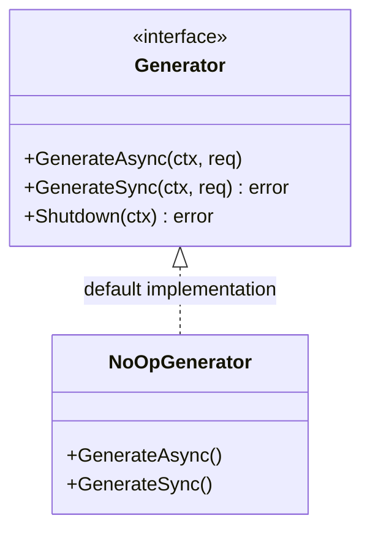

# AI Memory Engineering (`ai/memory`)

`memory` 包定义了 AI Agent 的记忆扩展接口，旨在实现更高级的记忆管理机制，如遗忘、合并及固化。

## 架构设计

*   **`Generator` 接口**: 定义了记忆生成的标准行为。
    *   **异步生成 (`GenerateAsync`)**: 用于生产环境，不阻塞主流程。
    *   **同步生成 (`GenerateSync`)**: 用于测试或调试。
*   **`NoOpGenerator`**: 默认的空实现。在未配置外部记忆服务（如 Mem0, Letta）时使用，确保系统稳定性。

## 记忆工程概念
该包的设计参考了人类记忆机制：
1.  **Importance Scoring**: 基于相关性、频率和新近度对信息打分。
2.  **Forgetting**: 模拟生物遗忘机制。
3.  **Consolidation**: 将短期记忆合并为长期记忆。

目前处于 **基础设施阶段**，定义了扩展点，未来可对接复杂的记忆存储服务。
