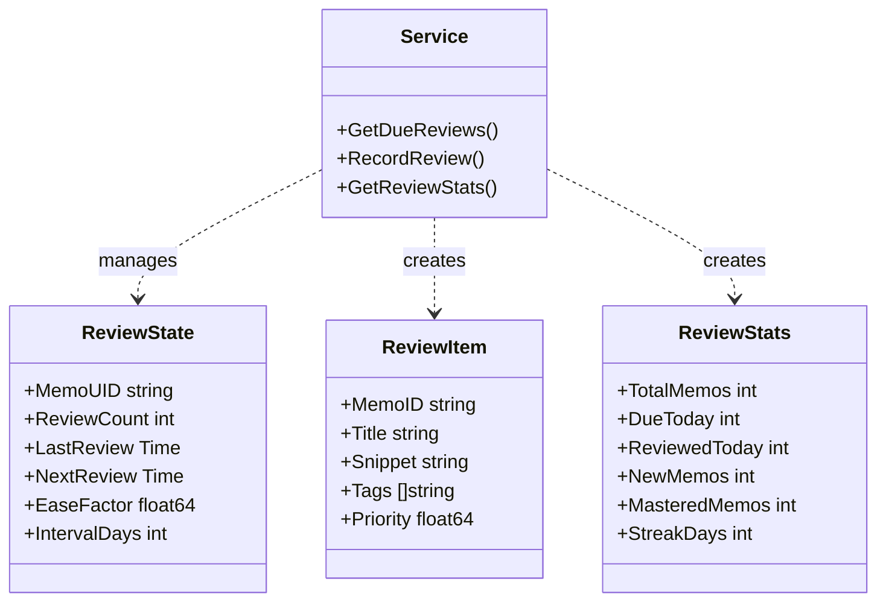
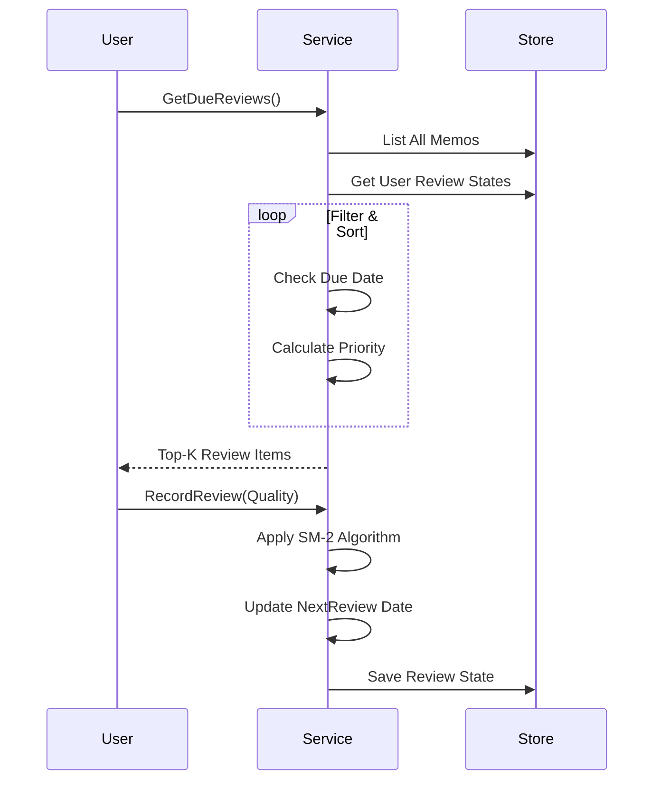

# AI Review Service (`ai/review`)

The `review` package implements an intelligent spaced repetition review system based on **SM-2 algorithm**, helping users efficiently review their Memos.

## Architecture

## Core Algorithm: SM-2

The review algorithm references SuperMemo-2, dynamically adjusting the next review interval based on user feedback's memory quality (`Quality`).

### Quality Ratings
- `0 (Again)`: Completely forgot, reset interval.
- `3 (Hard)`: Remember with difficulty, interval slightly reduced or unchanged.
- `4 (Good)`: Remember normally, standard interval increase.
- `5 (Easy)`: Remember easily, accelerated interval increase.

### Parameter Updates
- **Ease Factor (EF)**: Difficulty factor, default 2.5. Adjusted after each review based on quality.
- **Interval (I)**: Next review interval days. `I(n) = I(n-1) * EF`.

### Interval Calculation
| Quality | Interval Formula |
| :------ | :--------------- |
| Again | Reset to 1 day |
| Hard | `I(n) = I(n-1) * 1.2` |
| Good | `I(n) = I(n-1) * EF` (first: 1->3->...) |
| Easy | `I(n) = I(n-1) * EF * 1.3` |

## Priority Calculation

`GetDueReviews` not only returns due memos but also calculates **Priority** for sorting:

`Priority = OverdueFactor + TagImportance + NewItemBonus - RecencyPenalty`

1. **Overdue Factor**: Longer overdue = higher priority.
2. **Tag Importance**: Notes with "重要", "核心", "important", "key", "critical" tags prioritized.
3. **New Item Bonus**: New notes (fewer reviews) given some preference.
4. **Recency Penalty**: Reduce weight for notes created less than 1 hour ago to avoid immediate review.

## Review Statistics

| Stat | Description |
| :--- | :---------- |
| `TotalMemos` | Total number of memos |
| `DueToday` | Number of memos due today |
| `ReviewedToday` | Number of memos reviewed today |
| `NewMemos` | Number of new memos (never reviewed) |
| `MasteredMemos` | Number of mastered memos (interval > 30 days) |
| `TotalReviews` | Total number of reviews |
| `StreakDays` | Consecutive days with reviews |
| `AverageAccuracy` | Estimated accuracy based on mastered ratio |

## Storage

Review states are persisted in user settings (`REVIEW_STATES` key) as protobuf.

## Business Flow

