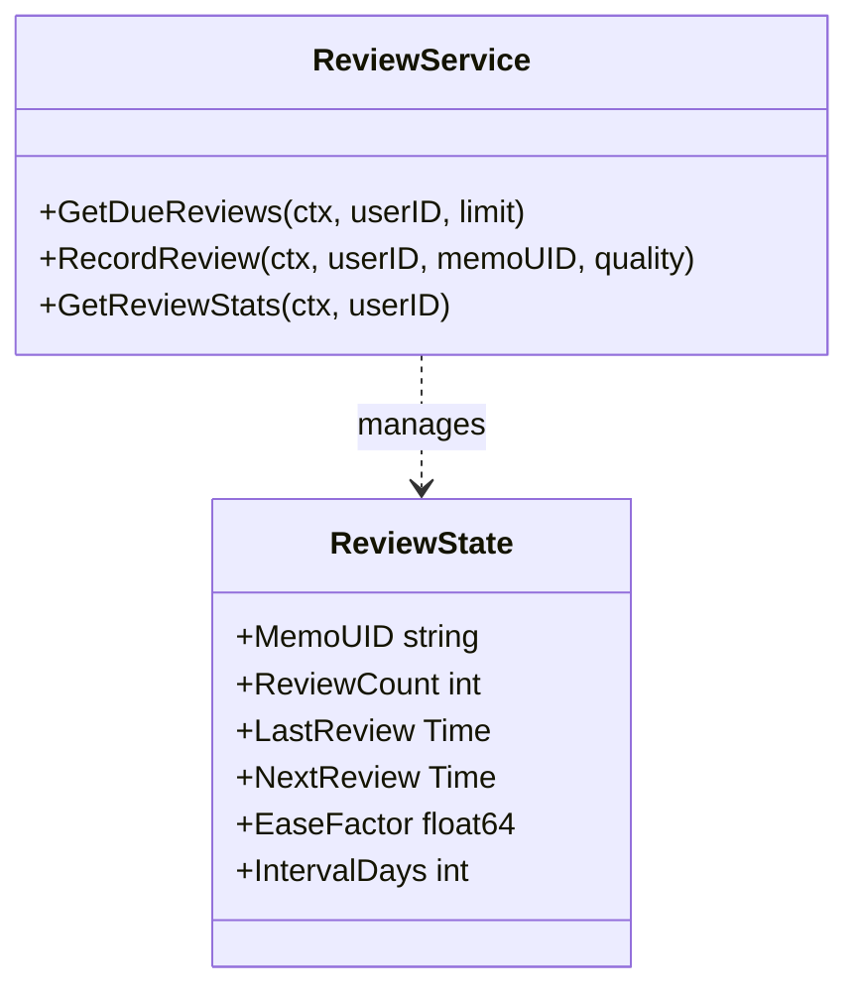
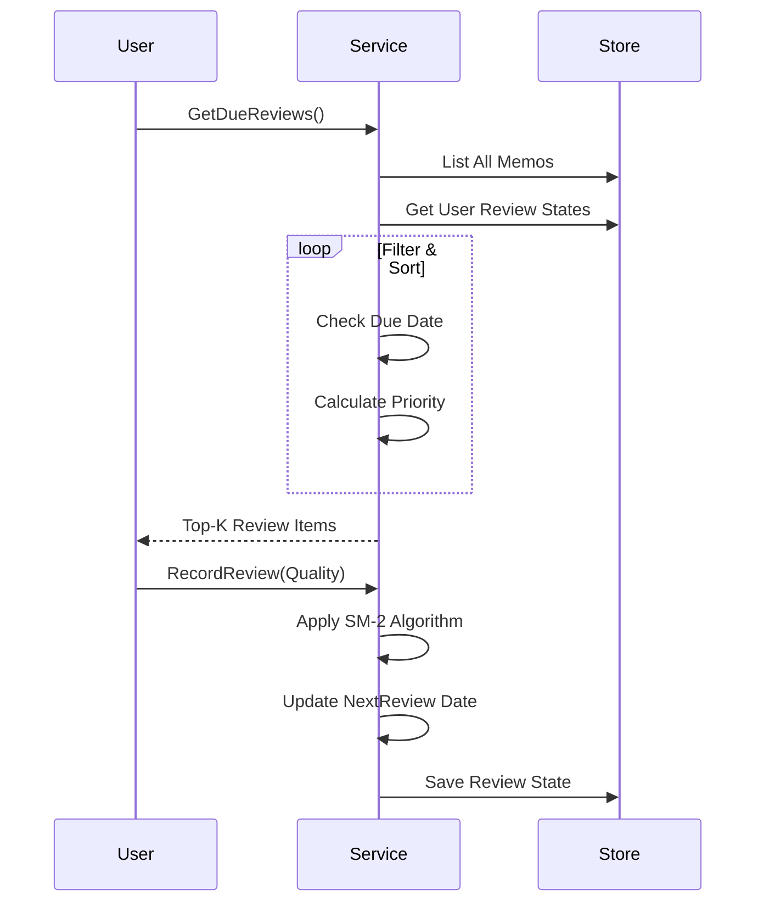

# AI Review Service (`ai/review`)

`review` 包实现了基于 **SM-2 算法** 的智能间隔重复 (Spaced Repetition) 复习系统，帮助用户高效回顾 Memo。

## 架构设计

## 核心算法: SM-2
复习算法参考了 SuperMemo-2，根据用户反馈的记忆质量 (`Quality`) 动态调整下一次复习的间隔。

**质量评分 (Quality)**:
*   `0 (Again)`: 完全忘记，重置间隔。
*   `3 (Hard)`: 记得很吃力，间隔略微缩短或不变。
*   `4 (Good)`: 正常记得，标准间隔增长。
*   `5 (Easy)`: 轻松记得，间隔加速增长。

**参数更新**:
*   **Ease Factor (EF)**: 难度系数，默认 2.5。每次复习根据质量调整。
*   **Interval (I)**: 下次复习间隔天数。`I(n) = I(n-1) * EF`。

## 排序与推荐
`GetDueReviews` 不仅仅返回到期的笔记，还计算 **优先级 (Priority)** 进行排序：

`Priority = OverdueFactor + TagImportance + NewItemBonus - RecencyPenalty`

1.  **Overdue Factor**: 逾期越久，优先级越高。
2.  **Tag Importance**: 包含 "重要", "核心" 等标签的笔记优先。
3.  **New Item Bonus**: 新笔记（复习次数少）给予一定优待。
4.  **Recency Penalty**: 刚创建不到 1 小时的笔记降权，避免立即复习。

## 业务流程

