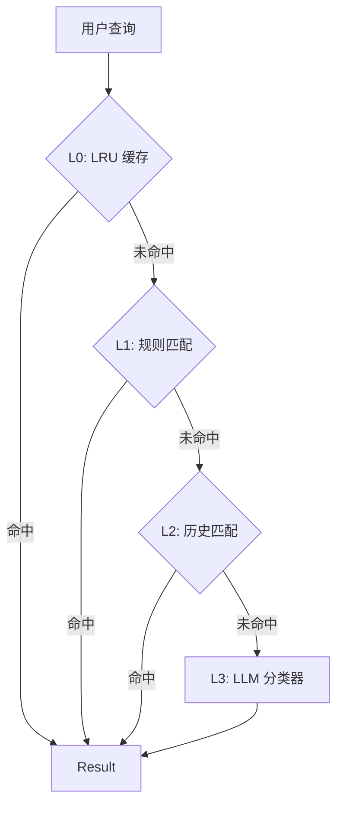

# 路由系统 (`ai/routing`)

`routing` 包为用户查询提供智能的意图分类 (Intent Classification) 和路由服务。

## 概览

路由系统采用四层架构来分类用户意图，旨在平衡延迟与准确率：



## 性能指标

| 层级   | 机制                  | 延迟   | 命中率 | 累计覆盖 |
| :----- | :-------------------- | :----- | :----- | :------- |
| **L0** | 内存缓存 (LRU)        | ~0ms   | -      | 60-70%   |
| **L1** | 规则匹配 (关键词)     | ~0ms   | 20-30% | 80-90%   |
| **L2** | 历史匹配 (向量相似度) | ~10ms  | 5-10%  | 90-95%   |
| **L3** | LLM 分类 (Qwen-7B)    | ~400ms | 100%   | 100%     |

## 目录结构

```
routing/
├── service.go           # 主服务 (编排所有层级)
├── cache.go             # L0: LRU 缓存
├── rule_matcher.go      # L1: 规则匹配器
├── history_matcher.go   # L2: 历史匹配器
├── llm_intent_classifier.go # L3: LLM 分类器
├── feedback.go          # 用户反馈收集
├── interface.go         # 接口定义
├── postgres_storage.go  # 反馈持久化
└── *test.go             # 测试文件
```

## 意图类型 (Intents)

*   `memo_create`: 创建笔记
*   `memo_query`: 查询笔记
*   `schedule_create`: 创建日程
*   `schedule_query`: 查询日程
*   `schedule_update`: 更新日程
*   `batch_schedule`: 批量日程操作
*   `unknown`: 未知/闲聊

## 核心组件详情

### L1: RuleMatcher (规则匹配)
基于加权关键词评分系统。
*   **时间词** (权重 2): "今天", "明天", "下周"
*   **动作词** (权重 2): "安排", "会议", "提醒"
*   **查询词** (权重 1): "查询", "显示"
*   **判定**: 总分 >= 阈值 (2.0) 即视为匹配。

### L2: HistoryMatcher (历史匹配)
利用向量数据库查找相似的历史查询。
如果用户输入 "查看明天的会"，且历史记录中有 "查询明天日程" (意图: `schedule_query`) 的相似度 > 0.85，则复用该意图。

### L3: LLM Classifier (大模型分类)
使用轻量级模型 (如 Qwen2.5-7B) 进行最终判定。
*   **Prompt**: 使用 Few-Shot Prompting 提高准确率。
*   **Output**: 严格限制为 JSON 格式。

## 反馈机制
系统会自动记录预测结果与用户实际行为的差异，用于后续优化规则权重或微调模型。
