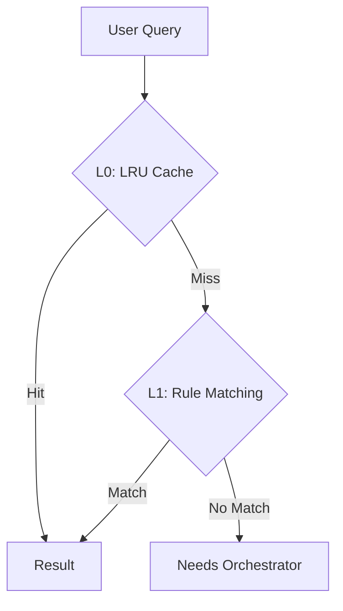

# Routing System (`ai/routing`)

`routing` package provides intelligent intent classification and routing services for user queries.

## Overview

The routing system uses a two-layer architecture (Cache + Rule) to balance latency and accuracy:



## Key Components

### 1. FastRouter (Service)
- **Layer 0 (L0)**: LRU Cache for routing decisions (~0ms latency)
- **Layer 1 (L1)**: Rule-based matching with weighted keywords
- **High confidence**: Direct response
- **Low confidence / Multi-intent**: Forward to Orchestrator

### 2. ExpertRouter
Configuration-driven expert selection for mapping AgentType to specific expert names.
- **Route**: Basic agent type to expert mapping
- **RouteWithKeywords**: Keyword-based disambiguation for same agent type

### 3. ModelStrategy
OCP-compliant model selection strategy for choosing local/cloud models based on task type.

## Performance Metrics

| Layer | Mechanism | Latency | Coverage |
| :---- | :-------- | :------ | :------- |
| **L0** | Memory Cache (LRU) | ~0ms | 60-70% |
| **L1** | Rule Matching (Keywords) | ~0ms | 80-95% |
| **Fallback** | Orchestrator | ~400ms | 100% |

## Intent Types

- `memo_create`: Create memo
- `memo_query`: Query memos
- `schedule_create`: Create schedule
- `schedule_query`: Query schedules
- `schedule_update`: Update schedules
- `batch_schedule`: Batch schedule operations
- `unknown`: Unknown/Chat

## Rule Matching Details

Based on weighted keyword scoring system:
- **Time words** (weight 2): "今天", "明天", "下周"
- **Action words** (weight 2): "安排", "会议", "提醒"
- **Query words** (weight 1): "查询", "显示"
- **Threshold**: Total >= 2.0

## Multi-Intent Detection

Requests containing multi-intent keywords are forwarded to Orchestrator:
- "顺便", "同时", "还有", "以及", "并且", "另外", "也"

## Confidence Threshold

- **Direct Response**: confidence >= 0.8
- **Orchestrator**: confidence < 0.8 or multi-intent detected

## Feedback Mechanism

System records prediction vs actual user behavior for dynamic weight adjustment (optional).

## Directory Structure

```
routing/
├── service.go           # FastRouter implementation
├── expert_router.go     # ExpertRouter for config-driven routing
├── model_strategy.go   # Model selection strategy
├── cache.go             # L0: RouterCache
├── rule_matcher.go      # L1: RuleMatcher
├── history_matcher.go   # History matching (deprecated)
├── feedback.go          # Feedback collection
├── interface.go         # Interface definitions
├── postgres_storage.go  # Feedback persistence
└── *test.go            # Test files
```
