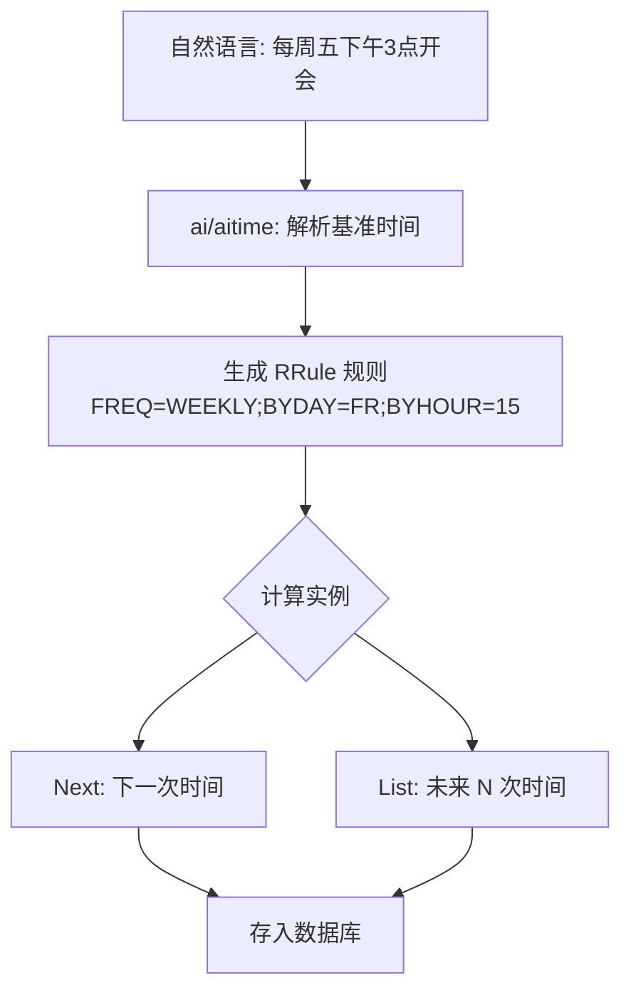

# AI Schedule Service (`ai/services/schedule`)

`schedule` 子包处理与日程相关的复杂业务逻辑，核心是重复规则 (Recurrence Rule) 的处理。

## 核心功能

### 重复规则 (Recurrence)
实现了对重复日程的解析和生成，支持以下模式：
*   **频率**: 每日、每周、每月、每年。
*   **间隔**: 每 N 天/周...
*   **结束条件**: 永不结束、直到某日期、执行 N 次后结束。
*   **例外**: 排除特定日期。

## 算法流程

## 业务流程

当用户创建一个重复日程（如“每周五下午3点开周会”）时：
1.  **AI 解析**: `aitime` 包解析出基础时间点。
2.  **规则生成**: 本包将自然语言描述转换为结构化的 RRule。
3.  **实例展开**: 根据 RRule 计算未来一段时间内的所有发生时间点 (Occurrences)，存入数据库。
