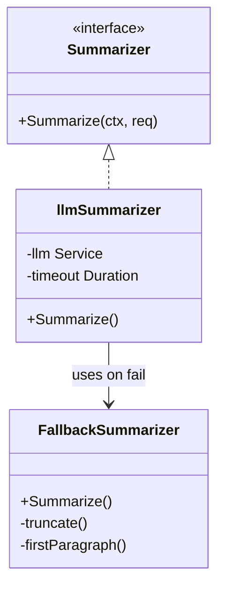
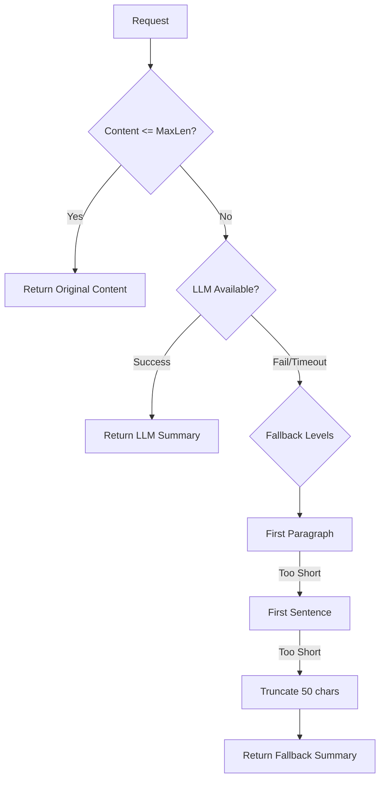

# AI Summarizer (`ai/summary`)

The `summary` package provides intelligent summary generation service for quickly extracting the core content of Memos.

## Architecture

- **`Summarizer` Interface**: Defines summary generation capability.
- **Fallback Strategy**: Considering LLM may timeout or be unavailable, the system implements a multi-level fallback strategy.

## Algorithm Flow

## Algorithm Details

### 1. Short Text Optimization
If text length (in runes) <= MaxLen (default 200), return original content directly with `Source: original`.

### 2. LLM Generation
Use a dedicated prompt (e.g., "请用一句话概括...") to call LLM.
- Request LLM to return JSON format: `{"summary": "生成的摘要"}`
- Parse and truncate to MaxLen characters.

### 3. Automatic Fallback
If LLM call fails, times out, or returns empty, try in order:
- **First Paragraph**: Extract first paragraph.
- **First Sentence**: Extract first sentence.
- **Truncate**: Truncate first N characters (default 50).

### 4. Result Marking
Return result includes `Source` field (`llm`, `fallback_*`, `original`) for frontend to distinguish display or decide whether to retry.

## Configuration

| Config | Default | Description |
| :----- | :------ | :---------- |
| `MaxLen` | 200 | Maximum summary length in characters |
| `Timeout` | 15s | LLM call timeout |
