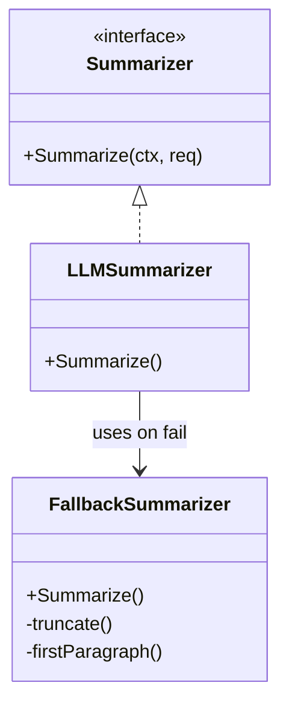
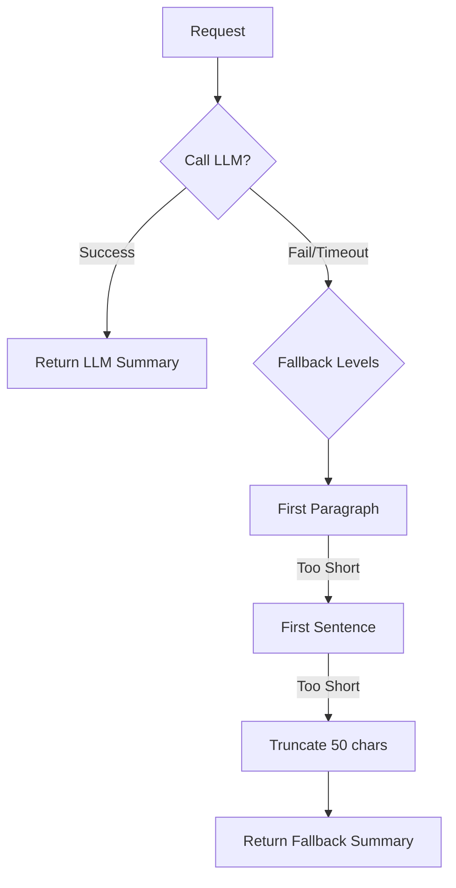

# AI Summarizer (`ai/summary`)

`summary` 包提供智能摘要生成服务，用于快速提取 Memo 的核心内容。

## 架构设计

*   **`Summarizer` 接口**: 定义摘要生成能力。
*   **降级策略 (Fallback)**: 考虑到 LLM 可能超时或不可用，系统实现了多级降级策略。

## 算法流程

1.  **尝试 LLM 生成**: 使用专门的 Prompt (如 "请用一句话概括...") 调用 LLM。
2.  **自动降级**: 如果 LLM 调用失败、超时或返回空，依次尝试：
    *   **First Paragraph**: 提取第一段。
    *   **First Sentence**: 提取第一句话。
    *   **Truncate**: 截取前 N 个字符 (默认 50)。
3.  **结果标记**: 返回结果中包含 `Source` 字段 (`llm`, `fallback_*`)，便于前端区分展示或决定是否重试。
