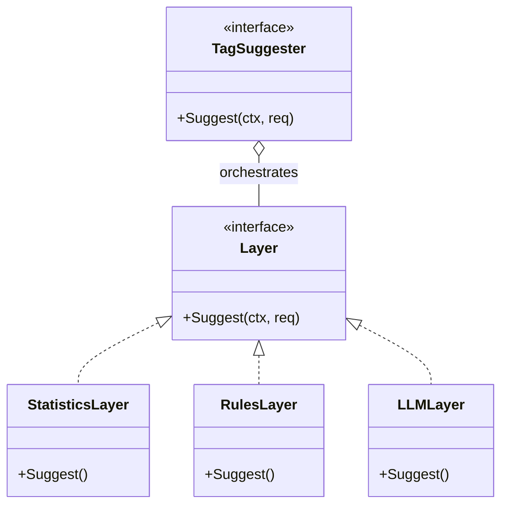
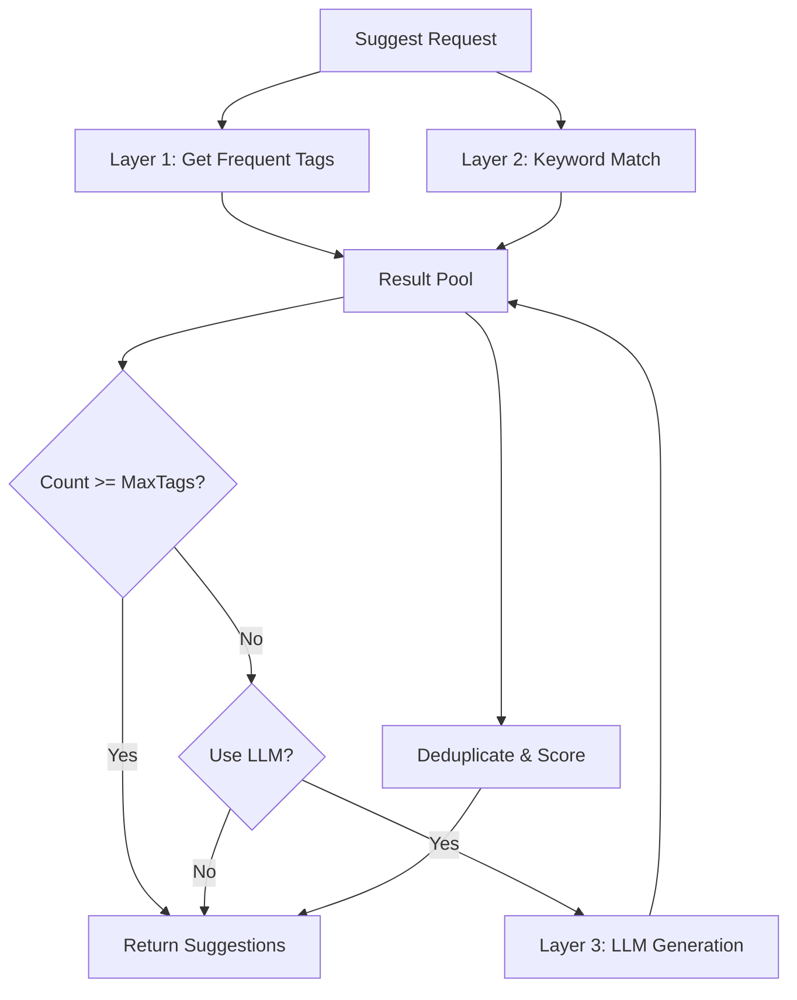

# AI Tag Suggester (`ai/tags`)

The `tags` package implements a three-layer progressive tag recommendation system, providing users with accurate and personalized tag suggestions.

## Architecture

The system uses a layered architecture, where each layer is an independent `Layer` interface implementation, orchestrated by `TagSuggester`.

## Recommendation Strategy (3-Layer System)

### Layer 1: Statistics (Statistics)
- **Principle**: Based on user's historical tag usage frequency.
- **Advantage**: Extremely fast (~0ms), follows user habits.
- **Content**: Returns user's most frequently used Top-N tags.

### Layer 2: Rules (Rule-based)
- **Principle**: Simple keyword matching. For example, content contains "会议" -> recommend `#work`.
- **Advantage**: Low latency, deterministic.

### Layer 3: LLM (Semantic)
- **Principle**: Use LLM or Embedding to understand deep semantics of note content, recommend new or related tags.
- **Advantage**: Intelligent, can discover potential connections.
- **Trigger**: Optional. Usually triggered when results from first two layers are insufficient.

## Workflow

## Merge and Ranking

After collecting suggestions from all layers:

1. **Deduplication**: Keep highest confidence for each tag (case-insensitive).
2. **Sorting**: Sort by confidence descending.
3. **Limiting**: Return up to `MaxTags` (default 5, max 10).
