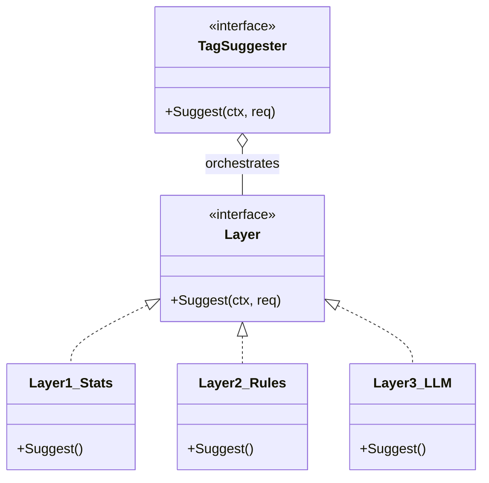
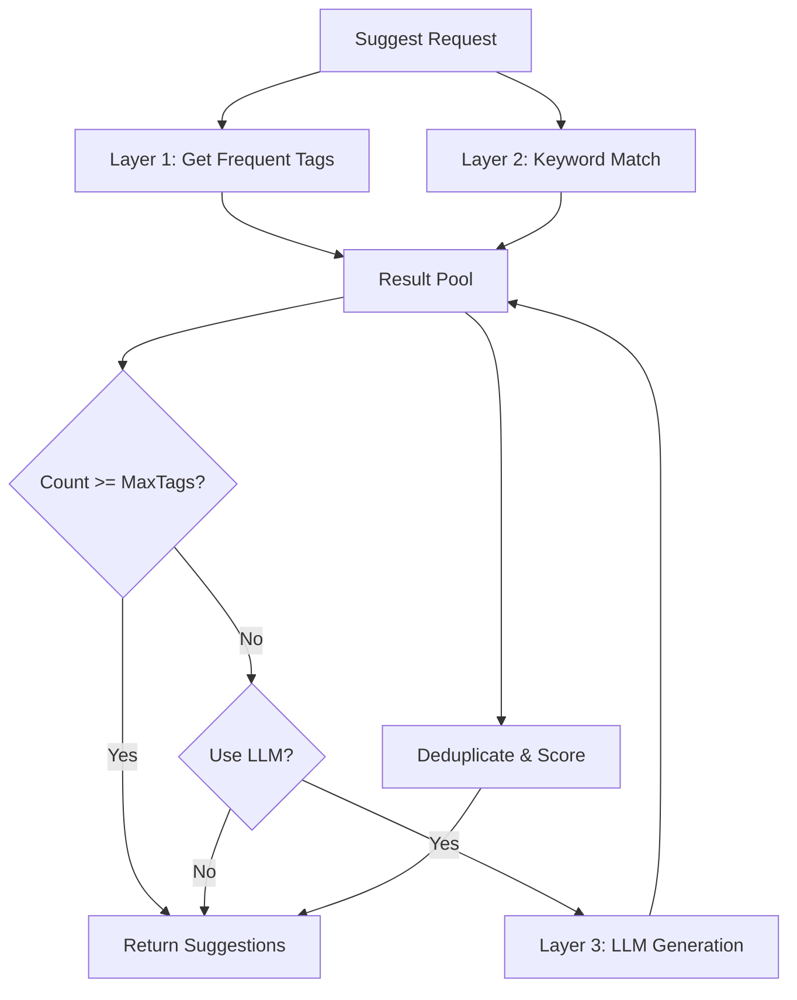

# AI Tag Suggester (`ai/tags`)

`tags` 包实现了三层渐进式的标签推荐系统，旨在为用户提供准确且个性化的标签建议。

## 架构设计

系统采用分层架构 (Layered Architecture)，每一层都作为独立的 `Layer` 接口实现，由 `TagSuggester` 统一编排。

## 推荐策略 (3-Layer System)

### Layer 1: 统计推荐 (Statistics)
*   **原理**: 基于用户历史标签的使用频率。
*   **优势**: 速度极快 (~0ms)，符合用户习惯。
*   **内容**: 返回用户最常用的 Top-N 标签。

### Layer 2: 规则匹配 (Rule-based)
*   **原理**: 简单的关键词匹配。例如，内容包含 "会议" -> 推荐 `#work`。
*   **优势**: 低延迟，确定性强。

### Layer 3: 语义理解 (LLM/Semantic)
*   **原理**: 使用 LLM 或 Embedding 理解笔记内容的深层语义，推荐新标签或相关标签。
*   **优势**: 智能，能发现潜在关联。
*   **触发**: 可选。通常在前两层结果不足时触发。

## 业务流程

