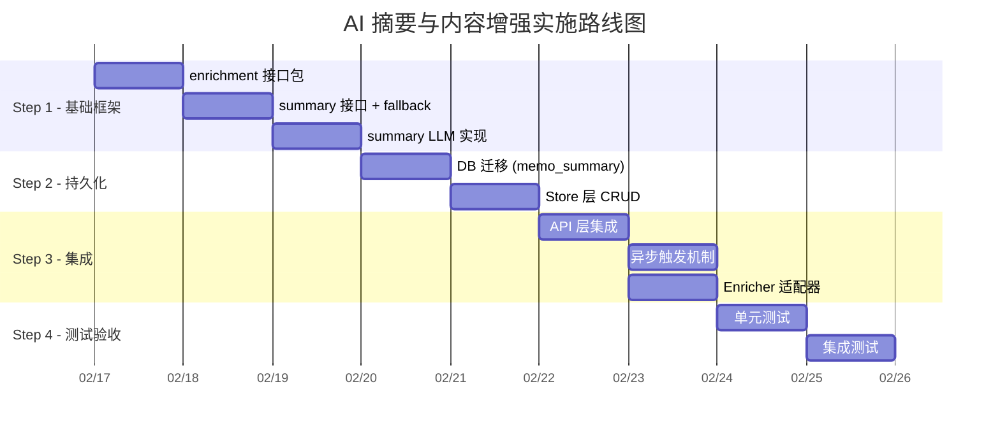

# AI 摘要生成与 Memo 内容增强统一架构方案

> **版本**: v1.0  
> **日期**: 2026-02-13  
> **状态**: 草案，待评审  
> **关联**: [ai-solid-refactoring-plan.md](./ai-solid-refactoring-plan.md)

---

## 目录

1. [需求背景](#1-需求背景)
2. [现状分析](#2-现状分析)
3. [架构设计](#3-架构设计)
4. [摘要服务详设](#4-摘要服务详设)
5. [异步执行与 Fallback 策略](#5-异步执行与-fallback-策略)
6. [与 SOLID 重构的协同](#6-与-solid-重构的协同)
7. [实施路线图](#7-实施路线图)
8. [风险与缓解](#8-风险与缓解)

---

## 1. 需求背景

### 1.1 问题

Memos 笔记内容可能很长（数千字），在便签纸风格的 UI 上直接展示全文会造成 **视觉沙漠**（Visual Desert）——用户无法快速扫描和定位笔记。

### 1.2 目标

- **AI 摘要**: 由 LLM 生成 ≤200 字的笔记摘要，用于便签卡片 UI 展示
- **异步运行**: 摘要生成不阻塞笔记创建/编辑流程
- **Fallback 策略**: 在 AI 摘要生成前，提供优雅的降级展示
- **统一架构**: 与现有 标签生成、标题生成、意图识别 能力统筹设计，符合 DRY + SOLID

---

## 2. 现状分析

### 2.1 现有 AI 内容增强能力

| 能力         | 包位置                               | 模式                      | LLM 依赖 | 触发方式       |
| :----------- | :----------------------------------- | :------------------------ | :------- | :------------- |
| **标签建议** | `ai/tags/`                           | 3层渐进式 (统计→规则→LLM) | 可选     | API 显式调用   |
| **标题生成** | `ai/title_generator.go`              | 直接 LLM 调用             | 必须     | 对话结束后异步 |
| **意图识别** | `ai/agents/llm_intent_classifier.go` | LLM JSON Schema           | 必须     | 对话路由时同步 |
| **摘要生成** | ❌ 不存在                             | —                         | —        | —              |

### 2.2 现有 Snippet/预览 方案

当前多处使用 **粗暴截断** 代替摘要：

```go
// server/router/api/v1/ai_service_semantic.go L118-121
snippet := r.Memo.Content
if len(snippet) > 200 {
    snippet = snippet[:200] + "..."
}
```

此方式存在的问题：
- ❌ 可能在中文多字节字符中间截断（按字节而非 rune）
- ❌ 无语义理解，截断位置随机
- ❌ 无法传达笔记核心要点

### 2.3 架构痛点

```
当前：各能力独立散落，无统一编排
┌──────────────────────────────────────┐
│  ai/tags/          ← 独立包，有接口  │
│  ai/title_generator.go ← 根包文件    │
│  ai/agents/llm_intent_classifier.go  │
│  (无 summary)                        │
└──────────────────────────────────────┘

问题：
1. TitleGenerator 在 ai/ 根包，tags 在 ai/tags/，无统一抽象
2. 各服务独立初始化，调用方需分别管理
3. 新增 Summary 能力会加剧碎片化
4. truncate/snippet 逻辑在多处重复（DRY 违规，已在重构方案 P1-06 识别）
```

---

## 3. 架构设计

### 3.1 核心理念：统一内容增强 Pipeline

将散落的 AI 能力抽象为 **统一的 Memo 内容增强管线**，按触发方式分为两条独立路径：

```
 ① 用户手动触发（"格式化"按钮）        ② Memo 保存后自动触发
┌─────────────────────────────┐    ┌───────────────────────────────────┐
│  Format Enricher            │    │  Post-save Enrichment             │
│  随意文本 → 标准 Markdown   │    │  ┌─────────┐ ┌─────┐ ┌───────┐  │
│  同步返回, 替换编辑器内容   │    │  │ Summary │ │Tags │ │Title  │  │
│  用户可预览后再保存         │    │  └────┬────┘ └──┬──┘ └───┬───┘  │
│  与保存流程完全解耦         │    │       └─────────┼────────┘       │
└─────────────────────────────┘    │         异步并行执行             │
         ▲                         │         持久化元数据             │
         │                         └───────────────────────────────────┘
         │         依赖注入                         ▲
         └──────────────┼───────────────────────────┘
              ┌────────┴────────┐
              │  ai.LLMService  │
              └─────────────────┘
```

**两条路径的关键区分**：

| 路径           | 触发方式             | 执行时机     | 修改对象               | 示例                 |
| :------------- | :------------------- | :----------- | :--------------------- | :------------------- |
| **① 手动触发** | 用户点击"格式化"按钮 | 同步，保存前 | 编辑器内容（未持久化） | Format               |
| **② 自动触发** | Memo 保存后          | 异步         | 附加元数据             | Summary、Tags、Title |

### 3.2 包结构设计

```
ai/
├── enrichment/              # [NEW] 统一内容增强包
│   ├── enricher.go          # Enricher 接口 + EnrichmentResult
│   ├── pipeline.go          # Pipeline 编排器（支持 Pre/Post-save 两阶段）
│   └── pipeline_test.go     # 编排器测试
├── format/                  # [NEW] 内容格式化（Pre-save 阶段）
│   ├── formatter.go         # Formatter 接口 + LLM 实现
│   ├── enricher_adapter.go  # Enricher 适配器
│   └── formatter_test.go    # 测试
├── summary/                 # [NEW] 摘要生成（Post-save 阶段）
│   ├── summarizer.go        # Summarizer 接口
│   ├── summarizer_impl.go   # LLM 摘要实现
│   ├── fallback.go          # Fallback 策略
│   └── summarizer_test.go   # 测试
├── tags/                    # [现有] 标签建议（Post-save 阶段）
│   ├── suggester.go
│   └── ...
├── title/                   # [REFACTOR] 标题生成（Post-save 阶段）
│   ├── generator.go         # TitleGenerator 核心逻辑
│   └── enricher_adapter.go  # Enricher 适配器（聊天标题 + Memo 标题复用）
└── title_generator.go       # [DEPRECATED] 保留为兼容入口，委托到 title/ 包

config/                      # 项目根配置目录（已有 parrots/, orchestrator/）
├── prompts/                 # [NEW] AI Prompt 模板
│   ├── format.yaml          # 内容格式化 Prompt（随意文本 → 标准 Markdown）
│   ├── summary.yaml         # 摘要生成 Prompt
│   ├── tags.yaml            # 标签建议 Prompt
│   ├── title.yaml           # 标题生成 Prompt（聊天会话 + Memo 标题共用）
│   └── intent.yaml          # 意图识别 Prompt
├── parrots/                 # [现有] Agent 配置
└── orchestrator/            # [现有] 编排器配置
```

### 3.3 核心接口设计

```go
// ai/enrichment/enricher.go
package enrichment

import "context"

// EnrichmentType 标识增强类型
type EnrichmentType string

const (
    // Pre-save enrichment（同步，修改内容本体）
    EnrichmentFormat  EnrichmentType = "format"   // 内容格式化

    // Post-save enrichment（异步，附加元数据）
    EnrichmentSummary EnrichmentType = "summary"  // 摘要生成
    EnrichmentTags    EnrichmentType = "tags"     // 标签建议
    EnrichmentTitle   EnrichmentType = "title"    // 标题生成
)

// MemoContent 是增强器的统一输入
type MemoContent struct {
    MemoID  string
    UID     string
    Content string  // 原文
    Title   string  // 已有标题（可能为空）
    UserID  int32
}

// EnrichmentResult 是单个增强器的输出
type EnrichmentResult struct {
    Type    EnrichmentType
    Success bool
    Data    any           // 具体结果（string/[]string 等）
    Error   error
    Latency time.Duration
}

// Enricher 是内容增强器的统一接口（SRP: 每个实现只做一件事）
type Enricher interface {
    // Type 返回增强器类型
    Type() EnrichmentType
    // Enrich 执行增强，返回结果
    Enrich(ctx context.Context, content *MemoContent) *EnrichmentResult
}
```

### 3.4 Pipeline 编排器

```go
// ai/enrichment/pipeline.go
package enrichment

// Pipeline 编排多个 Enricher，支持并行/串行执行
type Pipeline struct {
    enrichers []Enricher
    timeout   time.Duration
}

// NewPipeline 创建增强管线
func NewPipeline(enrichers ...Enricher) *Pipeline {
    return &Pipeline{
        enrichers: enrichers,
        timeout:   30 * time.Second,
    }
}

// EnrichAll 并行执行所有增强器，返回结果集合
func (p *Pipeline) EnrichAll(ctx context.Context, content *MemoContent) map[EnrichmentType]*EnrichmentResult {
    ctx, cancel := context.WithTimeout(ctx, p.timeout)
    defer cancel()

    results := make(map[EnrichmentType]*EnrichmentResult)
    var mu sync.Mutex
    var wg sync.WaitGroup

    for _, e := range p.enrichers {
        wg.Add(1)
        go func(enricher Enricher) {
            defer wg.Done()
            result := enricher.Enrich(ctx, content)
            mu.Lock()
            results[enricher.Type()] = result
            mu.Unlock()
        }(e)
    }

    wg.Wait()
    return results
}

// EnrichOne 执行单个类型的增强
func (p *Pipeline) EnrichOne(ctx context.Context, t EnrichmentType, content *MemoContent) *EnrichmentResult {
    for _, e := range p.enrichers {
        if e.Type() == t {
            return e.Enrich(ctx, content)
        }
    }
    return &EnrichmentResult{Type: t, Success: false, Error: ErrEnricherNotFound}
}
```

### 3.5 SOLID 合规性分析

| 原则    | 如何满足                                                                                              |
| :------ | :---------------------------------------------------------------------------------------------------- |
| **SRP** | 每个 Enricher 只负责一种增强（摘要/标签/标题），Pipeline 只负责编排                                   |
| **OCP** | 新增增强类型只需实现 `Enricher` 接口；Prompt 配置化到 `config/prompts/`，修改 Prompt 无需改代码重编译 |
| **LSP** | 所有 Enricher 实现遵循相同的接口合约，可自由替换                                                      |
| **ISP** | `Enricher` 接口最小化（仅 `Type()` + `Enrich()`），消费方不依赖不需要的方法                           |
| **DIP** | Pipeline 依赖 `Enricher` 接口而非具体实现；各 Enricher 依赖 `ai.LLMService` 接口                      |

### 3.6 DRY 合规性分析

| 之前                                   | 之后                                                     |
| :------------------------------------- | :------------------------------------------------------- |
| `tags/layer3_llm.go` 独立 LLM 调用逻辑 | 共享 `ai.LLMService` 抽象                                |
| `title_generator.go` 独立 LLM 调用逻辑 | 同上，且可作为 `Enricher` 适配                           |
| 多处 `snippet[:200] + "..."`           | Summary Enricher 统一生成语义摘要                        |
| 各处独立的 content 截断逻辑            | `enrichment.TruncateContent()` 工具函数（与 P1-06 协同） |

---

## 4. 摘要服务详设

### 4.1 Summarizer 接口

```go
// ai/summary/summarizer.go
package summary

import "context"

// Summarizer 提供笔记摘要能力
type Summarizer interface {
    // Summarize 生成笔记摘要，maxLen 为最大字符数（rune）
    Summarize(ctx context.Context, req *SummarizeRequest) (*SummarizeResponse, error)
}

// SummarizeRequest 摘要请求
type SummarizeRequest struct {
    MemoID  string
    Content string // 笔记原文
    Title   string // 已有标题（辅助理解）
    MaxLen  int    // 摘要最大长度（rune），默认 200
}

// SummarizeResponse 摘要响应
type SummarizeResponse struct {
    Summary  string        // AI 生成的摘要
    Source   string        // 来源标识: "llm" | "fallback_truncate" | "fallback_first_para"
    Latency  time.Duration
}
```

### 4.2 LLM 摘要实现

```go
// ai/summary/summarizer_impl.go
package summary

type llmSummarizer struct {
    llm     ai.LLMService
    timeout time.Duration
}

func NewSummarizer(llm ai.LLMService) Summarizer {
    return &llmSummarizer{
        llm:     llm,
        timeout: 15 * time.Second,
    }
}

func (s *llmSummarizer) Summarize(ctx context.Context, req *SummarizeRequest) (*SummarizeResponse, error) {
    // 1. 短文本无需摘要
    if runeLen(req.Content) <= req.MaxLen {
        return &SummarizeResponse{
            Summary: req.Content,
            Source:  "original",
        }, nil
    }

    // 2. LLM 不可用时走 Fallback
    if s.llm == nil {
        return FallbackSummarize(req)
    }

    // 3. LLM 生成摘要
    ctx, cancel := context.WithTimeout(ctx, s.timeout)
    defer cancel()

    prompt := buildSummarizePrompt(req.Content, req.MaxLen)
    messages := []llm.Message{
        llm.SystemPrompt(summarySystemPrompt),
        llm.UserMessage(prompt),
    }

    content, stats, err := s.llm.Chat(ctx, messages)
    if err != nil {
        // LLM 失败，降级到 Fallback
        slog.Warn("summary_llm_failed", "error", err, "memo_id", req.MemoID)
        return FallbackSummarize(req)
    }

    // 4. 解析并截断
    summary := parseSummary(content)
    summary = truncateRunes(summary, req.MaxLen)

    return &SummarizeResponse{
        Summary: summary,
        Source:  "llm",
        Latency: stats.Latency,
    }, nil
}
```

### 4.3 Prompt 配置化设计

> **设计原则**: Prompt 是 AI 行为的核心参数，属于"策略"而非"逻辑"。配置化后，
> 运维/产品可直接调优 Prompt 而无需修改代码、重新编译部署（OCP）。

#### 4.3.1 Prompt 配置文件

```yaml
# config/prompts/summary.yaml
name: summary
version: "1.0"

system_prompt: |
  你是一个专业的笔记摘要助手。你的任务是根据笔记原文，生成一段精炼的摘要。

  要求：
  1. 摘要长度不超过指定字数
  2. 保留笔记的核心观点和关键信息
  3. 使用与原文一致的语言（中文笔记用中文摘要，英文笔记用英文摘要）
  4. 不要添加原文没有的观点
  5. 如果笔记是列表/清单格式，摘要应概述主题和要点数量
  6. 直接输出摘要文本，不要添加"摘要："等前缀

  请直接返回JSON格式：{"summary": "生成的摘要"}

user_prompt_template: |
  请为以下笔记生成不超过 {{.MaxLen}} 字的摘要：

  {{.Content}}

params:
  max_tokens: 300
  temperature: 0.3
  timeout_seconds: 15
  input_truncate_chars: 3000
```

#### 4.3.2 与现有加载机制的融合分析

现有项目中有 **两套 YAML 配置加载器**，模式高度相似：

| 机制                    | 位置                          | 核心逻辑                                                | DRY 问题                   |
| :---------------------- | :---------------------------- | :------------------------------------------------------ | :------------------------- |
| **Parrot 配置**         | `universal/parrot_factory.go` | `os.ReadDir` → `yaml.Unmarshal` → 注册                  | ⬇️ 重复                     |
| **Orchestrator Prompt** | `orchestrator/prompts.go`     | `readFileWithFallback` → `yaml.Unmarshal` → `sync.Once` | ⬇️ 重复                     |
| **新 Prompt 加载**      | 本方案                        | 需要相同的 读取 → 解析 → 缓存 流程                      | ❌ 如果独立实现则成为第三套 |

共同模式提取：

```
读取 YAML 文件 (支持路径 fallback)
        ↓
yaml.Unmarshal → 结构体
        ↓
可选缓存 (sync.Once / map)
        ↓
模板渲染 (text/template)
```

#### 4.3.3 统一配置加载器设计

> **核心决策**: 提取 `ai/configloader` 公共包，融合 `orchestrator/prompts.go` 的
> `readFileWithFallback` 逻辑 + `parrot_factory.go` 的目录批量加载逻辑。

```go
// ai/configloader/loader.go
// 统一 YAML 配置加载器，服务于 prompts / parrots / orchestrator
package configloader

import (
    "fmt"
    "os"
    "path/filepath"
    "sync"

    "gopkg.in/yaml.v3"
)

// Loader 是通用的 YAML 配置加载器
type Loader struct {
    baseDir string       // 项目根目录
    cache   sync.Map     // 配置缓存: path → any
}

// NewLoader 创建加载器，baseDir 为项目根目录
func NewLoader(baseDir string) *Loader {
    return &Loader{baseDir: baseDir}
}

// Load 加载单个 YAML 文件到目标结构体（带缓存）
// subPath: 相对于 baseDir 的路径，如 "config/prompts/summary.yaml"
func (l *Loader) Load(subPath string, target any) error {
    absPath := filepath.Join(l.baseDir, subPath)
    data, err := ReadFileWithFallback(absPath)
    if err != nil {
        return fmt.Errorf("load %s: %w", subPath, err)
    }
    return yaml.Unmarshal(data, target)
}

// LoadCached 带缓存的加载（适合不变的 Prompt 配置）
func (l *Loader) LoadCached(subPath string, factory func() any) (any, error) {
    if cached, ok := l.cache.Load(subPath); ok {
        return cached, nil
    }
    target := factory()
    if err := l.Load(subPath, target); err != nil {
        return nil, err
    }
    l.cache.Store(subPath, target)
    return target, nil
}

// LoadDir 批量加载目录下所有 YAML（复用 parrot_factory 的目录遍历逻辑）
func (l *Loader) LoadDir(subDir string, factory func(path string) (any, error)) (map[string]any, error) {
    dir := filepath.Join(l.baseDir, subDir)
    entries, err := os.ReadDir(dir)
    if err != nil {
        return nil, fmt.Errorf("read dir %s: %w", subDir, err)
    }
    results := make(map[string]any)
    for _, entry := range entries {
        if entry.IsDir() || (filepath.Ext(entry.Name()) != ".yaml" && filepath.Ext(entry.Name()) != ".yml") {
            continue
        }
        item, err := factory(filepath.Join(dir, entry.Name()))
        if err != nil {
            return nil, fmt.Errorf("load %s: %w", entry.Name(), err)
        }
        name := strings.TrimSuffix(entry.Name(), filepath.Ext(entry.Name()))
        results[name] = item
    }
    return results, nil
}

// ReadFileWithFallback 读取文件，支持可执行文件目录 fallback
// （复用自 orchestrator/prompts.go，消除 DRY 违规）
func ReadFileWithFallback(path string) ([]byte, error) {
    data, err := os.ReadFile(path)
    if err == nil {
        return data, nil
    }
    // Fallback: 相对于可执行文件目录（生产部署场景）
    execPath, execErr := os.Executable()
    if execErr != nil {
        return nil, err // 返回原始错误
    }
    return os.ReadFile(filepath.Join(filepath.Dir(execPath), path))
}
```

#### 4.3.4 Prompt 专用加载（基于统一加载器）

```go
// ai/prompt/loader.go
// 基于 configloader 的 Prompt 专用加载器
package prompt

import (
    "text/template"
    "strings"

    "github.com/hrygo/divinesense/ai/configloader"
)

// PromptConfig 表示一个 Prompt 配置
type PromptConfig struct {
    Name               string       `yaml:"name"`
    Version            string       `yaml:"version"`
    SystemPrompt       string       `yaml:"system_prompt"`
    UserPromptTemplate string       `yaml:"user_prompt_template"`
    Params             PromptParams `yaml:"params"`
}

type PromptParams struct {
    MaxTokens          int     `yaml:"max_tokens"`
    Temperature        float64 `yaml:"temperature"`
    TimeoutSeconds     int     `yaml:"timeout_seconds"`
    InputTruncateChars int     `yaml:"input_truncate_chars"`
}

// PromptLoader 基于统一加载器的 Prompt 加载器
type PromptLoader struct {
    loader *configloader.Loader
}

func NewPromptLoader(loader *configloader.Loader) *PromptLoader {
    return &PromptLoader{loader: loader}
}

// Load 加载指定 Prompt 配置（带缓存）
func (pl *PromptLoader) Load(name string) (*PromptConfig, error) {
    path := "config/prompts/" + name + ".yaml"
    cached, err := pl.loader.LoadCached(path, func() any { return &PromptConfig{} })
    if err != nil {
        return nil, err
    }
    return cached.(*PromptConfig), nil
}

// RenderUserPrompt 渲染用户 Prompt 模板
func (c *PromptConfig) RenderUserPrompt(data any) (string, error) {
    tmpl, err := template.New(c.Name).Parse(c.UserPromptTemplate)
    if err != nil {
        return "", err
    }
    var buf strings.Builder
    if err := tmpl.Execute(&buf, data); err != nil {
        return "", err
    }
    return buf.String(), nil
}
```

#### 4.3.5 现有加载器的重构迁移路径

| 现有位置                      | 重构前                                      | 重构后                                  |
| :---------------------------- | :------------------------------------------ | :-------------------------------------- |
| `orchestrator/prompts.go`     | 自有 `readFileWithFallback` + `sync.Once`   | 复用 `configloader.Loader.LoadCached()` |
| `universal/parrot_factory.go` | 自有 `os.ReadDir` + 逐文件 `yaml.Unmarshal` | 复用 `configloader.Loader.LoadDir()`    |
| `ai/summary/` (新建)          | —                                           | 直接使用 `prompt.PromptLoader`          |

Prompt 配置迁移：

| 现有位置                             | 当前方式                         | 迁移到                        |
| :----------------------------------- | :------------------------------- | :---------------------------- |
| `ai/title_generator.go`              | `const titleSystemPrompt`        | `config/prompts/title.yaml`   |
| `ai/tags/layer3_llm.go`              | `const tagSuggestPrompt`         | `config/prompts/tags.yaml`    |
| `ai/summary/` (新建)                 | —                                | `config/prompts/summary.yaml` |
| `ai/agents/llm_intent_classifier.go` | `const intentSystemPromptStrict` | `config/prompts/intent.yaml`  |
| `orchestrator/decomposer.yaml`       | 已配置化，独立加载器             | 加载器统一为 `configloader`   |

> 与现有 `config/parrots/`、`config/orchestrator/` 同级，统一项目配置管理。
> `configloader` 成为全项目唯一的 YAML 配置加载基础设施。

### 4.4 Enricher 适配器

将 `Summarizer` 适配为统一 `Enricher` 接口：

```go
// ai/summary/enricher_adapter.go
package summary

import "github.com/hrygo/divinesense/ai/enrichment"

// SummaryEnricher 将 Summarizer 适配为 Enricher 接口
type SummaryEnricher struct {
    summarizer Summarizer
}

func NewEnricher(summarizer Summarizer) enrichment.Enricher {
    return &SummaryEnricher{summarizer: summarizer}
}

func (e *SummaryEnricher) Type() enrichment.EnrichmentType {
    return enrichment.EnrichmentSummary
}

func (e *SummaryEnricher) Enrich(ctx context.Context, content *enrichment.MemoContent) *enrichment.EnrichmentResult {
    start := time.Now()
    resp, err := e.summarizer.Summarize(ctx, &SummarizeRequest{
        MemoID:  content.MemoID,
        Content: content.Content,
        Title:   content.Title,
        MaxLen:  200,
    })
    if err != nil {
        return &enrichment.EnrichmentResult{
            Type: enrichment.EnrichmentSummary, Success: false, Error: err,
            Latency: time.Since(start),
        }
    }
    return &enrichment.EnrichmentResult{
        Type: enrichment.EnrichmentSummary, Success: true,
        Data: resp.Summary, Latency: resp.Latency,
    }
}
```

同理，`tags.TagSuggester` 和 `TitleGenerator` 也可通过适配器接入 Pipeline：

```go
// ai/tags/enricher_adapter.go
type TagsEnricher struct { suggester TagSuggester }
func (e *TagsEnricher) Type() enrichment.EnrichmentType { return enrichment.EnrichmentTags }
func (e *TagsEnricher) Enrich(ctx context.Context, c *enrichment.MemoContent) *enrichment.EnrichmentResult { ... }
```

```go
// ai/title/enricher_adapter.go
package title

import "github.com/hrygo/divinesense/ai/enrichment"

// TitleEnricher 将 TitleGenerator 适配为 Enricher 接口
// 同时服务于：1) 聊天会话标题生成  2) Memo 标题生成
type TitleEnricher struct {
    generator *Generator    // 重构后的 TitleGenerator
    promptLoader *prompt.PromptLoader
}

func NewEnricher(generator *Generator, pl *prompt.PromptLoader) enrichment.Enricher {
    return &TitleEnricher{generator: generator, promptLoader: pl}
}

func (e *TitleEnricher) Type() enrichment.EnrichmentType {
    return enrichment.EnrichmentTitle
}

func (e *TitleEnricher) Enrich(ctx context.Context, content *enrichment.MemoContent) *enrichment.EnrichmentResult {
    start := time.Now()
    // 加载配置化 Prompt
    promptCfg, _ := e.promptLoader.Load("title")
    title, err := e.generator.GenerateWithPrompt(ctx, content.Content, promptCfg)
    if err != nil {
        return &enrichment.EnrichmentResult{
            Type: enrichment.EnrichmentTitle, Success: false, Error: err,
            Latency: time.Since(start),
        }
    }
    return &enrichment.EnrichmentResult{
        Type: enrichment.EnrichmentTitle, Success: true,
        Data: title, Latency: time.Since(start),
    }
}
```

**聊天标题生成复用说明**：

现有 `TitleGenerator.Generate(userMessage, aiResponse)` 用于聊天对话标题。
重构为 `ai/title/` 包后，同一个 `Generator` 同时支持两种场景：

| 场景             | 输入                       | Prompt 模板变量                       | 触发方式            |
| :--------------- | :------------------------- | :------------------------------------ | :------------------ |
| **聊天会话标题** | `userMessage + aiResponse` | `{{.UserMessage}}`, `{{.AIResponse}}` | 对话结束后异步      |
| **Memo 标题**    | `memoContent`              | `{{.Content}}`                        | Enrichment Pipeline |

两者共用 `config/prompts/title.yaml`，通过 `user_prompt_template` 中的条件模板区分：

```yaml
# config/prompts/title.yaml
name: title
version: "1.0"

system_prompt: |
  你是一个标题生成助手。根据给定内容，生成一个简短精炼的标题。
  要求：
  1. 标题不超过 30 个字
  2. 准确概括核心主题
  3. 中文内容用中文标题，英文内容用英文标题
  返回 JSON：{"title": "生成的标题"}

user_prompt_template: |
  {{if .AIResponse -}}
  用户消息: {{.UserMessage}}
  AI 回复: {{.AIResponse}}
  请为这段对话生成一个简短的标题。
  {{- else -}}
  请为以下笔记内容生成一个简短的标题：
  {{.Content}}
  {{- end}}

params:
  max_tokens: 100
  temperature: 0.3
  timeout_seconds: 10
  input_truncate_chars: 2000
```

### 4.5 内容格式化服务详设（用户手动触发）

> 格式化通过编辑器 UI 上的独立“格式化”按钮触发，**与保存流程完全解耦**。
> 用户点击后，同步返回格式化结果，替换编辑器中的内容，用户可预览后再决定是否保存。

#### 4.5.1 Formatter 接口

```go
// ai/format/formatter.go
package format

import "context"

// Formatter 将随意输入的文本格式化为标准 Markdown
type Formatter interface {
    Format(ctx context.Context, req *FormatRequest) (*FormatResponse, error)
}

type FormatRequest struct {
    Content  string // 用户原始输入
    UserID   int32
}

type FormatResponse struct {
    Formatted string        // 格式化后的 Markdown 内容
    Changed   bool          // 内容是否有变化
    Source    string        // "llm" | "passthrough"
    Latency  time.Duration
}
```

#### 4.5.2 LLM 格式化实现

```go
// ai/format/formatter.go (续)

type llmFormatter struct {
    llm          ai.LLMService
    promptLoader *prompt.PromptLoader
    timeout      time.Duration
}

func NewFormatter(llm ai.LLMService, pl *prompt.PromptLoader) Formatter {
    return &llmFormatter{
        llm:          llm,
        promptLoader: pl,
        timeout:      10 * time.Second,
    }
}

func (f *llmFormatter) Format(ctx context.Context, req *FormatRequest) (*FormatResponse, error) {
    // 1. 已经是合格 Markdown 的短文本，直接跳过
    if isWellFormatted(req.Content) {
        return &FormatResponse{Formatted: req.Content, Changed: false, Source: "passthrough"}, nil
    }

    // 2. LLM 不可用时直接放行
    if f.llm == nil {
        return &FormatResponse{Formatted: req.Content, Changed: false, Source: "passthrough"}, nil
    }

    // 3. 加载 Prompt
    promptCfg, err := f.promptLoader.Load("format")
    if err != nil {
        return &FormatResponse{Formatted: req.Content, Changed: false, Source: "passthrough"}, nil
    }

    ctx, cancel := context.WithTimeout(ctx, f.timeout)
    defer cancel()

    userPrompt, _ := promptCfg.RenderUserPrompt(map[string]any{
        "Content": req.Content,
    })

    messages := []llm.Message{
        llm.SystemPrompt(promptCfg.SystemPrompt),
        llm.UserMessage(userPrompt),
    }

    content, _, err := f.llm.Chat(ctx, messages)
    if err != nil {
        // LLM 失败不阻塞保存，原样放行
        slog.Warn("format_llm_failed", "error", err)
        return &FormatResponse{Formatted: req.Content, Changed: false, Source: "passthrough"}, nil
    }

    formatted := parseFormattedContent(content)
    return &FormatResponse{
        Formatted: formatted,
        Changed:   formatted != req.Content,
        Source:    "llm",
    }, nil
}

// isWellFormatted 简单判断是否已是合格 Markdown
func isWellFormatted(content string) bool {
    // 如果已包含 Markdown 标记（标题、列表、代码块），认为已格式化
    lines := strings.Split(content, "\n")
    mdMarkers := 0
    for _, line := range lines {
        trimmed := strings.TrimSpace(line)
        if strings.HasPrefix(trimmed, "#") || strings.HasPrefix(trimmed, "- ") ||
           strings.HasPrefix(trimmed, "* ") || strings.HasPrefix(trimmed, "```") {
            mdMarkers++
        }
    }
    return mdMarkers >= 2  // 至少有2个 Markdown 标记
}
```

#### 4.5.3 Prompt 配置

```yaml
# config/prompts/format.yaml
name: format
version: "1.0"

system_prompt: |
  你是一个笔记格式化助手。将用户随意输入的内容整理为结构清晰的 Markdown 格式。

  规则：
  1. 保持原文含义完全不变，不添加、不删除任何信息
  2. 合理使用 Markdown 标记：标题(#)、列表(-)、加粗(**)、代码块(```)
  3. 如果内容包含多个主题，使用标题分隔
  4. 如果内容是清单/列表形式，转为 Markdown 列表
  5. 如果内容已经格式良好，原样返回
  6. 不要添加额外的标题或总结

  直接返回格式化后的 Markdown，不要包裹在 JSON 或代码块中。

user_prompt_template: |
  请将以下内容整理为标准 Markdown 格式：

  {{.Content}}

params:
  max_tokens: 2000
  temperature: 0.1       # 低温度，尽量忠实原文
  timeout_seconds: 10
  input_truncate_chars: 5000
```

#### 4.5.4 与 Post-save Enricher 的执行编排

```go
// ai/enrichment/pipeline.go 中新增两阶段方法

// Phase 标识执行阶段
type Phase string

const (
    PhasePre  Phase = "pre_save"   // 同步，保存前
    PhasePost Phase = "post_save"  // 异步，保存后
)

// Enricher 接口新增 Phase 方法
type Enricher interface {
    Type() EnrichmentType
    Phase() Phase  // 返回该 Enricher 所属阶段
    Enrich(ctx context.Context, content *MemoContent) *EnrichmentResult
}

// EnrichPreSave 执行 Pre-save 阶段的增强（同步）
func (p *Pipeline) EnrichPreSave(ctx context.Context, content *MemoContent) map[EnrichmentType]*EnrichmentResult {
    return p.enrichByPhase(ctx, PhasePre, content)
}

// EnrichPostSave 执行 Post-save 阶段的增强（异步并行）
func (p *Pipeline) EnrichPostSave(ctx context.Context, content *MemoContent) map[EnrichmentType]*EnrichmentResult {
    return p.enrichByPhase(ctx, PhasePost, content)
}
```

#### 4.5.5 Format vs Summary 对比

| 维度            | Format（格式化）             | Summary（摘要）     |
| :-------------- | :--------------------------- | :------------------ |
| **触发方式**    | 用户手动点击"格式化"按钮     | Memo 保存后自动触发 |
| **执行方式**    | 同步，实时返回结果           | 异步                |
| **修改对象**    | 编辑器内容（未持久化）       | 附加元数据          |
| **失败策略**    | 提示用户格式化失败，保留原文 | Fallback 三级降级   |
| **Prompt 风格** | "整理格式，不改含义"         | "提炼要点"          |
| **温度**        | 0.1（保守）                  | 0.3（适度创意）     |
| **是否可选**    | 可选（用户手动触发）         | 默认执行            |

---

## 5. 异步执行与 Fallback 策略

### 5.1 核心时序

```
                             用户创建/编辑 Memo
                                      │
              ┌─────────────────────┴──────────────────┐
              │                                               │
     ① 按“格式化”按钮 (可选)                        ② 按“保存”按钮
              │                                               │
              ▼                                               ▼
  ┌─────────────────────────┐              ┌──────────────────┐
  │  Format API               │              │ Memo 保存到 DB   │
  │  随意文本 → 标准 MD        │              └──────┬───────────┘
  │  同步返回，替换编辑器内容 │                     │
  │  用户可预览后再保存       │                     │ 异步触发
  └─────────────────────────┘                     ▼
                                    ┌─────────────────────────────┐
                                    │  Post-save Enrichment        │
                                    │  Summary + Tags + Title      │
                                    │  并行执行                     │
                                    └────────┬────────────────────┘
                                               │
                                               ▼
                                    持久化元数据 → memo_summary 表
                                    前端下次拉取 / SSE 推送
```

### 5.2 Fallback 三级降级策略

在 AI 摘要生成完成前（或 LLM 不可用时），按优先级依次尝试：

```go
// ai/summary/fallback.go
package summary

// FallbackSummarize 提供三级降级摘要
func FallbackSummarize(req *SummarizeRequest) (*SummarizeResponse, error) {
    maxLen := req.MaxLen
    if maxLen <= 0 {
        maxLen = 200
    }

    // Level 1: 首段提取（最优降级）
    if firstPara := extractFirstParagraph(req.Content); firstPara != "" {
        if runeLen(firstPara) <= maxLen {
            return &SummarizeResponse{
                Summary: firstPara,
                Source:  "fallback_first_para",
            }, nil
        }
    }

    // Level 2: 首句提取
    if firstSentence := extractFirstSentence(req.Content); firstSentence != "" {
        if runeLen(firstSentence) <= maxLen {
            return &SummarizeResponse{
                Summary: firstSentence,
                Source:  "fallback_first_sentence",
            }, nil
        }
    }

    // Level 3: Rune 安全截断（保底）
    return &SummarizeResponse{
        Summary: truncateRunes(req.Content, maxLen) + "...",
        Source:  "fallback_truncate",
    }, nil
}
```

### 5.3 三级策略对比

| 级别   | 策略      | 效果           | 适用场景                 |
| :----- | :-------- | :------------- | :----------------------- |
| **L1** | 首段提取  | ⭐⭐⭐ 语义完整   | 结构化笔记（有明确段落） |
| **L2** | 首句提取  | ⭐⭐ 主题明确    | 第一句能概括全文的笔记   |
| **L3** | Rune 截断 | ⭐ 保底展示     | 非结构化、连续文本       |
| **AI** | LLM 摘要  | ⭐⭐⭐⭐⭐ 语义理解 | 异步完成后替换 Fallback  |

### 5.4 异步执行模型

```go
// server/router/api/v1/ai_service_enrichment.go [NEW]

// EnrichMemoAsync 异步触发 Memo 内容增强
func (s *AIService) EnrichMemoAsync(memoID int32, content, title string, userID int32) {
    // 非阻塞提交到后台 worker
    go func() {
        ctx, cancel := context.WithTimeout(context.Background(), 30*time.Second)
        defer cancel()

        pipeline := s.getEnrichmentPipeline()
        results := pipeline.EnrichAll(ctx, &enrichment.MemoContent{
            MemoID:  fmt.Sprintf("%d", memoID),
            Content: content,
            Title:   title,
            UserID:  userID,
        })

        // 持久化结果
        for typ, result := range results {
            if !result.Success {
                slog.Warn("enrichment_failed",
                    "type", typ, "memo_id", memoID, "error", result.Error)
                continue
            }
            switch typ {
            case enrichment.EnrichmentSummary:
                _ = s.Store.UpsertMemoSummary(ctx, memoID, result.Data.(string))
            case enrichment.EnrichmentTags:
                // 标签建议可推送给前端或存储为建议
            }
        }

        slog.Info("memo_enrichment_completed",
            "memo_id", memoID,
            "enrichers", len(results))
    }()
}
```

### 5.5 触发时机

| 事件      | 触发增强 | 增强类型       | 说明                           |
| :-------- | :------- | :------------- | :----------------------------- |
| Memo 创建 | ✅        | Summary + Tags | 首次创建时全量增强             |
| Memo 编辑 | ✅        | Summary        | 内容变化需重新摘要（可设防抖） |
| Memo 查询 | ❌        | —              | 仅读取已缓存的摘要             |
| 批量导入  | ✅        | Summary        | 排队异步处理，避免 LLM 过载    |

### 5.6 存储方案

摘要作为 Memo 的扩展属性持久化：

```sql
-- 方案 A：独立表（推荐，查询灵活）
CREATE TABLE memo_summary (
    memo_id    INTEGER PRIMARY KEY REFERENCES memo(id) ON DELETE CASCADE,
    summary    TEXT NOT NULL,
    source     VARCHAR(32) NOT NULL DEFAULT 'fallback_truncate',
    version    INTEGER NOT NULL DEFAULT 1,
    created_ts TIMESTAMPTZ NOT NULL DEFAULT NOW(),
    updated_ts TIMESTAMPTZ NOT NULL DEFAULT NOW()
);

CREATE INDEX idx_memo_summary_source ON memo_summary(source);
```

```go
// store/memo_summary.go [NEW]
type MemoSummary struct {
    MemoID    int32
    Summary   string
    Source    string  // "llm" | "fallback_first_para" | "fallback_truncate"
    Version   int
}

// UpsertMemoSummary 更新或插入摘要（幂等）
func (s *Store) UpsertMemoSummary(ctx context.Context, memoID int32, summary string) error { ... }

// GetMemoSummary 获取摘要
func (s *Store) GetMemoSummary(ctx context.Context, memoID int32) (*MemoSummary, error) { ... }

// BatchGetMemoSummaries 批量获取（列表页使用）
func (s *Store) BatchGetMemoSummaries(ctx context.Context, memoIDs []int32) (map[int32]*MemoSummary, error) { ... }
```

---

## 6. 与 SOLID 重构的协同

### 6.1 依赖关系

本方案与 [ai-solid-refactoring-plan.md](./ai-solid-refactoring-plan.md) 的关系：

```
SOLID 重构方案                      本方案（新功能）
───────────────                     ─────────────────
P1-02: title_generator DIP  ──────→ TitleGenerator 可接入 Enricher
P1-04: jsonSchema 去重      ──────→ Summary 可复用统一 JSON Schema
P1-06: truncate 去重        ──────→ Summary fallback 共享 truncate 工具
P3-03: LLMIntent DIP        ──────→ 所有 Enricher 统一使用 LLMService

新 Spec (本方案):
S1: ai/enrichment/ 包创建   ← 独立于重构，可并行
S2: ai/summary/ 包创建      ← 依赖 S1
S3: Enricher 适配器          ← 依赖 S1 + P1-02 完成后可对接 Title
S4: 存储层 + 异步触发       ← 依赖 S2
```

### 6.2 实施策略

> **关键决策**: 本方案 **不阻塞** SOLID 重构，可独立并行推进。

| 场景             | 策略                                                                               |
| :--------------- | :--------------------------------------------------------------------------------- |
| SOLID 重构先完成 | Summary 直接使用重构后的 `core/llm.Service`，TitleGenerator 已是 Enricher 友好形态 |
| 本方案先完成     | Summary 使用当前 `ai.LLMService`（已是 `llm.Service` 的类型别名），日后零成本迁移  |
| 同时推进         | 各自独立包，无冲突。P1-06 truncate 去重完成后，Summary fallback 可直接引用         |

### 6.3 对现有重构 Spec 的影响

| 现有 Spec             | 影响                                               | 行动                               |
| :-------------------- | :------------------------------------------------- | :--------------------------------- |
| P1-02 (title_gen DIP) | ✅ 积极：完成后 TitleGenerator 可作为 Enricher 适配 | 在 P1-02 中预留适配器位置          |
| P1-06 (truncate 去重) | ✅ 积极：统一 truncate 函数供 Summary fallback 使用 | 确保 truncate 支持 rune-aware 截断 |
| P3-04 (Router 拆分)   | 无影响                                             | —                                  |
| 全部其他 Spec         | 无影响                                             | —                                  |

---

## 7. 实施路线图

### 7.1 分步实施计划



### 7.2 Spec 任务清单

| ID   | Spec                    | 工作量 | 风险 | 依赖   | 产出                                                      |
| :--- | :---------------------- | :----- | :--- | :----- | :-------------------------------------------------------- |
| S1   | enrichment 接口包       | 0.5d   | 🟢    | 无     | `ai/enrichment/enricher.go`, `pipeline.go`                |
| S2   | summary 接口 + fallback | 1d     | 🟢    | S1     | `ai/summary/summarizer.go`, `fallback.go`                 |
| S3   | summary LLM 实现        | 1d     | 🟡    | S2     | `ai/summary/summarizer_impl.go`                           |
| S4   | DB 迁移 + Store 层      | 1d     | 🟡    | 无     | `memo_summary` 表, `store/memo_summary.go`                |
| S5   | API 集成 + 异步触发     | 1.5d   | 🟡    | S3, S4 | `ai_service_enrichment.go`                                |
| S6   | Enricher 适配器         | 0.5d   | 🟢    | S1     | `summary/enricher_adapter.go`, `tags/enricher_adapter.go` |
| S7   | 测试                    | 1.5d   | 🟢    | S5     | 全量 UT + 集成测试                                        |

**总计**: ~7 工作日（1 人串行）/ ~3 工作日（2 人并行）

### 7.3 关键路径

```
S1 → S2 → S3 → S5 → S7 = 0.5d + 1d + 1d + 1.5d + 1.5d = 5.5d
```

S4（DB 迁移）与 S1-S3 **可并行**，不在关键路径上。

---

## 8. 风险与缓解

### 8.1 技术风险

| 风险                            | 概率 | 影响       | 缓解措施                                   |
| :------------------------------ | :--- | :--------- | :----------------------------------------- |
| LLM 延迟过高（>5s）             | 🟡 中 | 用户体验   | 异步执行 + Fallback 保底                   |
| LLM 生成摘要质量不稳定          | 🟡 中 | 用户信任   | Prompt 迭代优化 + JSON Schema 约束输出格式 |
| 大量 Memo 同时触发导致 LLM 过载 | 🟡 中 | 系统稳定性 | 限流（rate limiter）+ 排队机制             |
| 与 SOLID 重构产生合并冲突       | 🟢 低 | 开发效率   | 独立包开发，无文件交叉                     |

### 8.2 产品风险

| 风险                 | 缓解措施                                               |
| :------------------- | :----------------------------------------------------- |
| 用户对 AI 摘要不满意 | 允许用户手动编辑摘要，AI 摘要仅作初始建议              |
| 摘要暴露敏感信息     | 摘要与原文相同权限级别，不额外暴露                     |
| Token 消耗过大       | 输入截断到 3000 字符，输出限制 200 字，选用 Flash 模型 |

### 8.3 验证策略

```bash
# 每步完成后
go build ./...
go test ./ai/summary/... -v -count=1
go test ./ai/enrichment/... -v -count=1
go vet ./ai/...

# 全量集成测试
go test ./... -count=1
```

---

## 附录：重构前后对比

### 增强能力全景

| 能力         | 重构前                           | 重构后                                  |
| :----------- | :------------------------------- | :-------------------------------------- |
| 标签建议     | `ai/tags/` 独立包                | `Enricher` 适配器接入 Pipeline          |
| 标题生成     | `ai/title_generator.go` 根包散落 | 可通过 `Enricher` 适配器统一管理        |
| 意图识别     | `ai/agents/` 内部使用            | 路由层独立使用，不纳入内容增强 Pipeline |
| **摘要生成** | ❌ 不存在                         | ✅ `ai/summary/` + `Enricher` 适配器     |
| **统一管线** | ❌ 不存在                         | ✅ `ai/enrichment/Pipeline` 并行编排     |
| **异步执行** | 仅标题生成有                     | ✅ 所有增强任务统一异步                  |

### 核心收益

1. **用户体验** ↑: 便签卡片展示语义摘要，告别视觉沙漠
2. **可扩展性** ↑: 新增增强能力仅需实现 `Enricher` 接口（如情感分析、关键词提取）
3. **可维护性** ↑: 统一接口 + Pipeline 编排，消除碎片化
4. **可靠性** ↑: 三级 Fallback 保证任何情况下都有可展示内容
5. **性能** ↑: 异步执行不阻塞用户操作，多增强器并行执行
