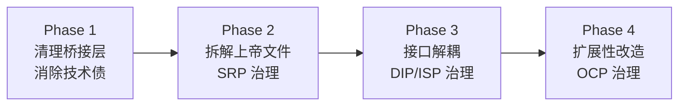
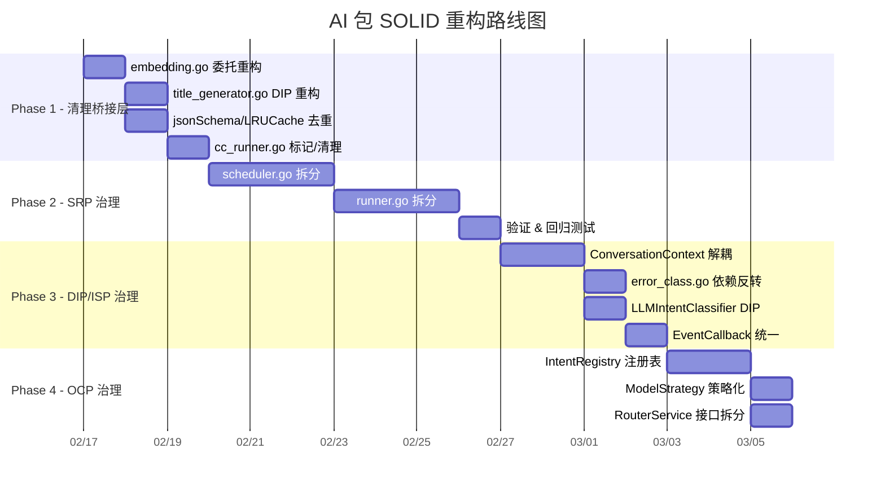

# AI 包 DRY + SOLID 架构升级重构方案

> **版本**: v1.0  
> **日期**: 2026-02-13  
> **状态**: 草案，待评审

---

## 目录

1. [现状分析](#1-现状分析)
2. [SOLID 违规诊断](#2-solid-违规诊断)
3. [DRY 违规诊断](#3-dry-违规诊断)
4. [重构方案](#4-重构方案)
5. [实施路线图](#5-实施路线图)
6. [风险与缓解](#6-风险与缓解)

---

## 1. 现状分析

### 1.1 包结构概览

```
ai/                          # 根包：配置 + 遗留桥接层
├── core/                    # ✅ 核心服务（embedding, llm, reranker, retrieval）
├── agents/                  # ⚠️ 代理系统（最大复杂度区域）
│   ├── universal/           # 配置驱动的通用鹦鹉（22 文件）
│   ├── tools/               # 代理工具（scheduler.go 38KB ❌）
│   ├── registry/            # 工具/Prompt/Metrics 注册中心
│   ├── orchestrator/        # Orchestrator-Workers 模式
│   ├── runner/              # CCRunner（runner.go 35KB ❌）
│   └── geek/                # GeekParrot（Claude Code 集成）
├── routing/                 # ✅ 意图路由（FastRouter: cache → rule）
├── context/                 # ✅ LLM 上下文构建
├── services/                # 高级服务（schedule, session, stats）
├── cache/                   # 语义缓存
├── observability/           # 可观测性（metrics, tracing, logging）
├── aitime/                  # 时间服务
├── duplicate/               # 重复检测
├── tags/                    # 标签建议
└── timeout/                 # 超时管理
```

### 1.2 关键度量

| 指标               | 当前值                                                      | 备注                                         |
| :----------------- | :---------------------------------------------------------- | :------------------------------------------- |
| 总文件数           | ~200                                                        | 含测试                                       |
| 最大单文件         | `tools/scheduler.go` 38KB                                   | 上帝工具                                     |
| 次大单文件         | `runner/runner.go` 35KB                                     | 上帝类                                       |
| 遗留桥接文件       | 4 个 (llm.go, reranker.go, cc_runner.go, 部分 embedding.go) | 技术债                                       |
| EventCallback 定义 | 3 处重复                                                    | agents, runner, orchestrator                 |
| jsonSchema 定义    | 2 处重复                                                    | title_generator.go, llm_intent_classifier.go |
| LRUCache 实现      | 2 处重复                                                    | universal/, routing/                         |
| IntentClassifier   | 2 套并行                                                    | agents/ 规则版 + LLM 版                      |

### 1.3 依赖关系图

```mermaid
graph TD
    subgraph "ai/ 根包"
        Config[config.go]
        LLMBridge[llm.go<br/>deprecated bridge]
        EmbBridge[embedding.go<br/>⚠️ 混合层]
        RerankerBridge[reranker.go<br/>deprecated bridge]
        TitleGen[title_generator.go<br/>⚠️ 直接依赖 openai]
    end

    subgraph "core/"
        CoreLLM[core/llm]
        CoreEmb[core/embedding]
        CoreReranker[core/reranker]
        CoreRetrieval[core/retrieval]
    end

    subgraph "agents/"
        BaseParrot[base_parrot.go]
        ChatRouter[chat_router.go]
        IntentCls[intent_classifier.go]
        LLMIntentCls[llm_intent_classifier.go<br/>⚠️ 直接依赖 openai]
        ToolAdapter[tool_adapter.go]
        Context[context.go<br/>⚠️ 耦合 schedule 领域]
        ErrorClass[error_class.go<br/>⚠️ 导入 server/store]
        Recovery[recovery.go]
        CCRunner[cc_runner.go<br/>20+ 类型别名]
    end

    subgraph "agents/universal/"
        UniParrot[universal_parrot.go]
        Executors[react/planning/reflexion<br/>executor]
        Strategies[strategies.go]
    end

    subgraph "agents/tools/"
        Scheduler[scheduler.go 38KB ❌]
        MemoSearch[memo_search.go]
        MemoIntent[memo_query_intent.go]
    end

    LLMBridge --> CoreLLM
    RerankerBridge --> CoreReranker
    EmbBridge -.-> |应该委托| CoreEmb
    ChatRouter --> Routing
    ErrorClass --> |❌ 跨层依赖| ServerSchedule[server/service/schedule]
    ErrorClass --> |❌ 跨层依赖| PostgresStore[store/db/postgres]
    Context --> |❌ 领域耦合| ServicesSchedule[services/schedule]
    Context --> |❌ 领域耦合| Store[store]
    LLMIntentCls --> |❌ 直接依赖| OpenAI[go-openai]
    TitleGen --> |❌ 直接依赖| OpenAI

    subgraph "routing/"
        Routing[service.go]
        RouterInterface[interface.go ✅]
    end
```



---

## 2. SOLID 违规诊断

### 2.1 S — 单一职责原则 (SRP)

#### ❌ 严重违规

| 文件                               | 问题                                                               | 影响                                   |
| :--------------------------------- | :----------------------------------------------------------------- | :------------------------------------- |
| `agents/tools/scheduler.go` (38KB) | 上帝工具：解析、验证、创建、查询、冲突检测、批量操作全部耦合       | 修改任何子功能都需触碰此文件，测试困难 |
| `agents/runner/runner.go` (35KB)   | 上帝类：会话管理、流式输出、进程控制、CLI 集成全部耦合             | 责任过多，修改风险高                   |
| `agents/context.go` (14KB)         | 混合了通用会话上下文 + 日程领域模型（ScheduleDraft, WorkflowStep） | 新增代理类型时必须修改此文件           |
| `agents/cc_runner.go` (8KB)        | 纯桥接层：20+ 类型别名 + 8 个函数别名                              | 增加认知负担，无实际逻辑               |

#### ⚠️ 轻度违规

| 文件                              | 问题                                                 |
| :-------------------------------- | :--------------------------------------------------- |
| `ai/embedding.go`                 | 根包同时定义接口和实现（其他服务已正确委托到 core/） |
| `ai/title_generator.go`           | 直接使用 openai 库而非通过 core/llm 抽象层           |
| `agents/llm_intent_classifier.go` | 直接使用 openai 库实例化 LLM 客户端                  |

### 2.2 O — 开闭原则 (OCP)

#### ❌ 严重违规

| 位置                               | 问题                                                                                   | 影响                   |
| :--------------------------------- | :------------------------------------------------------------------------------------- | :--------------------- |
| `routing/interface.go` Intent 常量 | 新增代理类型需修改 `Intent` 枚举 + `IntentToAgentType` 映射 + `AgentTypeToIntent` 映射 | 3 处联动修改           |
| `agents/chat_router.go`            | `mapIntentToRouteType` 硬编码 switch，新增路由类型需修改                               | 与 routing 包联动修改  |
| `agents/intent_classifier.go`      | 关键词列表嵌入代码，新增意图需修改源码                                                 | 无法通过配置扩展       |
| `routing/service.go` SelectModel   | 模型选择策略硬编码在 switch 中                                                         | 新增任务类型需修改源码 |

### 2.3 L — 里氏替换原则 (LSP)

#### ⚠️ 潜在问题

| 位置                 | 问题                                                                                                       |
| :------------------- | :--------------------------------------------------------------------------------------------------------- |
| `EventCallback` 类型 | 三处定义签名不一致：`agents/runner` 用 `func(string, any) error`，`orchestrator` 用 `func(string, string)` |
| `ParrotAgent` 接口   | `Execute` 与 `ExecuteWithCallback` 方法重叠，实现者可能行为不一致                                          |

### 2.4 I — 接口隔离原则 (ISP)

#### ❌ 严重违规

| 位置                                    | 问题                                                                               | 影响                                   |
| :-------------------------------------- | :--------------------------------------------------------------------------------- | :------------------------------------- |
| `agents/context.go` ConversationContext | 通用上下文混入 `ScheduleDraft`、`WorkflowStep`、`ExtractRefinement` 等日程特有字段 | Memo Agent 被迫依赖 schedule 领域类型  |
| `routing/RouterService`                 | `SelectModel` 方法与意图路由无关，应拆分                                           | 不需要模型选择的消费者也被迫依赖此方法 |

### 2.5 D — 依赖倒置原则 (DIP)

#### ❌ 严重违规

| 文件                              | 问题                                                      | 正确做法                       |
| :-------------------------------- | :-------------------------------------------------------- | :----------------------------- |
| `agents/error_class.go`           | 直接导入 `server/service/schedule` 和 `store/db/postgres` | AI 层不应依赖 server/store 层  |
| `agents/llm_intent_classifier.go` | 直接实例化 `openai.Client`                                | 应通过 `core/llm.Service` 抽象 |
| `ai/title_generator.go`           | 直接实例化 `openai.Client`                                | 应通过 `core/llm.Service` 抽象 |
| `ai/embedding.go`                 | 根包仍持有具体实现                                        | 应全权委托到 `core/embedding`  |
| `agents/context.go`               | 直接导入 `store` 包和 `services/schedule`                 | 应使用接口隔离                 |

---

## 3. DRY 违规诊断

> **DRY (Don't Repeat Yourself)**: 每一项知识在系统中都应有且仅有一个权威、明确的表示。

### 3.1 结构型重复

#### ❌ `jsonSchema` struct 重复定义

| 位置                                       | 行数  | 用途                 |
| :----------------------------------------- | :---- | :------------------- |
| `ai/title_generator.go` L211-223           | 13 行 | 标题生成 JSON Schema |
| `agents/llm_intent_classifier.go` L286-298 | 13 行 | 意图分类 JSON Schema |

两处定义 **完全相同**（字段、标签、MarshalJSON 方法均一致），属于典型的复制粘贴重复。

**合并目标**: `core/llm/schema.go` [NEW]

---

#### ❌ `LRUCache` 实现重复

| 位置                                            | 行数    | 用途          |
| :---------------------------------------------- | :------ | :------------ |
| `agents/universal/universal_parrot.go` L336-483 | ~150 行 | 代理结果缓存  |
| `routing/cache.go` L1-180                       | ~180 行 | 路由决策缓存  |
| `cache/lru.go`                                  | ~130 行 | 通用 LRU 缓存 |

三套 LRU 实现逻辑高度相似，均基于 `container/list` + `sync.Mutex` + TTL 过期。

**合并目标**: 统一到 `cache/lru.go`，其他位置引用此包。

---

### 3.2 类型定义重复

#### ❌ `EventCallback` 类型三处独立定义

| 位置                                       | 签名                                             |
| :----------------------------------------- | :----------------------------------------------- |
| `agents/runner/types.go`                   | `func(eventType string, eventData any) error`    |
| `agents/orchestrator/types.go`             | `func(eventType string, eventData string)`       |
| `agents/base_parrot.go` (SafeCallbackFunc) | `func(eventType string, data interface{}) error` |

三处签名不一致（返回值、参数类型不同），调用方需适配多种回调格式。

**合并目标**: `agents/events/callback.go` [NEW]，统一定义。

---

### 3.3 逻辑重复

#### ⚠️ 意图分类器双轨并行

| 实现                         | 文件                              | 方法              |
| :--------------------------- | :-------------------------------- | :---------------- |
| 规则版 `IntentClassifier`    | `agents/intent_classifier.go`     | 关键词 + 正则匹配 |
| LLM 版 `LLMIntentClassifier` | `agents/llm_intent_classifier.go` | LLM 调用          |

两者的意图枚举 (`TaskIntent`) 完全一致，`ShouldUsePlanExecute` 方法逻辑相同。规则版应作为 LLM 版的快速前置层，而非独立并行存在。

> [!NOTE]
> 此重复已在 `routing/` 中被重新实现为分层架构（cache → rule → LLM），但 `agents/` 包内的旧实现仍保留，形成双轨冗余。

---

#### ⚠️ 截断函数重复

| 函数                        | 位置                                   |
| :-------------------------- | :------------------------------------- |
| `TruncateString(s, maxLen)` | `agents/cc_runner.go` (alias → runner) |
| `truncateForLog(s, maxLen)` | `agents/llm_intent_classifier.go`      |
| `truncate(s, maxLen)`       | `routing/utils.go`                     |

三处实现逻辑完全等价，仅函数名不同。

**合并目标**: 统一到 `agents/runner/` 或提取为通用工具函数。

---

### 3.4 桥接层重复（技术债）

`cc_runner.go` 包含 **20+ 类型别名** 和 **8 个函数别名**，总计 ~250 行零逻辑代码。这不是典型 DRY 违规，而是迁移不完整导致的冗余层。

### 3.5 DRY 违规汇总

| 类别                                  | 实例数 | 冗余行数    | 优先级 |
| :------------------------------------ | :----- | :---------- | :----- |
| 结构型重复 (jsonSchema, LRUCache)     | 2      | ~300 行     | 🔴 高   |
| 类型定义重复 (EventCallback)          | 3 处   | ~30 行      | 🔴 高   |
| 逻辑重复 (IntentClassifier, truncate) | 2      | ~400 行     | 🟡 中   |
| 桥接层冗余 (cc_runner.go)             | 1      | ~250 行     | 🟢 低   |
| **合计**                              |        | **~980 行** |        |

---

## 4. 重构方案

### 4.1 总体策略

采用 **渐进式重构**，分 4 个阶段实施，每阶段独立可验证、可回退：



---

### Phase 1：清理桥接层 & DRY 治理

**目标**：移除遗留桥接代码，消除代码重复，统一抽象层。

**优先级**: 🔴 高 | **风险**: 🟢 低 | **预计工作量**: 2-3 天

---

#### 1.1 删除 `ai/embedding.go` 中的具体实现

**现状**: `ai/embedding.go` 定义了 `EmbeddingService` 接口 **和** `embeddingService` 具体实现，直接依赖 `go-openai`。而 `core/embedding` 已有完整实现。

**改造**:

```diff
 // ai/embedding.go
 package ai

-import (
-    "context"
-    "errors"
-    "fmt"
-    "github.com/sashabaranov/go-openai"
-)
+import (
+    "github.com/hrygo/divinesense/ai/core/embedding"
+)

 // EmbeddingService is the vector embedding service interface.
-type EmbeddingService interface {
-    Embed(ctx context.Context, text string) ([]float32, error)
-    EmbedBatch(ctx context.Context, texts []string) ([][]float32, error)
-    Dimensions() int
-}
+//
+// Deprecated: Use embedding.Service directly.
+type EmbeddingService = embedding.Service

-type embeddingService struct { ... }
-func NewEmbeddingService(...) { ... }
-func (s *embeddingService) Embed(...) { ... }
-func (s *embeddingService) EmbedBatch(...) { ... }
-func (s *embeddingService) Dimensions() int { ... }

+// NewEmbeddingService creates a new EmbeddingService.
+//
+// Deprecated: Use embedding.NewService directly.
+func NewEmbeddingService(cfg *EmbeddingConfig) (EmbeddingService, error) {
+    return embedding.NewService((*embedding.Config)(cfg))
+}
```

#### 1.2 重构 `ai/title_generator.go` 使用 `core/llm` 抽象

**现状**: 直接实例化 `openai.Client`，绕过了 `core/llm.Service` 抽象层。

**改造**: 注入 `llm.Service` 依赖，消除对 `go-openai` 的直接依赖。

```diff
 type TitleGenerator struct {
-    client *openai.Client
-    model  string
+    llm ai.LLMService
 }

-func NewTitleGenerator(cfg TitleGeneratorConfig) *TitleGenerator { ... }
+func NewTitleGenerator(llm ai.LLMService) *TitleGenerator {
+    return &TitleGenerator{llm: llm}
+}

 func (tg *TitleGenerator) Generate(ctx context.Context, ...) (string, error) {
-    resp, err := tg.client.CreateChatCompletion(ctx, req)
+    resp, _, err := tg.llm.Chat(ctx, messages)
     ...
 }
```

#### 1.3 标记 `cc_runner.go` 桥接层为可安全删除

**现状**: 20+ 类型别名 + 8 个函数别名，零业务逻辑。

**改造**:
- 在所有消费方代码中将 `agent.XXX` 替换为 `runner.XXX`
- 添加 `go:generate` 工具或 IDE 搜索确认无外部引用后删除文件

#### 1.4 消除重复定义

| 重复实体            | 出现位置                                            | 合并位置                             |
| :------------------ | :-------------------------------------------------- | :----------------------------------- |
| `jsonSchema` struct | `title_generator.go`, `llm_intent_classifier.go`    | `core/llm/schema.go` [NEW]           |
| `LRUCache`          | `universal/universal_parrot.go`, `routing/cache.go` | `cache/lru.go`（已有） — 见 DRY §3.1 |
| `truncate` 函数     | `agents/`, `routing/` 共 3 处                       | 统一到公共 utils — 见 DRY §3.3       |

---

### Phase 2：拆解上帝文件 (SRP)

**目标**：将 38KB 和 35KB 的超大文件按职责拆分为若干内聚模块。

**优先级**: 🔴 高 | **风险**: 🟡 中 | **预计工作量**: 5-7 天

---

#### 2.1 拆解 `agents/tools/scheduler.go` (38KB)

**目标大小**: 每个文件 < 500 行

```
agents/tools/scheduler.go (38KB, ~1200行)
    ↓ 拆分为
agents/tools/schedule/
├── tool.go              # SchedulerTool 入口 + Run() 路由
├── parser.go            # 时间/日程解析逻辑
├── creator.go           # 日程创建（单条 + 批量）
├── query.go             # 日程查询
├── conflict.go          # 冲突检测与解决
├── validator.go         # 输入验证
└── formatter.go         # 结果格式化
```

**关键原则**:
- `tool.go` 仅做路由分派，命令模式将不同操作分派到对应处理器
- 各子模块通过接口交互，不直接引用彼此内部
- 保持 `ToolWithSchema` 接口合约不变

#### 2.2 拆解 `agents/runner/runner.go` (35KB)

```
agents/runner/runner.go (35KB, ~1100行)
    ↓ 拆分为
agents/runner/
├── runner.go            # CCRunner 核心生命周期管理
├── process.go           # 子进程管理（启动/停止/健康检查）
├── stream.go            # 流式输出解析与分发
├── prompt.go            # System prompt 构建
├── conversation.go      # 会话消息管理
└── health.go            # 健康检查与自愈
```

---

### Phase 3：接口解耦 (DIP + ISP)

**目标**：消除跨层依赖，通过接口隔离实现松耦合。

**优先级**: 🟡 中 | **风险**: 🟡 中 | **预计工作量**: 4-5 天

---

#### 3.1 解耦 `ConversationContext` 中的领域绑定

**现状**: `agents/context.go` 导入 `services/schedule` 和 `store`，嵌入了 `ScheduleDraft`、`WorkflowStep` 等日程特有类型。

**改造**:

```diff
 // agents/context.go — 保留通用会话上下文
 type ConversationContext struct {
     SessionID    string
     UserID       int32
     Turns        []ConversationTurn
     LastRoute    ChatRouteType
-    WorkingState *WorkingState   // ❌ 日程领域耦合
+    Extensions   map[string]any  // ✅ 可扩展状态存储
     ...
 }

-// ❌ 删除日程特有类型
-type WorkingState struct { ... }
-type ScheduleDraft struct { ... }
-type WorkflowStep string
```

**日程特有状态迁移到**:
```go
// agents/tools/schedule/context.go [NEW]
type ScheduleWorkingState struct {
    ProposedSchedule *ScheduleDraft
    CurrentStep      WorkflowStep
    Conflicts        []*ConflictInfo
}
```

#### 3.2 消除 `error_class.go` 跨层依赖

**现状**: 直接导入 `server/service/schedule` 和 `store/db/postgres`。

**改造**: 引入错误接口，通过错误匹配而非类型断言来分类。

```diff
 // agents/error_class.go
-import (
-    "github.com/hrygo/divinesense/server/service/schedule"
-    postgresstore "github.com/hrygo/divinesense/store/db/postgres"
-)

+// ConflictError 是冲突错误的接口
+type ConflictError interface {
+    error
+    IsConflict() bool
+}

 func ClassifyError(err error) *ClassifiedError {
-    if errors.Is(err, schedule.ErrScheduleConflict) { ... }
-    var conflictErr *postgresstore.ConflictConstraintError
-    if errors.As(err, &conflictErr) { ... }
+    // 使用接口断言替代具体类型
+    var conflictErr ConflictError
+    if errors.As(err, &conflictErr) && conflictErr.IsConflict() { ... }
     ...
 }
```

**对应变更**: `server/service/schedule` 和 `store/db/postgres` 中的错误类型需实现 `ConflictError` 接口。

#### 3.3 重构 `LLMIntentClassifier` 使用 `core/llm` 抽象

```diff
 type LLMIntentClassifier struct {
-    client   *openai.Client
-    model    string
+    llm      ai.LLMService
 }

-func NewLLMIntentClassifier(cfg LLMIntentConfig) *LLMIntentClassifier {
+func NewLLMIntentClassifier(llm ai.LLMService) *LLMIntentClassifier {
```

#### 3.4 拆分 `RouterService` 接口

```diff
 // routing/interface.go
 type RouterService interface {
     ClassifyIntent(ctx context.Context, input string) (Intent, float32, bool, error)
-    SelectModel(ctx context.Context, task TaskType) (ModelConfig, error)
     RecordFeedback(ctx context.Context, feedback *RouterFeedback) error
     GetRouterStats(ctx context.Context, userID int32, timeRange time.Duration) (*RouterStats, error)
 }

+// ModelSelector 独立的模型选择接口
+type ModelSelector interface {
+    SelectModel(ctx context.Context, task TaskType) (ModelConfig, error)
+}
```

#### 3.5 统一 EventCallback 类型

```diff
+// agents/events/callback.go [NEW]
+package events
+
+// Callback 是统一的事件回调类型
+type Callback func(eventType string, eventData any) error
+
+// SimpleCallback 用于不需要错误处理的场景
+type SimpleCallback func(eventType string, eventData string)
```

所有包统一使用 `events.Callback`，消除 3 处独立定义。

---

### Phase 4：扩展性改造 (OCP)

**目标**：实现"对扩展开放、对修改关闭"，通过注册/配置机制替代硬编码。

**优先级**: 🟢 低 | **风险**: 🟡 中 | **预计工作量**: 3-4 天

---

#### 4.1 意图注册表替代硬编码常量

```go
// routing/intent_registry.go [NEW]
type IntentRegistry struct {
    mu       sync.RWMutex
    intents  map[Intent]IntentConfig
    mappings map[Intent]AgentType
}

type IntentConfig struct {
    Intent      Intent
    AgentType   AgentType
    Keywords    []string
    Patterns    []*regexp.Regexp
    Priority    int
}

// RegisterIntent 运行时注册新意图
func (r *IntentRegistry) RegisterIntent(cfg IntentConfig) { ... }

// Match 通过注册的规则进行匹配
func (r *IntentRegistry) Match(input string) (Intent, float32, bool) { ... }
```

**效果**: 新增 Agent 类型时仅需在启动时注册配置，无需修改源码。

#### 4.2 模型选择策略化

```go
// routing/model_strategy.go [NEW]
type ModelStrategy interface {
    SelectModel(ctx context.Context, task TaskType) (ModelConfig, error)
}

// ConfigDrivenModelStrategy 基于配置文件的模型选择
type ConfigDrivenModelStrategy struct {
    configs map[TaskType]ModelConfig
}
```

---

## 5. 实施路线图



### 建议实施优先级

| 阶段    | 收益                             | 风险                     | 建议         |
| :------ | :------------------------------- | :----------------------- | :----------- |
| Phase 1 | 🟢 立即：减少认知负担、统一抽象层 | 🟢 低：纯重构不改业务逻辑 | **优先实施** |
| Phase 2 | 🔴 高：降低维护成本、提升可测试性 | 🟡 中：需仔细处理内部引用 | **紧接 P1**  |
| Phase 3 | 🔴 高：消除架构风险、支持未来扩展 | 🟡 中：需更新所有调用方   | **核心改造** |
| Phase 4 | 🟡 中：提升扩展性                 | 🟡 中：引入注册机制复杂度 | **可延后**   |

---

## 6. 风险与缓解

### 6.1 回归风险

| 风险                       | 缓解措施                                             |
| :------------------------- | :--------------------------------------------------- |
| Phase 2 拆分大文件引入 bug | 每次拆分仅移动代码不改逻辑，逐步验证测试通过         |
| Phase 3 接口变更破坏调用方 | 使用 deprecated 标记过渡，先增后删，保留编译时安全网 |
| 跨包引用遗漏               | `go vet` + `staticcheck` 全量扫描确认无断裂引用      |

### 6.2 向后兼容策略

- **Phase 1-2**: 保留 deprecated 别名，文件改名时保留旧包入口
- **Phase 3**: 新旧接口并行运行一个版本周期（至少 1 个 minor release）
- **Phase 4**: 新机制为补充性变更，旧代码无需立即修改

### 6.3 验证策略

```bash
# 每阶段完成后执行
go build ./...                    # 编译通过
go test ./ai/... -v -count=1     # 全量单元测试
go vet ./ai/...                  # 静态检查
staticcheck ./ai/...             # 深度静态分析（如已配置）
```

---

## 附录: 重构前后架构对比

### 重构前

```
ai/ 根包
  ├─ 直接依赖 go-openai (embedding.go, title_generator.go)
  ├─ agents/ 直接依赖 server/, store/ (error_class.go, context.go)
  └─ 上帝文件: scheduler.go(38KB), runner.go(35KB)
```

### 重构后（目标）

```
ai/ 根包
  ├─ 仅定义接口 + 委托到 core/
  ├─ agents/ 仅依赖 ai/ 内部接口，通过 DI 注入外部能力
  ├─ 文件粒度: 每文件 < 500 行
  └─ 新代理类型: 仅需注册配置，无需修改现有代码
```

### 核心收益

1. **可维护性** ↑: 文件粒度从 38KB → <500 行
2. **可测试性** ↑: 消除跨层依赖，各模块可独立 mock
3. **可扩展性** ↑: 新增代理类型从"修改 5+ 文件"→"注册配置"
4. **认知负担** ↓: 删除 ~200 行桥接代码、统一回调类型
