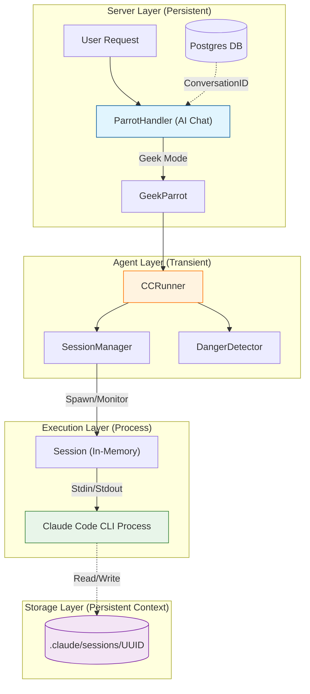
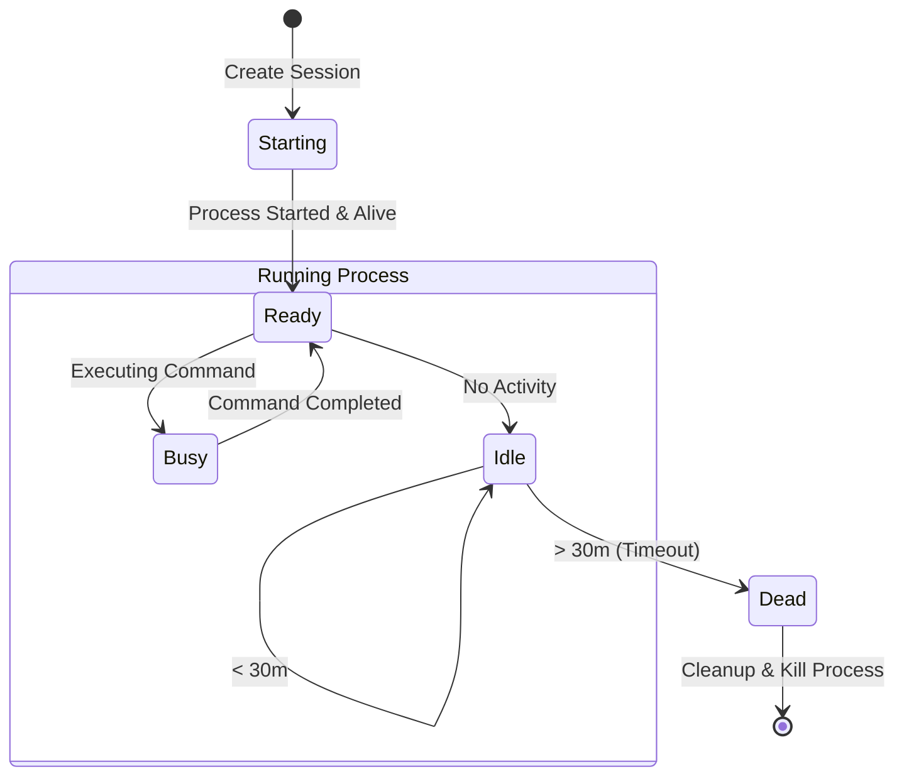
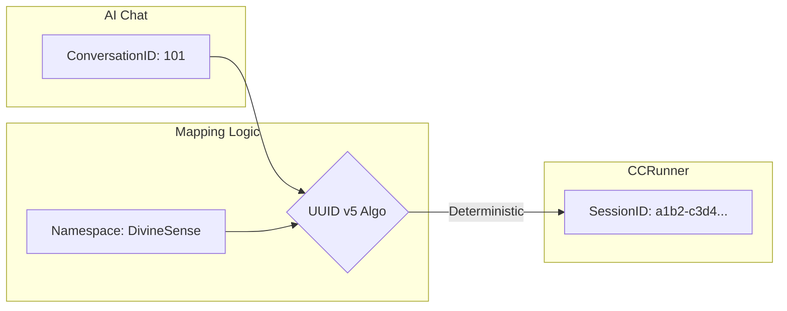
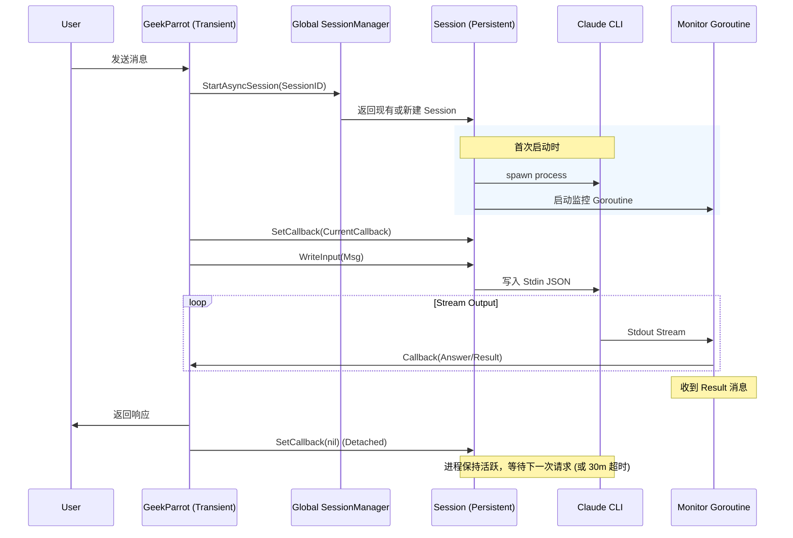
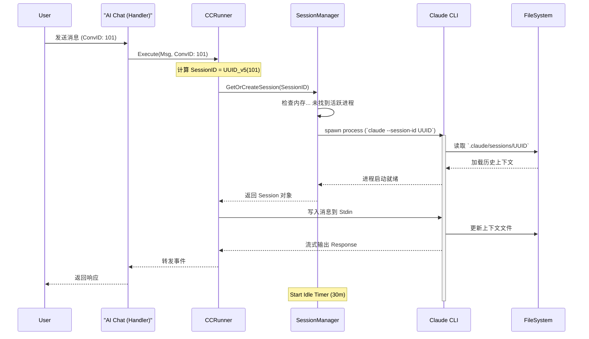

# DivineSense CC Runner 架构设计文档

## 📋 执行摘要

本报告深入分析了 `CCRunner` (Claude Code Runner) 的架构设计、生命周期管理及其与 AI Chat 系统的集成关系。核心发现是：**AI Chat 利用确定性的 UUID 映射策略，将持久化的数据库对话 (Conversation) 与临时的 Claude Code CLI 会话 (Session) 链接起来**。这种由于 UUID v5 带来的确定性映射，确保了即使底层执行进程被回收或重启，用户的会话上下文（存储在磁盘上的 `.claude/sessions` 目录中）依然能够被精准恢复，实现了"无状态后端，有状态 CLI"的架构目标。

---

## 1. 系统核心组件架构

整个系统通过分层架构实现从用户请求到底层 CLI 执行的传导。

### 1.1 组件概览

*   **AI Chat (`ParrotHandler`)**: 位于 `server/router/api/v1/ai/handler.go`。负责处理 gRPC/HTTP 请求，路由分发，以及维护数据库中的对话状态 (`AIConversation`)。
*   **GeekParrot (`ai/agents/geek`)**: 极客模式代理，作为 AI Chat 与 CCRunner 之间的适配器。
*   **CCRunner (`ai/agents/runner`)**: 统一的执行引擎。负责管理 CLI 进程、流式输出解析 (`stream-json`)、以及安全检查 (`DangerDetector`)。
*   **SessionManager**: 负责进程的生命周期管理（创建、监控、空闲回收）。

### 1.2 架构关系图



---

## 2. 生命周期深度分析

### 2.1 进程生命周期 (Process Lifecycle)

`CCRunner` 管理着 `claude` CLI 的物理 OS 进程。

1.  **惰性启动 (Lazy Start)**: 进程不会随系统启动，只有在首次调用 `Execute()` 时才会创建。
2.  **执行 (Execution)**:
    *   **首次运行**: 使用 `--session-id <UUID>` 初始化。
    *   **后续运行/恢复**: 再次使用 `--session-id <UUID>` (或 `--resume`)，CLI 会自动加载磁盘上的上下文。
3.  **空闲监控 (Idle Monitoring)**: `SessionManager` 每分钟运行一次 `cleanupLoop`。
4.  **终止 (Termination)**:
    *   **空闲超时**: 默认为 **30分钟**。如果会话超过30分钟无活动，进程会被杀掉以释放内存资源。
    *   **显式停止**: 调用 `TerminateSession()` 强制结束。

### 2.2 会话生命周期 (Session Lifecycle)

"会话" (Session) 的概念被拆分为 **内存状态 (Memory)** 和 **磁盘状态 (Disk)**。

*   **内存会话 (`runner.Session`)**: 临时的。跟踪运行中的 `cmd` 对象、管道和状态。进程结束后即消失。
*   **磁盘上下文 (`.claude/sessions`)**: 持久化的。由 `claude` CLI 自身管理。即使进程重启或机器重启，文件依然存在，上下文可被恢复。

#### 会话状态流转图



---

## 3. AI Chat 与 CCRunner 的核心关系

AI Chat (持久层) 与 CCRunner (执行层) 之间的关键纽带是 **确定性身份映射 (Deterministic Identity Mapping)**。

### 3.1 确定性映射机制

系统使用 **UUID v5** 算法，基于固定的命名空间和 AI Chat 的 `ConversationID` 生成 `SessionID`。

**公式**: `SessionID = UUID_v5(Namespace, "divinesense:conversation:{ConversationID}")`

这意味着：
*   **一对一**: 一个 AI Chat 对话永远对应同一个 CLI 会话 ID。
*   **无状态**: 后端不需要存储 "ConversationID 100 对应哪个 SessionID"，因为它可以随时算出来。

#### ID 映射流程图



### 3.2 交互场景时序分析

#### 场景: GeekParrot 交互逻辑 (持久化进程实现)

GeekParrot 现在使用 **Persistent Process (持久化进程)** 模式。通过全局 `SessionManager` 复用 CLI 进程，实现 30 分钟内的长连接保活。



> **注意**: 只有在 30 分钟内无任何交互时，`SessionManager` 才会回收进程。下次交互将触发冷启动恢复流程（加载磁盘上下文）。

#### 场景: 会话恢复 (Resume) - "冷启动"

这是最典型的场景：用户隔了一段时间回来，之前的 CLI 进程已经被回收，但上下文需要保留。



---

## 4. 关键配置总结

| 配置项                       | 值                                                  | 说明                                                              |
| :--------------------------- | :-------------------------------------------------- | :---------------------------------------------------------------- |
| **空闲超时 (Idle Timeout)**  | **30 分钟**                                         | 硬编码在 `NewCCSessionManager` 中。超过此时长无交互，进程被回收。 |
| **会话 ID 算法**             | **UUID v5**                                         | 基于 SHA-1 哈希，确保跨平台、跨重启的一致性。                     |
| **会话存储路径 (Geek)**      | `~/.divinesense/claude/user_<id>/.claude/sessions/` | 每个用户有独立的沙箱目录，相互隔离。                              |
| **会话存储路径 (Evolution)** | `<ProjectRoot>/.claude/sessions/`                   | 进化模式直接操作项目根目录。                                      |

## 5. 结论

CCRunner 的架构设计成功地将 **逻辑对话** (AI Chat) 与 **执行运行时** (CCRunner Process) 解耦。

1.  **稳定性**: 通过确定性映射，后端重启不会丢失用户上下文。
2.  **资源效率**: 30分钟的自动回收机制防止了僵尸进程占用服务器资源。
3.  **连续性**: 用户感知不到进程的重启，体验上是连续的对话流。

---

## 6. 安全与风控 (Security & Safety)

CCRunner 内置了多层安全防御机制，防止 AI 执行危险操作。

### 6.1 危险命令检测 (DangerDetector)

`DangerDetector` (`ai/agents/runner/danger.go`) 会实时扫描用户输入和工具调用，拦截高危指令。

**拦截模式示例**:
*   `rm -rf /` (系统破坏)
*   `mkfs.*` (格式化)
*   `dd if=...` (直接磁盘写入)
*   `> /dev/sd*` (覆盖设备文件)

### 6.2 权限控制模式

*   **默认模式**: CLI 运行在受限权限下。
*   **Bypass 模式**: 管理员可通过 `--permission-mode bypassPermissions` 绕过检查（需在 `StartAsyncSession` 配置中显式启用，通常仅限 Evolution Mode）。

### 6.3 运行环境隔离

*   **Geek Mode**:
    *   **工作目录**: 每个用户拥有独立的沙箱工作目录 `~/.divinesense/claude/user_<id>/`。
    *   **配置隔离**: 强制设置环境变量 `HOME` 指向沙箱目录，确保 `.claude` 配置和会话文件物理隔离，不污染宿主环境。
*   **Git 仓库强制**: 建议在 Git 仓库内运行，以便通过 Git 历史回滚文件变更。

---

## 7. 配置与运维 (Configuration & Operations)

### 7.1 环境变量配置

| 环境变量                               | 默认值                  | 说明                            |
| :------------------------------------- | :---------------------- | :------------------------------ |
| `DIVINESENSE_CLAUDE_CODE_ENABLED`      | `false`                 | 是否启用 Geek Mode              |
| `DIVINESENSE_CLAUDE_CODE_WORKDIR`      | `~/.divinesense/claude` | 根工作目录                      |
| `DIVINESENSE_CLAUDE_CODE_IDLE_TIMEOUT` | `30m`                   | 空闲超时时间 (Go 格式 duration) |
| `DIVINESENSE_CLAUDE_CODE_MAX_SESSIONS` | `10`                    | 单机最大并发会话数              |
| `DIVINESENSE_EVOLUTION_ENABLED`        | `false`                 | 是否启用 Evolution Mode         |

### 7.2 调试与诊断

**查看活动会话**:
```bash
# 列出当前 SessionManager 管理的所有会话
curl http://localhost:28081/api/v1/chat/geek/sessions
```

**日志文件**:
*   **CLI 日志**: 位于会话工作目录下的 `.claude/sessions/{session-id}/logs.txt`。
*   **应用日志**: DivineSense 后端日志包含 `CCRunner` 前缀的详细执行流。

**手动强杀**:
如果出现僵尸进程，可手动清理：
```bash
# 杀掉所有 claude 进程
killall -9 claude
```
