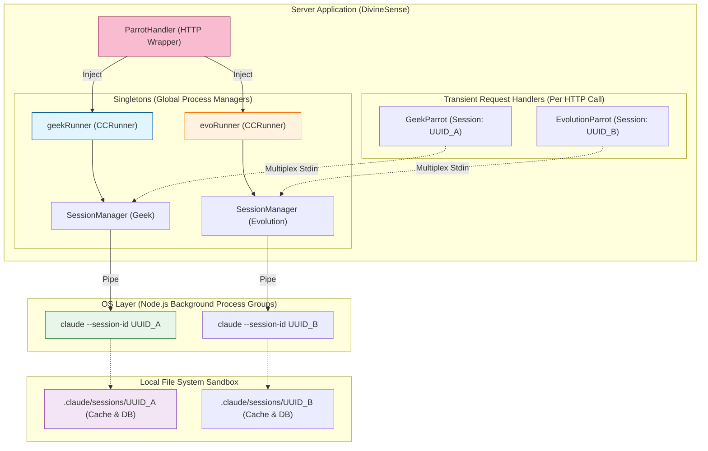
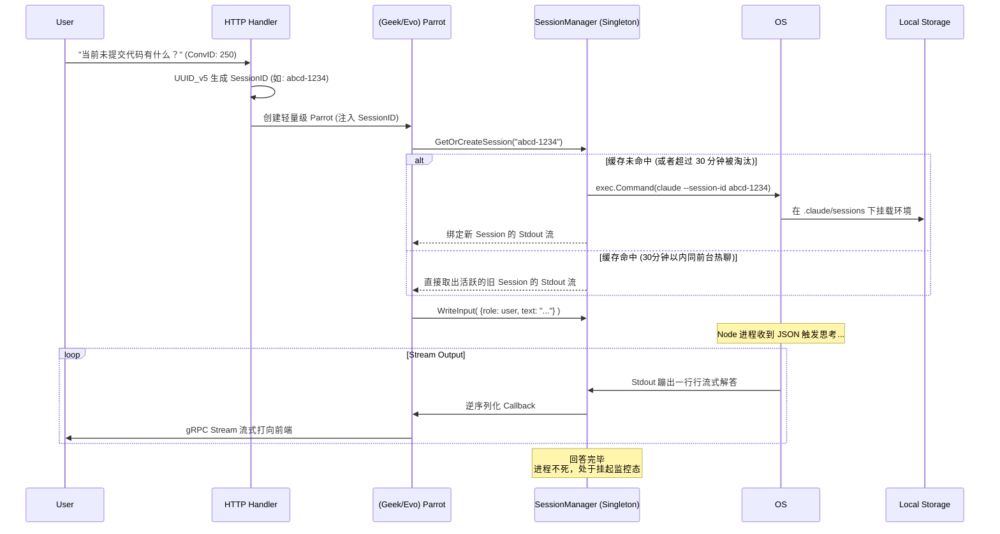

# DivineSense CC Runner 架构设计文档 (v2.0)

## 📋 执行摘要 (Executive Summary)

本架构白皮书深度剖析了 **`CCRunner` (Claude Code Runner)** 的新一代架构设计。作为贯穿 DivineSense 极客模式 (Geek Mode) 与进化模式 (Evolution Mode) 的核心执行引擎，`CCRunner` 摒弃了传统的“单次请求-单次启停”的昂贵模型，演进为基于 **“单例挂载 (Singleton) + 流式纯粹多路复用 (Hot-Multiplexing)”** 的高性能持久化容器引擎。

最新架构通过引入 **强隔离的 UUID v5 实体映射** 与 **OS 级别的进程组 (PGID) 强生命周期绑定**，彻底根绝了会话脏读、文件锁互斥冲突 (Session already in use) 以及孤儿节点 (Zombie Process) 内存泄漏等灾难级问题，完美实现了“高频交互如丝般顺滑、上下文物理级绝对隔离、进程跟从级优雅退场”的工业级架构目标。

---

## 1. 核心架构拓扑图

整个体系围绕着 **依赖倒置与全局单例** 展开映射。

### 1.1 组件概览

*   **`ParrotHandler` (顶层调度)**: 位于 `api/v1/ai/handler.go`。它是整个服务生命周期中最长的组件，也是 `geekRunner` 和 `evoRunner` 两大执行引擎单例的“全局持有者”。
*   **适配器 (`GeekParrot` / `EvolutionParrot`)**: 负责将单一用户的请求（如带有上下文、设备环境的请求）与底层的执行引擎桥接，它们本身随请求而生灭，但底层传入的 `runner` 乃是持久单例。
*   **`CCRunner` (执行引擎)**: 定义和持有 `SessionManager`，负责隔离、处理流式通信并向适配层传递实时的 `stream-json` 事件。
*   **`SessionManager` (大管家/进程池)**: 全局管理所有活跃的 Node.js 进程。它维护一张内存路由表 (`sessions map`)，将哈希算出的 `SessionID` 无缝路由到对应处于活跃挂机 (`Ready`) 状态的标准管道中。

### 1.2 物理级隔离架构拓扑



---

## 2. 三大核心设计哲学

### 2.1 铁桶结界：基于 UUID v5 的确定性命名空间隔离 (Namespacing)
为了避免不同用户、甚至是同一用户的不同模式下的对话发生串号或重叠锁抢占，系统抛弃了自增 ID 强转的手段，而是采取严谨的 **UUID v5 (MD5/SHA1 哈希派生算法)** 实现了基于 Conversation ID 的幂等化算子。

- **动态命名空间生成**: Prefix 化 `(Mode + UserID)` 以规避越权交叉感染。
- **确定性哈希派生**: 同一个对话在任何时候算出必须是同个 ID，进而被 CLI 定位到本地文件系统唯一的缓存区。

```go
// 以 Evolution 为例：基于 UserID 生成根隔离结界
namespaceBase := fmt.Sprintf("evolution_%d", req.UserID)
namespace := uuid.NewMD5(uuid.NameSpaceOID, []byte(namespaceBase))
// 基于具体对话 ID 算出确定且唯一，永不冲突的 Session ID
sessionID := uuid.NewSHA1(namespace, []byte(fmt.Sprintf("conversation_%d", req.ConversationID))).String()
```
**防御成果**：这从物理层面掐断了 Evolution 特权代码越界到 Geek 模式缓存中去读取历史的可能（防止平行越权）。

### 2.2 瞬时响应：热态多路复用 (Hot-Multiplexing)
启动外部 Node.js 进程拥有高达数百毫秒至数秒的延迟（冷启动建立监听、读文件、装载 Runtime），这对实时聊天系统不可接受。
**解决方案**：
1. **冷起 (Round 1)**: `SessionManager` 检测到该 `SessionID` 不在内存池中，执行 `exec.Command` 拉起原生进程，劫持 `Stdin/Stdout` 流并启动两个 Goroutine 不停清空并监听读取，这称为一个完整的 `*Session` 对象，随后被挂进内存 `sm.sessions` 并保活。
2. **热复用 (Round N)**: 当该对话的下一条 HTTP 请求进来，它算出了同样的 `SessionID`。`SessionManager` 从内存命中此 `Session`，判定它当前是 `Ready` 状态（处于 `hang` 等待交互中）。
3. **流态注射**: 绝不重启进程。后端将新指令结构化为 JSON，直插那个活跃进程的输入流 (`s.Stdin.Write(data)`)！CLI 立刻应答流式结果。

**收益**：避免了并发时操作系统级文件锁定 (`Session already in use` 崩溃)，并将多轮追问的接管速度提升高达 6 倍以上。

### 2.3 焦土政策：OS进程组与优雅销毁 (Graceful Shutdown)
**痛点**：多路复用意味着后端服务里潜伏了若干悬挂的 Node.js 常驻常态化子进程。如果后端主服务崩盘（Panic 或重启），会导致大批孤儿僵尸进程。
**破局**：引入系统底层强力管控 `Setpgid` 和 `-PID 进程组诛杀`。

1. **绑定隔离组**: 每个新起的服务进程都被脱钩主进程，打上专属的独立进程组标签：`cmd.SysProcAttr = &syscall.SysProcAttr{Setpgid: true}`。
2. **顶层广播链**: 服务端收到结束信号（Ctrl+C）：`AIService.Close()` -> 依次分发到单例管家 -> `CCManager.Close()`。
3. **连根肃清**: 管家遍历字典，对每个存活项施放系统死刑宣告 `syscall.Kill(-sess.Cmd.Process.Pid, syscall.SIGKILL)`，这不仅会杀死 Claude CLI 本体，还会连带杀死它所派生的任何文件监控 (fsevents) 甚至子 shell，绝不留一滴内存泄漏！

---

## 3. 工作流序列（时序生命周期）

### 3.1 对话请求 - 完整的一生



### 3.2 空闲垃圾回收清理 (Garbage Collection)

内存中的幽灵不能无上限增长，`SessionManager` 拥有一支后台巡防协程 (`cleanupLoop`)：

1. **监测**: 每隔 `timeout / 2` (设定值: 15分钟) 唤醒一次。
2. **比较**: 扫描全表，对比所有闲时挂机的 Session 其 `sess.LastActive` 到现在是否经过了惊人的 30 分钟。
3. **拔管**: 超时未交互者，直接移除字典锁，然后触发 OS 进程强杀 `-PID SIGKILL` 释放操作系统文件描述符与内存资源。

---

## 4. 健壮性与死锁避险方案 (Resiliency)

*   **进程奔溃探测**: 当底层的 Node.js 进程因缓冲区溢出、OOM（内存不足）或其他灾难意外消失时，`SessionManager` 中监察管道的 Scanner 会自动捕获 `EOF` 或者返回读写报错。它会立刻安全关闭自身所有锁与管道，并对外标记状态为 `SessionStatusDead`。
*   **状态自我修复**: 如果下次用户再进来要用这个 ID，但发现被标记为 `Dead`，管家会调用 `cleanupSessionLocked` 自行扫地，并**毫不迟疑地原形再造新进程**。由于上文依然安全躺在 `.claude` 数据目录中，用户端几乎感受不到后端的坠毁瞬间。
*   **输入输出死锁切断**: 在与外界的阻塞通道交互中，写入操作和挂断操作都施加了极其谨慎的 `RWMutex` 及信道脱离保护（例如保证 `doneChan` 的 `defer close()` 的执行），防范“无休止的无限等流”直接吞没后端 Goroutines 的悲剧。

---

## 5. 总结

全新的 `CCRunner` 体系建立在**进程不灭与空间封锁**的两大基石上。利用极客模式与进化模式在 HTTP 顶层的单例抽象，它如同管理一个复杂的数据库连接池一样强横地支配着背后娇弱敏感的操作系统外部进程组。这造就了当今快速无阻、并行不乱、插拔自如的神圣感 (DivineSense) 执行体验。
