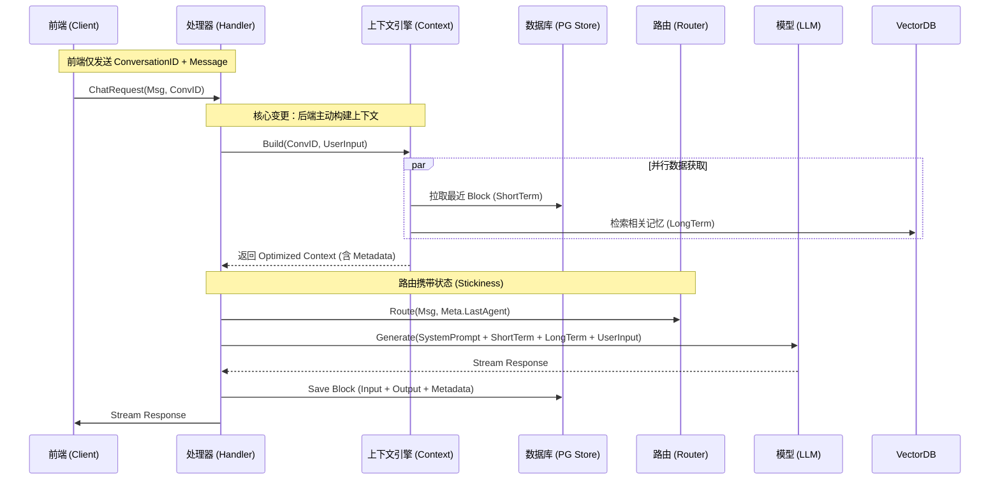

# AI Context 上下文工程架构与最佳实践 (2026 Revised)

## 1. 核心理念与架构愿景

在 **"后端即真相 (Backend as Source of Truth)"** 的原则指导下，DivineSense 的上下文工程旨在构建一个 **状态化、智能裁剪、安全可靠** 的会话记忆系统。

我们摒弃了传统的 "客户端上传历史 (Client-side History)" 模式，转向 "后端驱动构建 (Backend-Driven Construction)" 模式。前端仅需传递当前会话 ID 与用户输入，其余复杂的上下文管理工作（Budgeting, Retrieval, Stickiness）完全由后端 `ai/context` 引擎接管。

## 2. 现状差距分析 (Gap Analysis)

| 核心维度                      | 2026 最佳实践                        | 当前实现现状                     | 存在的问题与风险                                                                                          |
| :---------------------------- | :----------------------------------- | :------------------------------- | :-------------------------------------------------------------------------------------------------------- |
| **数据源 (Source of Truth)**  | **后瑞数据库 (Postgres)**            | **前端请求体 (Request Body)**    | 后端 `ParrotHandler` 盲目信任前端传回的 `History` 字符串数组，忽略了拥有丰富 Metadata 的 `AIBlockStore`。 |
| **上下文构建 (Construction)** | **动态预算裁剪 (Dynamic Budgeting)** | **简单字符串拼接 (Linear Join)** | 历史记录无限增长时，后端直接送入 LLM，无 Token 预算控制，必然导致超长截断或成本爆炸。                     |
| **状态持久化 (Persistence)**  | **结构化元数据 (Metadata)**          | **无状态 (Ephemeral)**           | `ConversationContext` 仅是空架子，无法在多轮对话间传递 "正在订票" 或 "上个Agent是日程" 等状态。           |
| **记忆能力 (Memory)**         | **混合记忆 (Short + Long Term)**     | **仅短期记忆 (Short Term Only)** | 现有的 `EpisodicMemory` (情景记忆) 模块空转，无法被注入到 Prompt 中，AI 无法展现个性和过往记忆。          |

## 3. 目标架构设计 (Architecture Design)

### 3.1 核心组件整合方案

我们将打通现有的三个孤岛模块：`AIBlockStore` (存储)、`ai/context` (计算)、`ParrotHandler` (调度)。

1.  **AI Block Store (存储层)**
    *   **角色**: 不可变的会话日志仓库。
    *   **能力**: 原生支持 `Metadata` (JSONB) 存储。
    *   **关键变更**: 需要能在 Metadata 中记录 `last_agent`, `intent_stage` 等状态信息。

2.  **AI Context Engine (`ai/context`) (大脑层)**
    *   **角色**: 动态组装 Prompt 的工厂。
    *   **能力**:
        *   **ShortTerm**: 通过 `MessageProvider` 拉取最近 N轮对话。
        *   **LongTerm**: 并行检索向量数据库中的 `EpisodicMemory`。
        *   **Budgeting**: 智能分配 Token 预算 (系统级指令 > 用户当前指令 > 短期记忆 > 长期记忆)。
    *   **关键变更**: 实现 `BlockStoreMessageProvider`，使其直接对接 PG 数据库。

3.  **Parrot Handler (`ai/handler.go`) (调度层)**
    *   **角色**: 流量入口。
    *   **关键变更**: **停止使用 `req.History`**。改为调用 `ContextBuilder.Build(ConvID)` 获取结构化的上下文对象。

### 3.2 数据流转全景图 (Data Flow)

### 3.3 实施路线图 (Implementation Roadmap)

#### Phase 1: 激活上下文引擎 (High Impact)
*   **目标**: 解耦前端，实现 Token 预算控制。
*   **动作**:
    1.  在 `ai/context/provider` 中实现 `BlockStoreMessageProvider`。
        *   逻辑：适配 `store.ListBlocks` -> `[]context.Message`。
    2.  在 `ParrotHandler` 初始化时注入此 Provider。
    3.  修改 `handle.go`：删除对 `req.History` 的依赖，改为 `ctxBuilder.Build()`。

#### Phase 2: 元数据与粘性路由 (Metadata & Stickiness)
*   **目标**: 服务端 "会话粘性" (Session Stickiness)。
*   **动作**:
    1.  保存 Block 时，写入 Metadata: `{"last_agent": "schedule", "intent": "booking"}`。
    2.  `ContextBuilder` 读取最近 Block 的 Metadata 并暴露给 Handler。
    3.  `ChatRouter` 读取 `last_agent` 实现极速粘性路由（替代现有的正则猜测）。

#### Phase 3: 智能长短时记忆 (Smart Memory)
*   **目标**: 无限对话长度支持与个性化记忆。
*   **动作**:
    1.  依靠 `BlockManager` 触发异步的 `EpisodicMemory` 生成（总结摘要）。
    2.  调整 `BudgetAllocator` 策略：当对话过长时，压缩 ShortTerm 比例，增加 LongTerm (RAG) 比例。

## 4. 最佳实践检查清单 (Checklist)

*   [x] **No Client State**: 客户端无状态化，仅传输指令，拒绝传输历史。
*   [x] **Budget Aware**: 严格的 Token 预算控制，杜绝 "Context Bloat" (上下文膨胀)。
*   [x] **Persistent State**: 状态落库 (PG Metadata)，无惧服务重启/Scaling。
*   [x] **Privacy First**: 历史数据处理完全在可信后端闭环，不经由公网传输。
*   [x] **Stateful Routing**: 路由决策基于确定的数据库状态，而非不可靠的文本正则。
